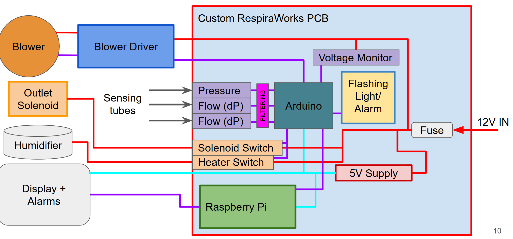

# Electrical design

-------------

## Overview
**TODO:** Say stuff here and provide context for diagram below.

**TODO:** describe subsystems and create dirctory structure to reflect them

**TODO:** wiring bom and instructions

**TODO:** link to PCB repo

[Plotting and recording live data from MCU](data_from_MCU.md)

