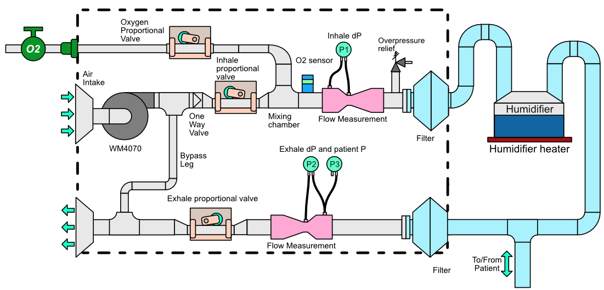

# Pneumatic design

-------------

## Overview
**TODO:** Say stuff here and provide context for diagram below.
**TODO:** Pneumatic State Diagram.

## Components

- Fan
- [Proportional pinch valve](pinch_valve/README.md)
- [Venturi flow sensor](venturi_flow_sensor/README.md)
- Oxygen control valve
- Exhaust closure valve
- Inhale and Exhale Nozzle + Filter
- Exhaust / Intake Filter

