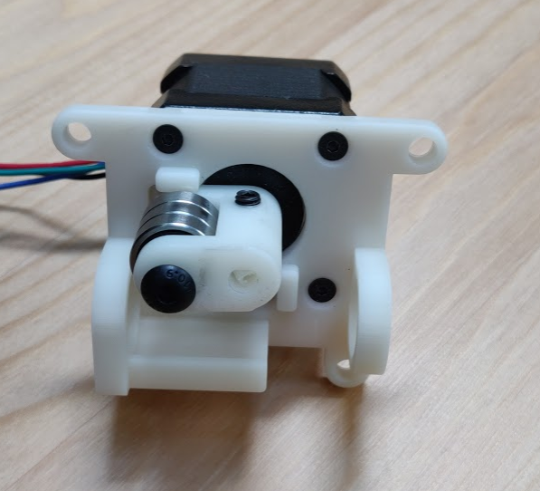

# Stepper proportional pinch valve

**TODO:** Explain motivation for this part

## CAD files

[Exported step file](exhaust%20pinch%20valve%201.5.step) of version 1.5 is available here for download.

### Changes since last version
The stop is moved down by 3 mm, which should buy us a lot more leverage.
The stop is now flat. We might need to tweak exact dimensions further to get a perfect close, but this should be better.
Watching the video I'm pretty concerned watching that stop flex. I made it run the full width, I made it thicker, and I also bulked out the tube holders.
Bearings are now better aligned with the tube.

Latest progress on 3d-printed part design is found in
[OnShape](https://cad.onshape.com/documents/3fe0c1f79c482144c267173d/w/2ad1c08071a25185f9c78c68/e/fed9023927bfd7d2374ff967).

## BOM

### Purchasing source abbreviations

* **C** = McMaster-Carr
* **Z** = Amazon
* **F** = Fast Eddy Bearings

| RefDes | Quantity | Manufacturer  | Part #              | Price($)     | Sources         | Notes |
| ------ |---------:| ------------- | ------------------- | ------------:|-----------------| ----- |
| 1      |        1 | STEPPERONLINE | 17HS19-2004S2       |       14.99  | [Z][1amzn]      | Stepper motor. Make sure to get one with the full-cut D-shaft. |
| 2      |        1 | McMaster-Carr | 92095A218           |   7.64 / 25  | [C][2mcmc]      | M5x30mm button head. Axle for bearing. |
| 3      |        3 | McMaster-Carr | 91294A128           |  4.82 / 100  | [C][3mcmc]      | M3x8mm flat head. Attaches frame to stepper body |
| 4      |        1 | McMaster-Carr | 91390A117           |  4.75 / 100  | [C][4mcmc]      | M5x5mm set screw. Attaches rotor to stepper |
| 5      |        3 | FastEddy      | TFE4262             |  12.50 / 10  | [F][5fast]      | 5x16x5 Metal shielded bearings |

[1amzn]:   https://www.amazon.com/dp/B07Z1J8JWH/ref=cm_sw_r_cp_api_i_d.zUEbRBKGSVW
[2mcmc]:   https://www.mcmaster.com/catalog/92095A218
[3mcmc]:   https://www.mcmaster.com/catalog/91294A128
[4mcmc]:   https://www.mcmaster.com/catalog/91390A117
[5fast]:   https://www.fasteddybearings.com/5x16x5-metal-shielded-bearing-625-zz-10-units/

## Assembly

**TODO:** add more detailed instructions here

Assembled it should look something like this (all screws and bearings are visible):

