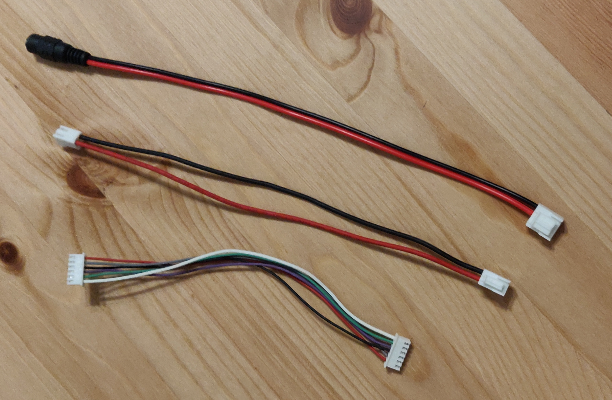

# Wiring

**DISCLAIMER: These are live documents.
There are duplicate and alternative items for undecided aspects of the physical design. 
RespiraWorks may or may not compensate you for any of these parts if you choose to buy them. Please connect with Edwin or Ethan first.
If you decide to buy them, do so at your own risk... oh, and thank you ;).**

**TODO:** explain purpose and contents

## Purchasing source abbreviations

* **Z** = Amazon
* **K** = Digikey

## Parts BOM

| RefDes | Quantity | Manufacturer  | Part #              | Price($)     | Sources         | Notes |
| ------ |---------:| ------------- | ------------------- | ------------:|-----------------| ----- |
| 1      |       12 | JST           | SXH-001T-P0.6       |         0.10 | [K][1digi]      | XH sockets, for sensor & actuator connections |
| 2      |        - | JST           | XHP-2               |         0.10 | [K][2digi]      | XH 2-pin housings, for solenoid |
| 3      |        - | JST           | XHP-3               |         0.10 | [K][3digi]      | XH 3-pin housings, for heater |
| 4      |        - | JST           | XHP-5               |         0.12 | [K][4digi]      | XH 5-pin housings, for sensors |
| 5      |        2 | JST           | XHP-6               |         0.12 | [K][4digi]      | XH 6-pin housings, for blower control |
| alt1   |        - | WGCD          | 4330589508          |         8.99 | [Z][alt1amzn]   | XH connector kit for 2/3/4/5 pins, alternative for 1+2+3+4 above |
| alt2   |        - | CQRobot       | CQRJST254-BGB       |         9.99 | [Z][alt2amzn]   | XH connector kit for 6/7/8 pins, alternative for 1+6 above |
| 6      |        6 | JST           | SVH-21T-P1.1        |         0.11 | [K][6digi]      | VH sockets, for power connectors |
| 7      |        2 | TE            | 1-1123722-2         |         0.18 | [K][7digi]      | VH housing 2 pin, for blower power |
| 8      |        1 | JST           | VHR-3N              |         0.14 | [K][8digi]      | VH housing 3 pin, for main power |
| 9      |        1 | AIMHD         | AHD-DC20-F-PT       |    9.99 / 20 | [Z][9amzn]      | Female Power Pigtail DC 5.5mm x 2.1mm Connectors, for main power |

[1digi]:   https://www.digikey.com/short/z44f8d
[2digi]:   https://www.digikey.com/short/z44f8f
[3digi]:   https://www.digikey.com/short/z44fb9
[4digi]:   https://www.digikey.com/short/z44r0b
[5digi]:   https://www.digikey.com/short/z44ff8
[alt1amzn]:   https://www.amazon.com/gp/product/B06ZZ45G7G
[alt2amzn]:   https://www.amazon.com/gp/product/B079MJ1RYN
[6digi]:   https://www.digikey.com/short/z44fjr
[7digi]:   https://www.digikey.com/short/z44fwj
[8digi]:   https://www.digikey.com/short/z44fwp
[9amzn]: https://www.amazon.com/Connectors-Upgraded-Surveillance-Transformer-Connection/dp/B0768V9V5Q

**TODO:** wires

## Tooling BOM

We try to make few assumptions about what tools you have. Here are recommended tools you might need.

| RefDes | Quantity | Manufacturer  | Part number         | Price($) | Sources         | Notes |
| ------ |---------:| ------------- | ------------------- | --------:|-----------------| ----- |
| T1     |        1 | IWISS         | SN-2549             |    25.29 | [Z][t1amzn]     | Crimping tool for HX and HV connectors |

[t1amzn]:https://www.amazon.com/gp/product/B01N4L8QMW

**TODO:** better quality crimper preferred?

## Assembly

As much as possible we should try to keep the cables one-to-one 
(for example the wiring of the PCB to blower driver cables are all pin 1 to pin 1,
pin 2 to pin 2, etc. with the same connector style on both ends.

