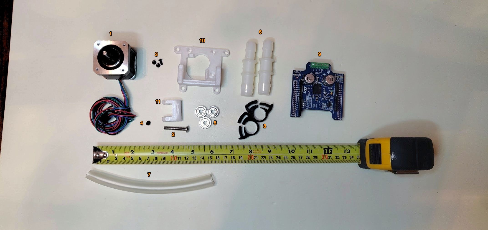

# Stepper Proportional Pinch Valve

  CAD File         |  Assembled         |Animation           
:------------------:|:-----------------:|:-------------------------:
  |    |  

## Overview

This contains details, BOM, & instructions for the pinch valve module for the pneumatic circuit. 

Note: You will need 2 pinch valves, in which case it makes sense to purchase a 2-axis stepper module, though you can work with two single steppers if that's what you already have. 

The module is something that can be "spliced" into any location in the pneumatic circuit.
This makes it interchangeable with solenoid or whatever other valve implementation we might consider/test.
The barbed adapters are needed because only 5/8"OD fits in the pinch valve mechanical assembly.
Beta will be 3/4"ID throughout, which will require different tubing adapters.

**NOTE: there are two types of tubing listed, with different internal diameter. 3/4"ID tubing is the default; however, if you've already purchased 5/8" you may be able to test with that for the time being. Depending on your system's tubing, you will also need to get appropriate diameter adapters.** 

### Latest Changes

The stop is moved down by 3 mm, which should buy us a lot more leverage.
The stop is now flat. We might need to tweak exact dimensions further to get a perfect close, but this should be better.
Watching the video I'm pretty concerned watching that stop flex. I made it run the full width, I made it thicker, and I also bulked out the tube holders.
Bearings are now better aligned with the tube.

v1.6: Broader shelf, slightly larger bump.

## 3D Printing

### Files 

- [Base - .step format](assets/exhaust%20pinch%20valve%201.6%20-%20base.step)
- [Rotor - .step format](assets/exhaust%20pinch%20valve%201.6%20-%20rotor.step)

Original design found
[here](https://cad.onshape.com/documents/3fe0c1f79c482144c267173d/w/2ad1c08071a25185f9c78c68/e/03a49465e4e026f9f102d0af).

### Guidelines

The above files should not be printed with FDM. Instead, a leaktight method like SLA or MJF should be used.

## Parts List (BOM)

### Purchasing Source Key

* **C**  = McMaster-Carr
* **Z**  = Amazon
* **F**  = Fast Eddy Bearings
* **K**  = Digikey
* **M**  = Mouser
* **3D** = 3D printed (RespiraWorks)
* **S**  = ST

### Parts 

| Item | Quantity | Manufacturer  | Part #              | Price (USD)     | Action     | Sources            | Notes |
| ------ |---------:| ------------- | ------------------- | ------------:| ------------ |--------------------| ----- |
| 1      |        1 | STEPPERONLINE | 17HS19-2004S2       |14.99 / each  | Buy          | [Z][1amzn]         | Stepper motor. Make sure to get one with the full-cut D-shaft. |
| 2      |        1 | STEPPERONLINE | 17HS19-2004S1       |13.99 / each  | Buy          | [Z][2amzn]         | **alternative to 1** Stepper motor.  |
| 3      |        1 | McMaster-Carr | 92095A218           |   7.64 / 25  | Buy          | [C][3mcmc]         | M5x30mm button head. Axle for bearing. |
| 4      |        3 | McMaster-Carr | 91294A128           |  4.82 / 100  | Buy          | [C][4mcmc]         | M3x8mm flat head. Attaches frame to stepper body |
| 5      |        1 | McMaster-Carr | 91390A117           |  4.75 / 100  | Buy          | [C][5mcmc]         | M5x5mm set screw. Attaches rotor to stepper |
| 6      |        3 | FastEddy      | TFE4262             |  12.50 / 10  | Buy          | [F][6fast]         | 5x16x5 Metal shielded bearings |
| 7      |        2 | McMaster-Carr | 5463K646            |  6.60 / 10   | Buy          | [C][7mcmc]         | Reducer 5/8"ID <-> 1/2"ID, single barb **READ WARNING BELOW**|
| 8      | 6in/15cm | McMaster-Carr | 5894K39             |  8.04 / 2 ft | Buy          | [C][8mcmc]         | Continuous-Flex Soft Tygon PVC Tubing, 1/2" ID, 5/8" OD |
| 9      |        2 | McMaster-Carr | 9579K67             |  12.63 / 20  | Buy          | [C][9mcmc]         | Easy-Install Double Snap-Grip Clamps, 1/2" to 19/32" ID |
| 10     |        1 | Digikey       | X-NUCLEO-IHM03A1    | 10.64 / each | *Ask first*  | [K][10key] [M][10mr] | Stepper driver dev board |
| 11     |        1 | ST            | X-NUCLEO-IHM02A1    | 15.00 / each | Buy          | [S][11st]    | **ALT for item 10:** Two-axis stepper driver dev board |
| 12     |        1 | RespiraWorks  | N/A                 |       N/A    | *Ask first*  | [3D][123d]         | BASE - 3D printed |
| 13     |        1 | RespiraWorks  | N/A                 |       N/A    | *Ask first*  | [3D][123d]         | ROTOR - 3D printed |
| 14     | 6in/15cm | McMaster-Carr | 5894K38             |  8.04 / 2 ft | Buy          | [C][14mcmc]        | **alternative to 8**, tubing 3/8" ID, 5/8" OD |

**WARNING: Item 7 may have to be substituted by another adapter, depending on your choice of tubing here (items 8 or 14) and your choice of pneumatic system internal diameter. Alternative adapters are listed on main [pizza page](../../4_Prototype_Assembly/Alpha_Build_Instructions/pizza_build.md)**

[1amzn]:   https://www.amazon.com/dp/B07Z1J8JWH
[2amzn]:   https://www.amazon.com/gp/product/B00PNEQKC0
[3mcmc]:   https://www.mcmaster.com/92095A218
[4mcmc]:   https://www.mcmaster.com/91294A128
[5mcmc]:   https://www.mcmaster.com/91390A117
[6fast]:   https://www.fasteddybearings.com/5x16x5-metal-shielded-bearing-625-zz-10-units/
[7mcmc]:   https://www.mcmaster.com/5463K646
[8mcmc]:   https://www.mcmaster.com/5894K39
[9mcmc]:   https://www.mcmaster.com/9579K67
[10key]:    https://www.digikey.com/short/z442qt
[10mr]:     https://www.mouser.com/ProductDetail/511-X-NUCLEO-IHM03A1
[11st]:    https://www.st.com/en/ecosystems/x-nucleo-ihm02a1.html#sample-and-buy
[123d]:    https://github.com/RespiraWorks/SystemDesign/blob/grace-pinch-valve-updates/2_Research_&_Development/Project-Pinch_Valve/README.md#exported-step-files
[14mcmc]:  https://www.mcmaster.com/5894K38

### Tools

| Item | Quantity | Manufacturer  | Part #      | Price (USD) | Sources         | Notes |
| ---- |---------:| ------------- | ----------- | ----------:|-----------------| ----- |
| a1   |        1 | TEKTON        | 37122       |       9.99 | [Z][a1amzn]      | Some sort of wrench/pliers, to clamp the herbie clips around the tubing+fitting. |
| a2   |        1 | Wiha          | 71397       |       6.76 | [Z][a2amzn]      | 2, 2.5, & 3mm hex drivers required for assembly.  |

[a1amzn]:   https://www.amazon.com/TEKTON-2-Inch-Joint-Pliers-37122/dp/B00KLY1FAY
[a2amzn]:   https://www.amazon.com/Wiha-71397-Metric-Insert-6-Piece/dp/B0084B7S70/ref=sr_1_4?dchild=1&keywords=3mm+hex&qid=1590347774&sr=8-4

## Assembly Instructions

Rotor Assembly                     |  Base Assembly           |   
:---------------------------------:|:-------------------------: 
|    
3mm hex and 2.5mm hex driver are required for assembling rotor.|  2mm hex driver is required for attaching base.

Assembled it should look something like this:

[Instructions on wiring the pinch valve to the PCB can be found here](https://github.com/RespiraWorks/pcbreathe).
