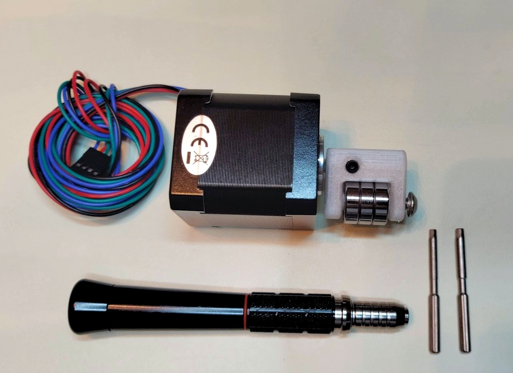

# Stepper Proportional Pinch Valve

  CAD File         |  Assembled         |Animation           
:------------------:|:-----------------:|:-------------------------:
  |    |  

This contains details, BOM, & instructions for the pinch valve module for the pneumatic circuit. 

The module is something that can be "spliced" into any location in the pneumatic circuit given the 5/8"ID standard adopted for alpha. This makes it interchangeable with solenoid or whatever other valve implementation we might consider/test. The barbed adapters are needed because only 5/8"OD fits in the pinch valve mechanical assembly. It is envisioned that beta will be 3/4"ID throughout, which will require different adapters for the pinch valve.

### Latest Changes

The stop is moved down by 3 mm, which should buy us a lot more leverage.
The stop is now flat. We might need to tweak exact dimensions further to get a perfect close, but this should be better.
Watching the video I'm pretty concerned watching that stop flex. I made it run the full width, I made it thicker, and I also bulked out the tube holders.
Bearings are now better aligned with the tube.

v1.6: Broader shelf, slightly larger bump.

## 3D Printing

### Files 

- [Base - .step format](assets/exhaust%20pinch%20valve%201.6%20-%20base.step)
- [Rotor - .step format](assets/exhaust%20pinch%20valve%201.6%20-%20rotor.step)

Original design found
[here](https://cad.onshape.com/documents/3fe0c1f79c482144c267173d/w/2ad1c08071a25185f9c78c68/e/764ab1c89ba2f5ce8cf4b650).

### Guidelines

The above files should not be printed with FDM. Instead, a leaktight method like SLA or MJF should be used.

## BOM

### Purchasing source abbreviations

* **C** = McMaster-Carr
* **Z** = Amazon
* **F** = Fast Eddy Bearings
* **K** = Digikey
* **M** = Mouser
* **3D** = 3D printed (RespiraWorks)

### Parts BOM

| RefDes | Quantity | Manufacturer  | Part #              | Price($)     | Do what?     | Sources         | Notes |
| ------ |---------:| ------------- | ------------------- | ------------:| ------------ |-----------------| ----- |
| 1      |        1 | STEPPERONLINE | 17HS19-2004S2       |       14.99  | Buy          | [Z][1amzn]      | Stepper motor. Make sure to get one with the full-cut D-shaft. |
| 2      |        1 | McMaster-Carr | 92095A218           |   7.64 / 25  | Buy          | [C][2mcmc]      | M5x30mm button head. Axle for bearing. |
| 3      |        3 | McMaster-Carr | 91294A128           |  4.82 / 100  | Buy          | [C][3mcmc]      | M3x8mm flat head. Attaches frame to stepper body |
| 4      |        1 | McMaster-Carr | 91390A117           |  4.75 / 100  | Buy          | [C][4mcmc]      | M5x5mm set screw. Attaches rotor to stepper |
| 5      |        3 | FastEddy      | TFE4262             |  12.50 / 10  | Buy          | [F][5fast]      | 5x16x5 Metal shielded bearings |
| 6      |        2 | McMaster-Carr | 5463K646            |  6.60 / 10   | Buy          | [C][6mcmc]      | Reducer 5/8"ID <-> 1/2"ID, single barb |
| 7      | 6in/15cm | McMaster-Carr | 5894K39             |  8.04 / 2 ft | Buy          | [C][7mcmc]      | Continuous-Flex Soft Tygon PVC Tubing, 1/2" ID, 5/8" OD |
| 8      |        2 | McMaster-Carr | 9579K67              |  12.63 / 20  | Buy         | [C][8mcmc]      | Easy-Install Double Snap-Grip Clamps, 1/2" to 19/32" ID |
| 9     |         1 | Digikey       | X-NUCLEO-IHM03A1     |        10.64 | *Ask first* | [K][9key] [M][9mr]      | Stepper driver dev board |
| 10     |        1 | RespiraWorks. | N/A                  |       N/A.   | Ask         | [3D][103d]      | BASE - 3D printed |
| 11     |        1 | RespiraWorks  | N/A                  |       N/A    | Ask         | [3D][103d]      | ROTOR - 3D printed |

[1amzn]:   https://www.amazon.com/dp/B07Z1J8JWH/ref=cm_sw_r_cp_api_i_d.zUEbRBKGSVW
[2mcmc]:   https://www.mcmaster.com/catalog/92095A218
[3mcmc]:   https://www.mcmaster.com/catalog/91294A128
[4mcmc]:   https://www.mcmaster.com/catalog/91390A117
[5fast]:   https://www.fasteddybearings.com/5x16x5-metal-shielded-bearing-625-zz-10-units/
[6mcmc]:   https://www.mcmaster.com/catalog/5463K646
[7mcmc]:   https://www.mcmaster.com/catalog/5894K39
[8mcmc]:   https://www.mcmaster.com/catalog/9579K67
[9key]:   https://www.digikey.com/short/z442qt
[9mr]:     https://www.mouser.com/ProductDetail/511-X-NUCLEO-IHM03A1
[103d]:    https://github.com/RespiraWorks/SystemDesign/blob/grace-pinch-valve-updates/2_Research_&_Development/Project-Pinch_Valve/README.md#exported-step-files

### Tooling BOM

| RefDes | Quantity | Manufacturer  | Part #              | Price($)     | Sources         | Notes |
| ------ |---------:| ------------- | ------------------- | ------------:|-----------------| ----- |
| 1      |        1 | TEKTON | 37122       |       9.99  | [Z][2amzn]      | For final assembly, some sort of wrench/pliers are needed to clamp the herbie clips around the tubing+fitting. |
| 2      |        1 | Wiha | 71397       |       6.76  | [Z][3amzn]      | 2, 2.5, & 3mm hex drivers required for assembly.  |

[2amzn]:   https://www.amazon.com/TEKTON-2-Inch-Joint-Pliers-37122/dp/B00KLY1FAY
[3amzn]:   https://www.amazon.com/Wiha-71397-Metric-Insert-6-Piece/dp/B0084B7S70/ref=sr_1_4?dchild=1&keywords=3mm+hex&qid=1590347774&sr=8-4

## Assembly

Rotor Assembly                     |  Base Assembly           |   
:---------------------------------:|:-------------------------: 
|    
3mm hex and 2.5mm hex driver are required for assembling rotor.|  2mm hex driver is required for attaching base.

Assembled it should look something like this:

[Instructions on wiring the pinch valve to the PCB can be found here](https://github.com/RespiraWorks/pcbreathe).
