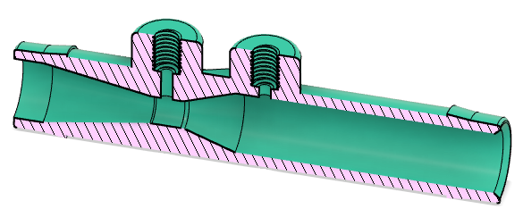
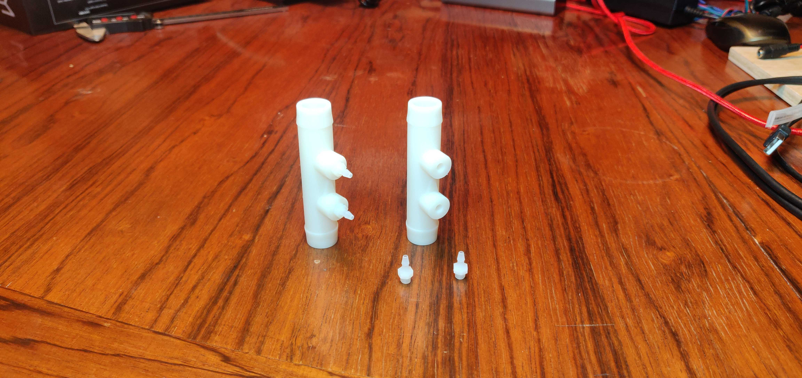

# Venturi flow sensor

The venturi is used to measure flow by measuring a change in pressure.
This version inserts within 5/8" ID tubing, though can also be used with 16mm ID tubing. 
You can use a zip tie or hose clamp to improve the seal. 

The flow sensor we are using has 2.5 mm or 3/32" barbs, which is too small for 1/8" tubing, therefore this model has #10-32 tapped holes for [this mcmaster part](https://www.mcmaster.com/5463k33).

You will also need a 10-32 tap to clean the threads. You do not need a bottoming tap, there is enough depth in the holes and the threads are short.

There is an arrow printed onto the body to indicate the direction of flow. 

**TODO:** link and explain STL files

## Transfer function

To go from voltage to flow rate, you need the following transfer functions.
For a 0.157" throat and 0.5" body using a 0-3920 Pa analog sensor, where offset is the 0 flow signal:

Q [liters/minute] = 0.75398*sqrt(1346.584669*(voltage-offset))
**TODO:** make math pretty with Mathjax?

For an arbitrary body geometry, you can use the following short spreadsheet to return the transfer function:
https://docs.google.com/spreadsheets/d/1G9Kb-ImlluK8MOx-ce2rlHUBnTOtAFQvKjjs1bEhlpM/edit#gid=963553579

**TODO:** make spreadsheet contents visible here

## Pressure Sensor

This venturi is designed to be paired with this sensor and a 14-bit ADC. 

[Data Sheet MPXV5004DP](https://www.nxp.com/docs/en/data-sheet/MPXV5004G.pdf)

Adjust values in the spreadsheet above accordingly to see how it will perform in your setup. 

## BOM

### Purchasing source abbreviations

* **C** = McMaster-Carr
* **Z** = Amazon

### Parts BOM

| RefDes | Quantity | Manufacturer  | Part number         | Price($) | Do what? | Sources         | Notes |
| ------ |---------:| ------------- | ------------------- | --------:| ----- |-----------------| ----- |
| 1      |        - | McMaster-Carr | 5463K33             | 3.93 / 10    | buy       | [C][1mcmc]      | Barbed fitting 3/32" for venturis |

[1mcmc]:   https://www.mcmaster.com/5463K33

### Tooling BOM

We try to make few assumptions about what tools you have. Here are recommended tools you might need.

| RefDes | Quantity | Manufacturer  | Part number         | Price($) | Sources         | Notes |
| ------ |---------:| ------------- | ------------------- | --------:|-----------------| ----- |
| T1     |        1 | McMaster-Carr | 26955A86            |     6.76 | [C][t1mcmc]     | Tap for 10-32 threads for venturis. Edwin notes that 3d printed fittings may not have good enough threads and you might need to chase them with a hand tap. |
| T2     |        1 | Kaufhof       | KF-ATW-0053         |    14.11 | [Z][t2amzn]     | Hand-operated tap wrenches, for use with T1 above 

[t1mcmc]:https://www.mcmaster.com/26955A86
[t2amzn]:https://www.amazon.com/gp/product/B003GKJYKI

## Assembly

No hand-tapping was required to insert nipples. 

**Testing:**
Check for leaks by plugging the holes and pulling some vacuum. There are threads in the print but they don’t always come out right if resin get a trapped in the grooves while it prints.
* Plug one large end, plug both nipples, suck on the remaining end.  If you have a vacuum pump handy do a regular vacuum hold leak test
* Or, blow into each port with your fingers over the other three.
