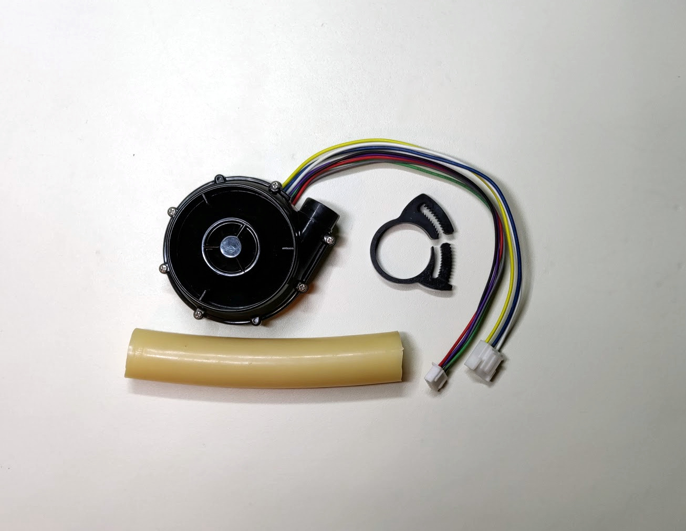
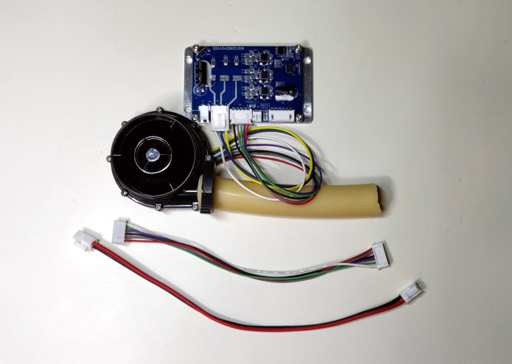

# Pizza build: blower sub-assembly

The blower/fan is what provides air pressure to the ventilator's pneumatic circuit.

The pneumatic aspect of the blower assembly includes the blower and a short segment of tubing compatible with blower outlet diameter. 

The electrical aspect of the blower assembly encompasses the driver board and wires of sufficient length to interface
with the [PCB](https://github.com/respiraworks/pcbreathe).

**TODO:** unit price analysis

## BOM

### Purchasing source abbreviations

* **A** = Ali Express
* **C** = McMaster-Carr
* **W** = Wonsmart
* **K** = Digikey
* **B** = Built by RespiraWorks
* **Z** = Amazon

### BOM

**NOTE:** Before you buy anything on this list, check with Edwin, Martin or Ethan. Blower takes a while to deliver.
We may have parts to send you from our inventory. 

| Item | Quantity | Manufacturer  | Part #              | Price($)     |Sources         | Notes |
| ---- |---------:| ------------- | ------------------- | ------------:|:--------------:|-------|
| 1    |        1 |               | WS7040-12-X200N     |        65.00 | [A][1ali]      | 12v blower and driver. Make sure to choose with driver when ordering. |
| 2    |        1 |               | WS1208              |        24.00 | [W][2won]      | blower driver, in case blower above did not come with driver. |
| 3    |   ~10 cm | McMaster-Carr | 5234K57             | 21.50 / 5ft  | [C][3mcmc]     | Soft latex tubing, 5/8" ID, 7/8" OD, already have some in 5/8"ID build |
| 4    |        1 | McMaster-Carr | 9579K72             | 12.21 / 20   | [C][4mcmc]     | Herbie clip J (20.3-23mm) for clamping 7/8"OD tubing, optional? |
| 5    |  6 or 12 | JST           | SXH-001T-P0.6       |         0.10 | [K][5digi]     | XH crimps, for control connector |
| 6    |   1 or 2 | JST           | XHP-6               |         0.14 | [K][6digi]     | XH 6-pin housing, for control connector |
| 7    |        - | CQRobot       | CQRJST254-BGB       |         9.99 | [Z][7amzn]     | XH connector kit for 6/7/8 pins, alternative for 1+6 above |
| 8    |   2 or 4 | JST           | SVH-21T-P1.1        |         0.11 | [K][8digi]     | VH crimps, for power connector |
| 9    |   1 or 2 | TE            | 1-1123722-2         |         0.18 | [K][9digi]     | VH housing 2 pin, for power connector |
| 10   |        - | Remington     | 16UL1007STRKIT      |        29.70 | [K][10amzn]    | 16 AWG wire, for power cable |
| 11   |        - | Remington     | 26UL1007STRKIT10COLOR |      31.60 | [K][11amzn]    | 26 AWG wire, for control cable |

[1ali]:   https://www.aliexpress.com/item/32698107687.html
[2won]:   https://wonsmart-motor.en.made-in-china.com/product/hsjxFewOppVg/China-Air-Pump12V-Brushless-Motor-12V-Blower-Fan-Driver.html
[3mcmc]:  https://www.mcmaster.com/5234K57
[4mcmc]:  https://www.mcmaster.com/9579K72
[5digi]:  https://www.digikey.com/short/z44f8d
[6digi]:  https://www.digikey.com/short/z44ff8
[7amzn]:  https://www.amazon.com/gp/product/B079MJ1RYN
[8digi]:  https://www.digikey.com/short/z44fjr
[9digi]:  https://www.digikey.com/short/z44fwj
[10amzn]: https://www.amazon.com/gp/product/B00N51OJJ4
[11amzn]: https://www.amazon.com/gp/product/B011JC76OA

## Tooling BOM

| Item | Quantity | Manufacturer  | Part number         | Price($) | Sources         | Notes |
| ---- |---------:| ------------- | ------------------- | --------:|-----------------| ----- |
| T1   |        1 | Preciva       | PR-3254 (PR102001)  |    39.99 | [Z][t1amzn]     | Crimping tool for HX and HV connectors |

[t1amzn]:https://www.amazon.com/gp/product/B07R1H3Z8X

**NOTE: Items 5-11 and T1 above are also duplicated in the [wiring BOM](../../../1_Ventilator_System_Design/Electrical_System/wiring.md)**

## Assembly instructions

Use short segment of tubing, probably shorter than pictured.
Use Herbie clip to secure tubing to blower. Alternatively, you can use a zip-tie.

**IMPORTANT** For the blower sub-assembly, you need 5/8"ID tubing, even if you are building a largely 3/4"ID pneumatic circuit.

You will have to crimp connectors to the second end of the wiring that connects the driver board
to the [PCB](https://github.com/respiraworks/pcbreathe).
It depends on your build layout, but it is highly likely you will want longer wires, which you can
manufacture if you have a crimping tool. In this case you will need the higher number of connector
components listed in the BOM above.

