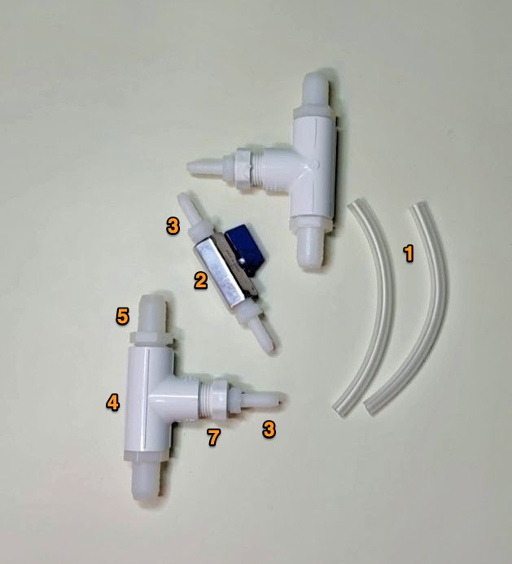
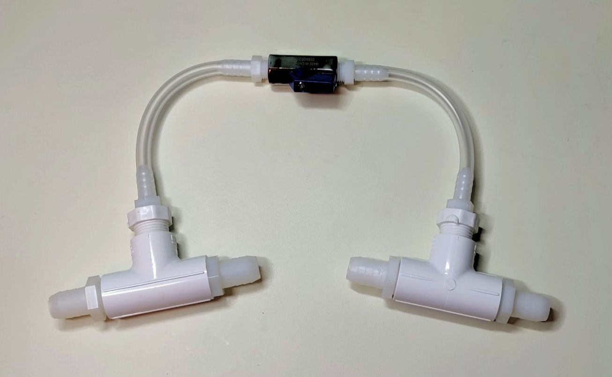

# Blower Bypass

The blower bypass is an optional "topping" that can be integrated into the [pizza build](../Alpha_Build_Instructions/pizza_build.md).

The purpose of the blower bypass is to prevent strain on blower when the inhale pinch valve is closed. This is the version for 3/8"ID [alpha build](../Alpha_Build_Instructions).

## BOM

### Purchasing Source Key

* **A** = Ali Express
* **Z** = Amazon
* **E** = ebay
* **C** = McMaster-Carr
* **M** = Mouser
* **W** = Wonsmart
* **B** = Built by RespiraWorks

### Parts BOM

| Item | Quantity | Manufacturer  | Part #              | Price (USD)     | Action  | Sources         | Notes |
| ------ |--------------:| ------------- | ----------------- | ------------:|:---------:|-----------------| ----- |
| 1      |    1ft / 30cm | McMaster-Carr | 5894K34           | 2.43 / ft   | buy       | [C][1mcmc]      | 1/4" ID tubing |
| 2      |        1  | DERNORD | DERNORD-373           | 12.79   | buy       | [Z][2azn]      | Ball valve, as adjustable orifice |
| 3      |         2 | McMaster-Carr | 5372K112           | 4.81/10   | buy       | [C][3mcmc]      | Barb to connect ball valve to tubing |
| 4      |         2 | McMaster-Carr | 4880K154           | 2.82/each   | buy       | [C][4mcmc]      | 1/2 NTP tees for branching the pneumatic circuit  |
| 5      |         4 | McMaster-Carr | 5372K128           | 4.89/10  | buy       | [C][5mcmc]      | Barb to connect tees to rest of 5/8"ID pneumatic circuit  |
| 6      |         2 | McMaster-Carr | 53415K204           | 7.89/10  | buy       | [C][6mcmc]      | Barb to connect tees to 1/4"ID bypass  |
| 7      |         2 | McMaster-Carr | 4880K343           | 1.44/each  | buy       | [C][7mcmc]      | **ALT:** As alt to last item in the list, get 2 more of item 5, and also this 1/2 NTP -> 1/4 NTP adaptor |

[1mcmc]:   https://www.mcmaster.com/5894K34 
[2azn]:    https://www.amazon.com/gp/product/B07BSQ5X8H
[3mcmc]:   https://www.mcmaster.com/5372K112
[4mcmc]:   https://www.mcmaster.com/4880K154
[5mcmc]:   https://www.mcmaster.com/5372K128
[6mcmc]:   https://www.mcmaster.com/53415K204
[7mcmc]:   https://www.mcmaster.com/4880K343

## Assembly

Parts:

Assembled:

Splice the assembled bypass into the pneumatic circuit such that:

* One fork is right after the blower assembly.
* The second fork is right at the outlet, after the exhale valve.

Integrated into pizza build:

