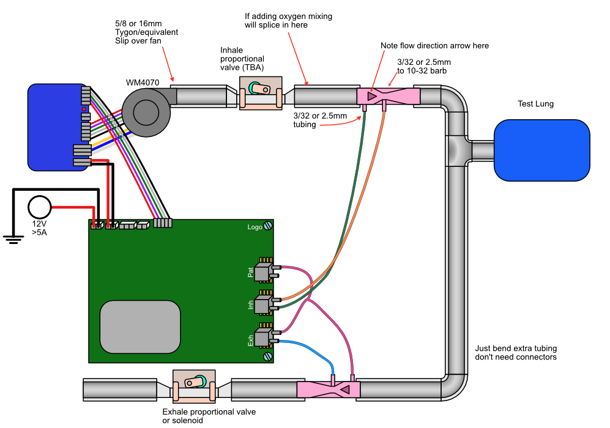
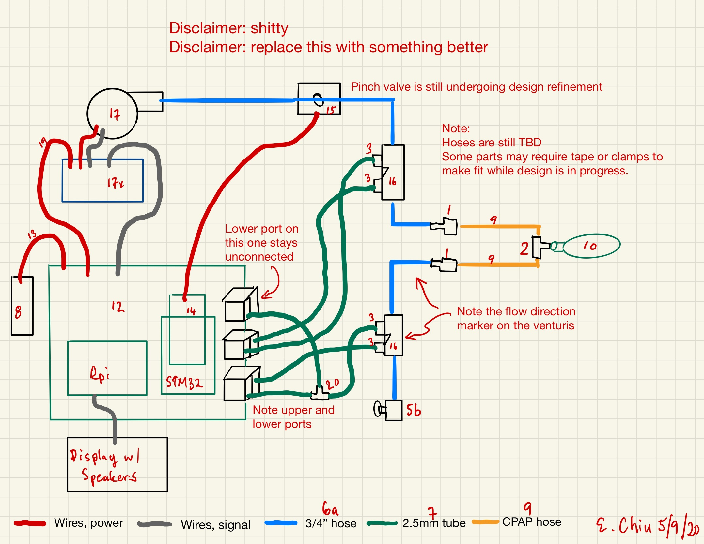
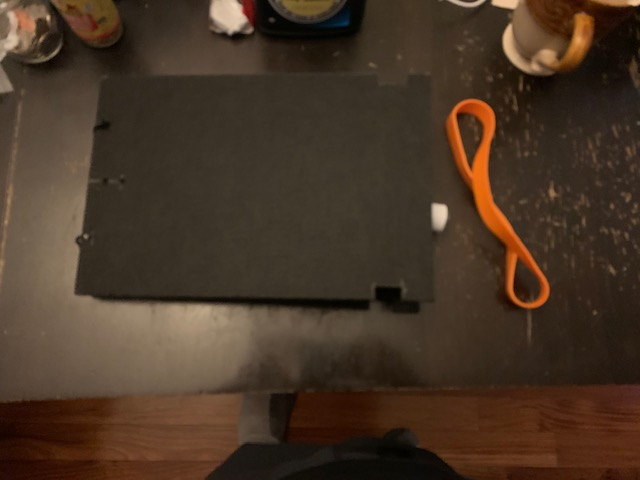

# Pizza Build

**DISCLAIMER: These are live documents.
There are duplicate and alternative items for undecided aspects of the physical design. 
RespiraWorks may or may not compensate you for any of these parts if you choose to buy them. Please connect with Edwin or Ethan first.
If you decide to buy them, do so at your own risk... oh, and thank you ;).**

This build consists of a functional ventilator pneumatic assembly with controller and user interface. This build is adequate for integration and systems testing.

It lacks heating, oxygen mixing, humidification, battery backup and air filtering.
It is also not enclosed like the final product and is meant to be operated in an open layout on your table, like a pizza.

**This is not intended to be used on patients and lacks a number of safety features.**

This build depends on already having a Brain build, which has its own BOM [here](brain_build.md).

## Purchasing source abbreviations

* **A** = Ali Express
* **Z** = Amazon
* **E** = ebay
* **C** = McMaster-Carr
* **K** = Digikey
* **W** = Wonsmart
* **B** = Built by RespiraWorks

## Parts BOM

| RefDes | Quantity | Manufacturer  | Part #              | Price($)     | Do what?  | Sources         | Notes |
| ------ |---------:| ------------- | ------------------- | ------------:|:---------:|-----------------| ----- |
| 1      |        - | McMaster-Carr | 53415K217           | 12.89 / 10   | buy       | [C][1mcmc]      | Barbed fitting 3/4" |
| 2      |        - | McMaster-Carr | 5463K565            | 10.53 / 10   | buy       | [C][2mcmc]      | Barbed tee-fitting 3/4" |
| 3      |        - | McMaster-Carr | 5463K33             | 3.93 / 10    | buy       | [C][3mcmc]      | Barbed fitting 3/32" for venturis |
| 4      |        - | McMaster-Carr | 5463K37             | 4.74 / 10    | buy       | [C][4mcmc]      | Barbed fitting 3/32" for venturis |
| 5      |        2 |               |                     | 12.95 / 2    | buy       | [Z][5amzn]      | 2pac of ball valves 1/2", diameter of current design but may not be for long |
| 5a     |        2 |               |                     | 13.45 / 2    | buy       | [Z][5a-amzn]    | 2pac of ball valves 5/8", alternative for uncertain design changes |
| 5b     |        2 |               |                     | 13.45 / 2    | buy       | [Z][5b-amzn]    | 2pac of ball valves 3/4", alternative for uncertain design changes |
| 6      |        - |               |                     | 14.26 / 10ft | buy       | [Z][6amzn]      | 5/8" tubing, fits current venturi design |
| 6a     |        - |               |                     | 42.99 / 10ft | buy       | [Z][6a-amzn] [C][6a-mcmc]   | 3/4" tubing, alternative because we are probably switching to this diameter |
| 7      |        - |               |                     | 6.49 / 16ft  | buy       | [Z][7amzn] [C][7mcmc]     | 2.5 mm tubing (for sensors?) |
| 8      |        1 |               |                     | 19.99        | buy       | [Z][8amzn] [C][8mcmc]     | 12v Power supply adapter (obsolete? opt for 8a?) |
| 8a     |        1 |               |                     | 13.99        | buy       | [Z][8a-amzn] [C][8a-mcmc]   | 12v Power supply adapter, better than 8 above |
| 9      |        2 |               |                     | 16.99 / 2    | buy       | [Z][9amzn]      | CPAP tubing |
| 10     |        1 |               |                     | 15.00        |*ask first*| [E][10ebay]     | test "lung", ask build-team if they have extra |
| 11     |        1 |               |                     | 6.98         | buy       | [Z][11amzn]     | use these to simulate lung compliance |
| 12     |        1 | RespiraWorks  | PCB1                |              | **ask**   | [B][12rw]       | RespiraWorks Ventilator Mainboard Rev 1 PCB |
| 13     |        1 | RespiraWorks  | Power input 1       |              | **ask**   | [B][13rw]               | Power Input cable |
| 14     |        1 | Digikey       | X-NUCLEO-IHM03A1    |        10.64 |*ask first*| [K][14key]      | Stepper driver dev board |
| 15     |        1 | RespiraWorks  | PinchValve1.4       |              | **ask**   | [B][15rw]       | Marc-designed stepper pinch valve rev 1.4 |
| 16     |        2 | RespiraWorks  | Venturi2            |              | **ask**   | [B][16rw]       | Ethan-designed 10-32 threaded venturis Rev 2 |
| 17     |        1 |               | WS7040-12-X200N     |        52.65 |*ask first*| [A][17ali]      | 12v blower and driver. Make sure to choose w/driver when ordering. |
| 17x    |        1 |               | WS1208DYY01V03      |        24.00 |*ask first*| [W][17x-won]    | blower driver, in case blower above did not come with driver. |
| 18     |        1 | RespiraWorks  | blower control cable|              | **ask**   | [B][18rw]               | blower control cable |
| 19     |        1 | RespiraWorks  | blower power cable  |              | **ask**   | [B][19rw]               | blower power cable |

[1mcmc]:   https://www.mcmaster.com/53415K217
[2mcmc]:   https://www.mcmaster.com/5463K565
[3mcmc]:   https://www.mcmaster.com/5463K33
[4mcmc]:   https://www.mcmaster.com/5463K37
[5amzn]:   https://www.amazon.com/gp/product/B07C5B4S1S
[5a-amzn]: https://www.amazon.com/gp/product/B07C5FVN9K
[5b-amzn]: https://www.amazon.com/gp/product/B07C5FVSQB
[6amzn]:   https://www.amazon.com/gp/product/B00LX6MB6G
[6a-amzn]: https://www.amazon.com/gp/product/B079WRWH34
[6a-mcmc]: https://www.mcmaster.com/5233K71
[7amzn]:   https://www.amazon.com/gp/product/B01F4BJ7PI
[7mcmc]:   https://www.mcmaster.com/50315K68
[8mcmc]:   https://www.mcmaster.com/3791N024
[8amzn]:   https://www.amazon.com/gp/product/B00Z9X4GLW
[8a-amzn]: https://www.amazon.com/gp/product/B01MYXTA6N
[8a-mcmc]:https://www.mcmaster.com/3824N132
[9amzn]:   https://www.amazon.com/gp/product/B01N14F1MV
[10ebay]:  https://www.ebay.com/itm/PORTEX-Adult-Disposable-Anesthesia-Breathing-Circuit-3L-Breathing-Bag-370924/362943456196
[11amzn]:  https://www.amazon.com/gp/product/B018WPZCSO
[12rw]:    https://github.com/RespiraWorks/pcbreathe/tree/master/NIGHTLY/20200424v2-RELEASE-CANDIDATE-2
[13rw]:    ../../1_Ventilator_System_Design/Electrical_System/wiring.md
[14key]:   https://www.digikey.com/short/z442qt
[15rw]:    ../../2_Research_&_Development/Project-Pinch_Valve/README.md 
[16rw]:    ../../2_Research_&_Development/Project-Venturi/README.md
[17ali]:   https://www.aliexpress.com/item/32698107687.html
[17x-won]: https://wonsmart-motor.en.made-in-china.com/product/hsjxFewOppVg/China-Air-Pump12V-Brushless-Motor-12V-Blower-Fan-Driver.html
[18rw]:    ../../1_Ventilator_System_Design/Electrical_System/wiring.md
[19rw]:    ../../1_Ventilator_System_Design/Electrical_System/wiring.md

## Tooling BOM

We try to make few assumptions about what tools you have. Here are recommended tools you might need.

| RefDes | Quantity | Manufacturer  | Part number         | Price($) | Sources         | Notes |
| ------ |---------:| ------------- | ------------------- | --------:|-----------------| ----- |
| T1     |        1 | McMaster-Carr | 26955A86            |     6.76 | [C][t1mcmc]     | Tap for 10-32 threads for venturis. Edwin notes that 3d printed fittings may not have good enough threads and you might need to chase them with a hand tap. |
| T2     |        1 | Kaufhof       | KF-ATW-0053         |    14.11 | [Z][t2amzn]     | Hand-operated tap wrenches, for use with T1 above |

[t1mcmc]:https://www.mcmaster.com/26955A86
[t2amzn]:https://www.amazon.com/gp/product/B003GKJYKI

## Reduced Compliance Test Lung

To test basic function a ventilator check lung or a breathing bag is sufficient, but can really only work up to 10cmH2O.  To be able to test higher PIP values, you need to reduce the conpliance of the lung so you don't just inflate it like a balloon (or pop it).  These are partial instructions, and there is currently a shortage of test lungs, so what model you get can vary, so expect to do some tinkering to these instrutions if you are going to build you own.  This is completely uncalibrated, so it is not intended for instrumentation just for functional observation.

| RefDes | Quantity | Manufacturer  | Part number         | Price($) | Sources         | Notes |
| ------ |---------:| ------------- | ------------------- | --------:|-----------------| ----- |
| TL1    |        1 | South Pacific | FlexLung            |     30.00| [Z][TL1amzn]     | Test Lung or breathing bag or equivalent, many models out there, check eBay as well |
| TL2    |        1 | BXI or whatever you have around| CA-BX-AP-PF |    30.00 | [Z][TL2amzn]     | Just some sturdy material.  Aluminum, wood, whatevery you have around. 1x 16x12 sheet needed, or 2x 8x12 sheets |
| TL3    |        1 | Grifiti | 9-inch Silicone Huge Rubber Band   |     11.00| [Z][TL3amzn]     | just a big rubber band.  several jumbo rubber bands or resistance tubing from an exercise device will work. |
| TL3a    |        1 | Alliance Rubber | 08997 SuperSize Bands  |     7.00| [Z][TL3aamzn]     | just some more big rubber bands. good for tuning the response. |
| TL4    |        1 | whoever | literally just some zip ties   |     14.00| [Z][TL4amzn]     | hopefully you have some zip ties at home already but if not, here's a link |
| TL5   |        1 | McMaster-Carr | 5463K615   |     12.00 for pack of 10| [Z][TL5mcmc]     | tee-juction to connect hoses to your test lung.  Again sizes vary so this is just a suggestion.  Find the right part for your hoses and your lung.  Expect to use some tape to ensure a tight seal. |

[TL1amzn]:  https://www.amazon.com/FlexLung-Biomedical-Ventilator-Testing-Demonstration/dp/B07B876P9C
[TL2amzn]:  https://www.amazon.com/gp/product/B077Q2HYMW
[TL3amzn]:  https://www.amazon.com/Wrapping-Exercise-Chemical-Resistant-Silicone/dp/B0070EEGTK
[TL3aamzn]:  https://www.amazon.com/gp/product/B0017D16PW
[TL4amzn]: https://www.amazon.com/gp/product/B0777LWBD9
[TL5mcmc]:  https://www.mcmaster.com/5463K615

* Cut a 16x12 panel of sturdy material into two 8x12 panels. (the sound absorber panels above work fine, or any wood or aluminum you have around.  Cardboard is probably not sturdy enough.

* Drill 2 holes at one end of each panel to form a zip tie hinge.  Drill two additional holes in one of the panels as a securing point for the test lung.  Measure with the rubber band and cut 2 notches at the opposite end of both panels to accomodate the rubber band.  
* If your lung does not have an attachement loop, make a fold of duct tape attached to the end of the lung and poke a hole in it for the zip tie to secure.  Secure the lung to the panel.
* Put the zip ties into the end of the panel for the hinge. Make sure the ties are loose enough to allow the panels to fold over completely.

* Put the rubber band around the notches.

* Mate the tee-junction to the port on the lung to allow attachment of your hoses.

