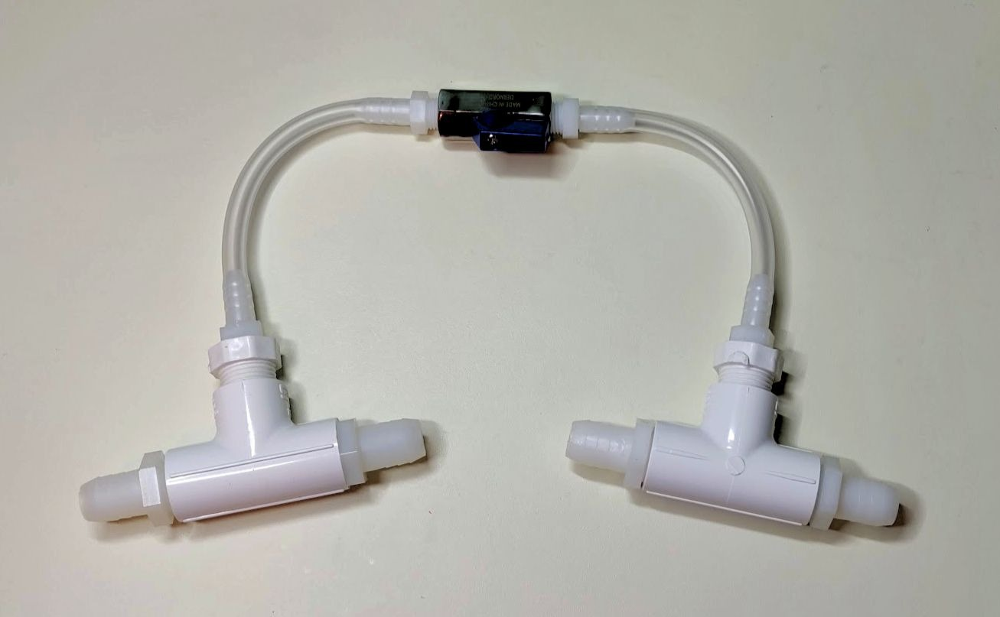

# Blower Bypass

The blower bypass is an optional "topping" that can be integrated into the [pizza build](../../Alpha_Build_Instructions/pizza_build.md).

The purpose of the blower bypass is to prevent strain on blower when the inhale pinch valve is closed. Note the alternative parts for 3/8"ID and 3/4"ID builds.

## Parts List (BOM)

### Purchasing Source Key

* **Z** = Amazon
* **C** = McMaster-Carr

### Parts

| Item   | Quantity      | Manufacturer  | Part #            | Price (USD)  | Sources         | Notes                    |
| ------ |--------------:| ------------- | ----------------- | ------------:|-----------------| ------------------------ |
| 1      |    1ft / 30cm | McMaster-Carr | 5894K34           | 2.43 / ft    | [C][1mcmc]      | 1/4" ID tubing |
| 2      |             1 | DERNORD | DERNORD-373             | 12.79        | [Z][2azn]       | Ball valve, acting as adjustable orifice |
| 3      |             2 | McMaster-Carr | 5372K112          | 4.81/10      | [C][3mcmc]      | 1/4 NTP male <-> 1/4" ID multi-barb, to connect ball valve to tubing |
| 4      |             2 | McMaster-Carr | 4880K154          | 2.82/each    | [C][4mcmc]      | 1/2 NTP female tee, for branching the pneumatic circuit  |
| 5      |             4 | McMaster-Carr | 5372K128          | 4.89/10      | [C][5mcmc]      | 1/2 NTP male <-> 5/8" ID multi-barb, to connect tees to rest of 5/8" ID pneumatic circuit  |
| 6      |             4 | McMaster-Carr | 53415K216         | 10.00/10     | [C][6mcmc]      | **ALT:** 1/2 NTP male <-> 3/4" ID barb, as alt to item 5 for 3/4" ID pneumatic circuit  |
| 7      |             2 | McMaster-Carr | 53415K204         | 7.89/10      | [C][7mcmc]      | 1/2 NTP male <-> 1/4" ID barb to connect tees to 1/4"ID bypass  |
| 8      |             2 | McMaster-Carr | 4880K343          | 1.44/each    | [C][8mcmc]      | **ALT:** 1/2 NTP male -> 1/4 NTP female adapter, as alt to item 7, paired with 2 more of item 3  |

[1mcmc]:   https://www.mcmaster.com/5894K34 
[2azn]:    https://www.amazon.com/gp/product/B07BSQ5X8H
[3mcmc]:   https://www.mcmaster.com/5372K112
[4mcmc]:   https://www.mcmaster.com/4880K154
[5mcmc]:   https://www.mcmaster.com/5372K128
[6mcmc]:   https://www.mcmaster.com/53415K216
[7mcmc]:   https://www.mcmaster.com/53415K204
[8mcmc]:   https://www.mcmaster.com/4880K343

## Assembly Instructions

Parts:

Assembled:

Splice the assembled bypass into the pneumatic circuit such that:

* One fork is right after the blower assembly.
* The second fork is right at the outlet, after the exhale valve.

Integrated into pizza build:

