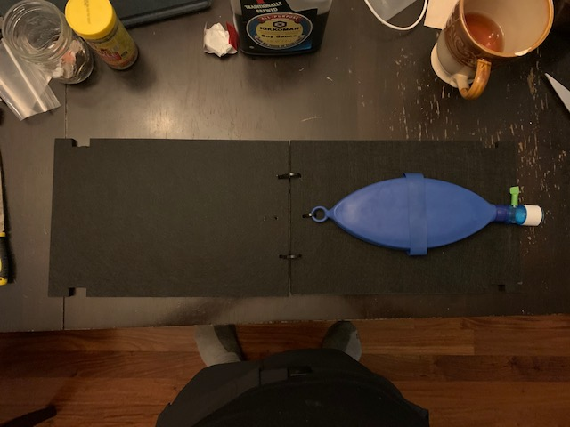
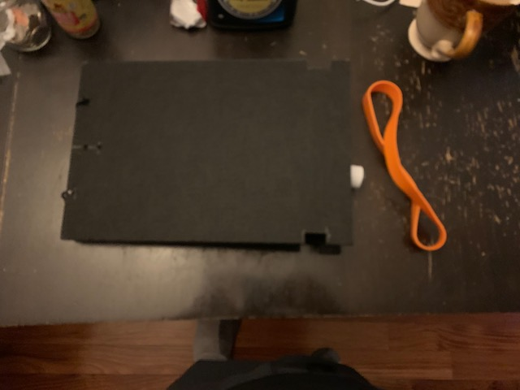

# Reduced Compliance Test Lung

This is an optional add-on (topping!) to the [pizza build](../pizza_build.md).

To test basic function a ventilator check lung or a breathing bag is sufficient, but can really only work up to 10cmH2O.
To be able to test higher PIP values, you need to reduce the conpliance of the lung so you don't just inflate it like
a balloon (or pop it).  These are partial instructions, and there is currently a shortage of test lungs, so what model
you get can vary, so expect to do some tinkering to these instrutions if you are going to build you own.
This is completely uncalibrated, so it is not intended for instrumentation just for functional observation.

**#TODO: synchronize parts list in this page with that in [simple test lung](../pizza_compliance_test/pizza_build.md), or make that a prerequisite**

## Part List (BOM)

### Purchasing Source Key

* **Z** = Amazon
* **C** = McMaster Carr

### Parts

| Item | Quantity | Manufacturer    | Part number         | Price (USD) | Sources         | Notes |
| ---- |---------:| --------------- | ------------------- | --------:|-----------------| ----- |
| 1  |        1 | South Pacific   | FlexLung            |  129.00 / 5 | [Z][1amzn]     | Test Lung or breathing bag or equivalent, many models out there, check eBay as well |
| 2  |        1 | BXI or whatever | CA-BX-AP-PF |    28.95 | [Z][2amzn]     | Just some sturdy material.  Aluminum, wood, whatevery you have around. 1x 16x12 sheet needed, or 2x 8x12 sheets |
| 3  |        1 | Grifiti         | 9-inch Silicone Huge Rubber Band   |     11.00| [Z][3amzn]     | just a big rubber band.  several jumbo rubber bands or resistance tubing from an exercise device will work. |
| 4 |        1 | Alliance Rubber | 08997 SuperSize Bands  |     7.00| [Z][4amzn]     | just some more big rubber bands. good for tuning the response. |
| 5  |        1 | whoever         | literally just some zip ties   |     14.00| [Z][5amzn]     | hopefully you have some zip ties at home already but if not, here's a link |
| 6  |        1 | McMaster-Carr   | 5463K615   |     12.00 for pack of 10| [C][6mcmc]     | tee-juction to connect hoses to your test lung.  Again sizes vary so this is just a suggestion.  Find the right part for your hoses and your lung.  Expect to use some tape to ensure a tight seal. |
| 7   |        1 |                 |                     | 6.98         | [Z][7amzn]     | more rubber bands, optional or alternative to 3 and 3a |

[1amzn]:  https://www.amazon.com/FlexLung-Biomedical-Ventilator-Testing-Demonstration/dp/B07B876P9C
[2amzn]:  https://www.amazon.com/gp/product/B077Q2HYMW
[3amzn]:  https://www.amazon.com/Wrapping-Exercise-Chemical-Resistant-Silicone/dp/B0070EEGTK
[4amzn]:  https://www.amazon.com/gp/product/B0017D16PW
[5amzn]: https://www.amazon.com/gp/product/B0777LWBD9
[6mcmc]:  https://www.mcmaster.com/5463K615
[7amzn]:  https://www.amazon.com/gp/product/B018WPZCSO

## Assembly Instructions

* Cut a 16x12 panel of sturdy material into two 8x12 panels. (the sound absorber panels above work fine, or any wood or aluminum you have around.  Cardboard is probably not sturdy enough.)

* Drill 2 holes at one end of each panel to form a zip tie hinge.  Drill two additional holes in one of the panels as a securing point for the test lung.  Measure with the rubber band and cut 2 notches at the opposite end of both panels to accomodate the rubber band.  
* If your lung does not have an attachment loop, make a fold of duct tape attached to the end of the lung and poke a hole in it for the zip tie to secure.  Secure the lung to the panel.
* Put the zip ties into the end of the panel for the hinge. Make sure the ties are loose enough to allow the panels to fold over completely.

* Put the rubber band around the notches.

* Mate the tee-junction to the port on the lung to allow attachment of your hoses.

