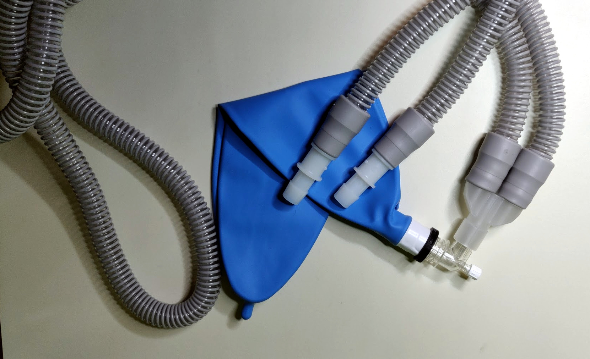

# Pizza build: Test Lung Sub-Assembly

True test lungs are expensive and hard to come by, so we must do with what's available. 

This page explains how to adapt off-the-shelf parts into a basic test lung for our ventilator prototype.

## Parts List (BOM)

### Purchasing Source Key

* **E** = ebay
* **Z** = Amazon
* **C** = McMaster-Carr

### Parts

| Item | Quantity | Manufacturer  | Part #         | Price (USD)     | Action | Sources         | Notes |
| ---- |---------:| ------------- | ------------------- | ------------:|-----------|----------------| ----- |
| 1    |        1 | Portex        | 370924              | 15.00        |*ask first*| [E][1ebay]     | test "lung", ask build-team if they have extra |
| 2    |        2 | Mars Wellness | 4332593260          | 16.99 / 2    | buy       | [Z][2amzn]     | CPAP tubing |
| 3    |        2 | McMaster-Carr | 5463K167            | 13.16 / 10   | buy       | [C][3mcmc]     | 3/4"ID <-> 5/8"ID single barb adapter |

[1ebay]:  https://www.ebay.com/itm/PORTEX-Adult-Disposable-Anesthesia-Breathing-Circuit-3L-Breathing-Bag-370924/362943456196
[2amzn]:  https://www.amazon.com/gp/product/B01N14F1MV
[3mcmc]:  https://www.mcmaster.com/5463K167

### Parts: Alt Tee

| Item | Quantity | Manufacturer  | Part #         | Price (USD)     | Sources        | Notes |
| ---- |---------:| ------------- | ------------------- | ------------:|----------------|----------------|
| a1    |  ~10 cm  | McMaster-Carr | 5234K57             | 21.50 / 5ft  | [C][a1mcmc]     | Soft latex tubing, 5/8" ID, 7/8" OD, optional? |
| a2    |       1  | McMaster-Carr | 9579K72             | 12.21 / 20   | [C][a2mcmc]     | Herbie clip J (20.3-23mm) for clamping 7/8"OD tubing, optional? |
| a3   |       1  | McMaster-Carr | 4880K154            | 2.82         | [C][a3mcmc]     | 1/2 NTP tee female |
| a4   |       3  | McMaster-Carr | 5372K128            | 4.89 / 10    | [C][a4mcmc]     | 1/2 NTP <-> 5/8"ID male multibarbed |
| a5   |       1  | McMaster-Carr | 5372K625            | 9.59 / 10    | [C][a5mcmc]     | 5/8"ID tee, multibarbed, *alternative to items 6 & 7 above* |

[a1mcmc]:  https://www.mcmaster.com/5234K57
[a2mcmc]:  https://www.mcmaster.com/9579K72
[a3mcmc]:  https://www.mcmaster.com/4880K154
[a4mcmc]:  https://www.mcmaster.com/5372K128
[a5mcmc]:  https://www.mcmaster.com/5372K625

**TODO:** pricing analysis

## Assembly

The test lung (*item 1*) will arrive with elbow fitting, tee-connector and CPAP hoses.

| As purchased         |  without hoses       |           
|:--------------------:|:--------------------:|
||

These hoses are not great for interfacing with our system, so you should replace them with the set bought separately (*item 2*).

The rubber ends work well with 3/4"ID fittings, so if interfacing with a 5/8"ID system, also attach adapters (*item 3*) on the other ends.
For a prototype with 3/4"ID tubing, these adapters should not be necessary.

### Alternative Configurations

Although running long respiratory limbs is the best emulation of a real clinical setup, you may be short on space in your set up. Also, the test lung you buy may not come with the same type of connectors. 

In this case, you could set up with tee connectors of your own. Two different options are possible with McMaster parts and pasts for both alternatives are listed as optional in the parts list. The assembled article below uses *item a5* as tee.

| Parts                  |  Assembled           |           
|:----------------------:|:--------------------:|
||

