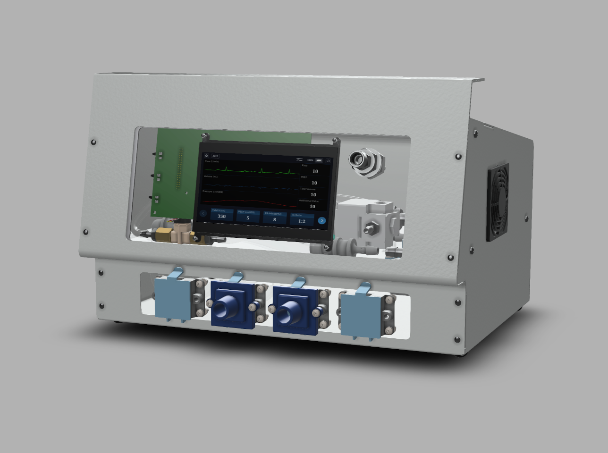

# RespiraWorks Open Source Ventilator

This is a common repository for all hardware and software components of the RespiraWorks open source ventilator.

**If you intend to contribute, please read our [wiki](https://github.com/RespiraWorks/Ventilator/wiki).**

[RespiraWorks](https://respira.works/) is a 501(c)(3) non-profit organization with over 200 contributors worldwide
working to rapidly develop, manufacture, and deploy a low-cost and open-source ventilator for communities underserved
by the global supply chain.

| Next prototype rendering    | First enclosed prototype in India    |
|:---:|:---:|
| |   |

## Design Vision

We are dedicated to making this ventilator:
* fully open source (software and hardware)
* affordable (materials cost under $2000)
* fully featured for extended clinical use through weaning and recovery
* regulatory-approved or filing-ready in multiple regimes around the world
* optimized to side-step constrained supply chains for specialized medical components
* clinically useful beyond the pandemic

Most low-cost ventilator designs that have emerged in light of the COVID-19 crisis tackle the 'bridge' problem —
keeping a patient alive for 6-8 hours of closely monitored care until they can be transitioned to a full
ventilator. We aim to design that full ventilator, which is a highly valued medical device critical to care beyond our
current crisis.

Our design will provide essential features such as an intuitive, localized user interface, adaptive pressure- and
volume-based operating modes, fine control of oxygen concentration, High Flow Nasal Cannula and other advanced features.
What sets us apart from other similarly ambitious projects is our dedication to being fully open source. This repository
embodies that promise.

We plan on targeting middle- and low-income parts of the world that will deal with COVID-19 for longer, with less access
to healthcare, and a larger deficit of medical devices. RespiraWorks provides solutions for these communities where
existing manufacturers cannot.

The maturity of our design is attested to by our collaboration with [Foundry-M](http://www.foundrym.in/), a startup
in Visakhapatnam, India. We are working closely with our colleagues in India to adapt this design to their local
manufacturing capabilities and regulatory needs.

## DISCLAIMER

**This is an incomplete, as yet untested design that is not yet intended to be used on patients.**

**This repository contains live documents. There are duplicate and alternative items for undecided aspects of the
physical design. Components may or may not connect and integrate as intended. Contents may also be out of date. If you
decide to buy or build anything, do so at your own risk.**

## CoVent Documentation

Our ventilator placed 3rd in the [CoVent-19 Challege](https://www.coventchallenge.com/) in late June 2020.
Some comprehensive documents denoting the current state of the ventilator design were created for this competition.
Links to key documents follow. Some of this may be more detailed than the documentation contained in the repository.
In time, this information should be transferred to the repository as plain text.

* [Design Overview document](design/assets/covent-june-2020-design-overview-document.pdf)
* [Progress Status Report](design/assets/covent-june-2020-progress-status-report.pdf)

## Repository Structure

* [**System Requirements**](requirements) -
  describes the requirement architecture, hierarchy, and process. Links to the releases of our system requirements, hardware specifications, and software requirements.
* [**System Design**](design) -
  describes the functional implementation and design theory of the system. This document also defines the hierarchy for the subsystems below.
    * [Design Rationale](design/design-rationales.md) - An explanation of the rationale that went into specific parts can be found here.
    * [Pneumatic System](design/pneumatic-system)
    * [Electrical System](design/electrical-system)
* [**Manufacturing Design**](manufacturing)
    * [**Pizza build**](manufacturing/pizza_build) - instructions for assembly table-top prototype for development/testing purposes
    * [**Enclosed build**](manufacturing/enclosed_build) - evolving design of the enclosed ventilator approaching the final product
    * [Venturi](manufacturing/venturi) - custom flow sensor
    * [Pinch valve](manufacturing/pinch_valve) - custom valve for air flow control
    * [Filter holder](manufacturing/filter_holder) - for integration of HEPA filters
    * [Blower assembly](manufacturing/blower) - provides pressure
    * [Characterization Test Plan](manufacturing/characterization-test-plan.md)
* [**Main Circuit Board**](pcb) - design, materials, assembly instructions
* [**Software**](software) - Source code for cycle controller and user interface; debug tools, test scripts and test data
* [**Quality Assurance**](quality-assurance) - quality assurance strategy
    * [Testing](quality-assurance/testing) - testing setups, plans, data
