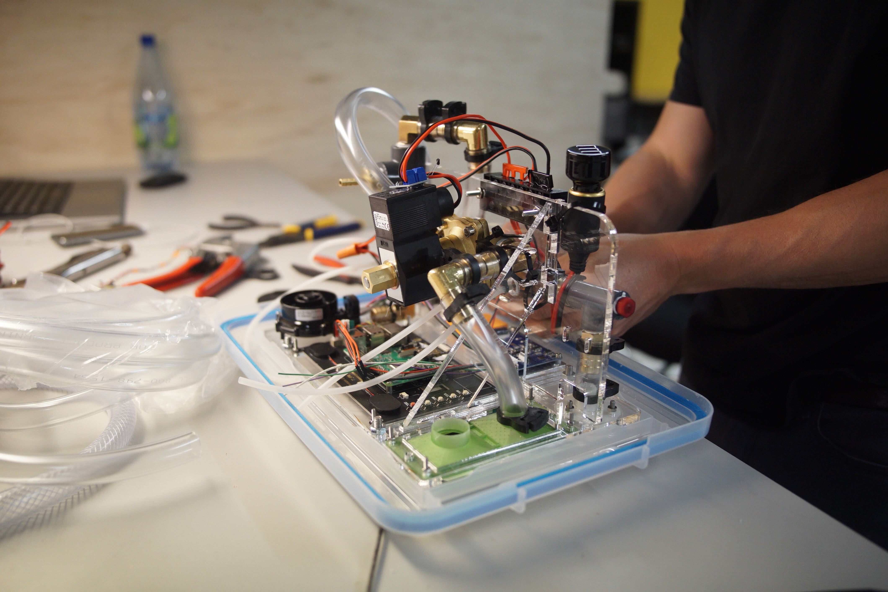

# RespiraWorks Open Source Ventilator

[RespiraWorks](https://respira.works/) is a 501(c)(3) non-profit organization with over 100 contributors worldwide working to rapidly develop, manufacture, and deploy a low-cost and open-source ventilator for communities under-served by the global supply chain.

## Design Origin

Most low-cost ventilator designs tackle the 'bridge' - how to keep a patient alive for 6-8 hours of closely monitored care until they can be transitioned to a full ventilator. However COVID-19 patients require lung-protective adaptive ventilation strategies, and require ventilator support for days to weeks.

Early in the crisis, we realized that the ventilator designs that could be completed in weeks might not be necessary, and if so, a more feature complete ventilator would be needed. As we started working on that, we realized that this was a market need unmet by the established ventilator market. Despite constant developments in the disease progression, we realized that a true-open source ventilator, with transparant requirements, design history documents, and yet still optimized for low-cost and ease of manufacturing would enable expanded global access to a critical piece of medical equipment.

Our ventilator exists between the short-term ambu-bag actuating designs and the commercial ventilators offered by established manufacturers. It provides essential features such as a graphical user interface, adaptive pressure controls, and fine control of FiO2, oxygen, and PEEP, with CMV, SIMV, PSV and PRVC operating modes. Unlike tranditional ventilators, our design work is being completed as fully open-source design, yet still with an IEC-conformant quality process, and an optimized BOM for sourcing and manufacture worldwide.

Our target is not the US or Europe, but the middle- and low-income parts of the world that will deal with COVID-19 for longer, with less healthcare, and a larger deficit of medical devices. RespiraWorks provides solutions for these communities where existing manufacturers cannot.

## DISCLAIMER

**This is an incomplete, as yet untested design that is not yet intended to be used on patients.**

**This repository contains live documents.
There are duplicate and alternative items for undecided aspects of the physical design. Components may or may not connect and integrate as intended.
Contents may also be out of date. RespiraWorks may, or may not compensate you for parts you purchase. If you decide to buy or build anything, do so at your own risk.**

## Repository Overview

* This repository tracks the physical design of the RespiraWorks open source medical ventilator. 
* The physical design encompasses everything that is not software run on the device, from the pneumatics, to the mechanical design, bill of materials, and circuit diagram. 
* The software repository can be found below and linked from within the system design. 

### Structure

  * [System Requirements](system-requirements.md) -
  describes the requirement architecture, heirarchy, and process. Links to the releases of our system requirements, hardware specifications, and software requirements. 
  * [Ventilator System Design](ventilator-design) -
  describes the functional implementation and design theory of the system. This document also defines the hierarchy for the subsystems below.
      * [Design Rationale](ventilator-design/design-rationales.md) - An explanation of the rationale that went into specific parts can be found here. 
      * [Pneumatic System](ventilator-design/pneumatic-system)
      * [Electrical System](ventilator-design/electrical-system)
      * [Software (separate repository)](https://github.com/RespiraWorks/VentilatorSoftware)
  * [Research & Development](research-development)
      * [Project: Fan](research-development/project-fan)
      * [Project: IAV Air Control](research-development/project-iav-air-control)
      * [Project: Pinch Valve](research-development/project-pinch-valve)
      * [Project: Venturi](research-development/project-venturi)
      * [Characterization Test Plan](research-development/characterization-test-plan.md)
  * [Quality Assurance](quality-assurance)
      * [Testing](quality-assurance/testing)
  * [Prototype Assembly](ventilator-build)
      * [Alpha Build Instructions](ventilator-build/alpha-build-instructions) -
         documentation for building the "Alpha" version of the device which can be used by developers to contribute to the software. Note that this is almost always out of date, by definition.
      * [Beta Build Plan](ventilator-build/beta-build-instructions) - Details on this page will be fleshed out once as we progress further into beta build. 
  
