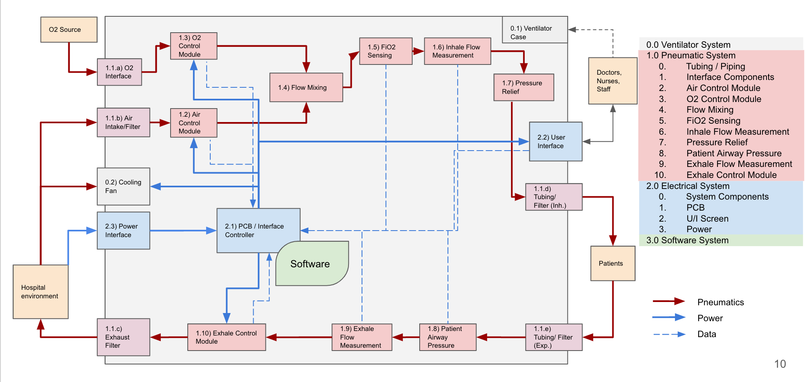

# System Design

This section of the repository contains the description of ventilator design implementation and closure of issues which
apply at the system level, such as architecture configuration.

## Design Motivations

When approaching the design for the ventilator, we learned some features cannot be sacrificed if our ventilators were
to have a lasting impact for communities in need of advanced life support equipment. There are numerous avenues,
however, to reduce cost through tuning the performance specification to targeted use cases. This includes the ability
to ventilate high resistance, low compliance lungs at small tidal volumes and high respiratory rates. Our design can
significantly reduce the delivered cost of such a device by
1. reducing some performance requirements
2. developing software under a crowd-sourced model
3. not charging licensing or royalty fees.

The design has focused on a pneumatic implementation, where possible to avoid mechanical complexity (bellows, actuators,
etc), thereby placing more of a burden on the electrical and software design. This is informed by our experience that a
deep expertise of electronics is more globally prevalent than similar expertise in mechanical engineering. The device is
intended to be manufacturable by facilities that manufacture consumer electronics, automotive parts, refrigerators, or
other similar manufacturing entities near to the point of use. This approach allows flexibility in selecting
manufacturing partners who are supported from the engineering side by our globally distributed team of volunteer
engineers and manufacturing-quality professionals. To enforce this process, the design strives to identify solid supply
chain alternatives for each component and choose components that are easily sourced in our targeted regions of use,
such as Guatemala, India, Kyrgyzstan, or Nigeria.

The custom case, sensors, and valves are designed to use injection molded, laser cut, or sheet metal folded parts that
then require only basic tools to assemble, making them amenable to any number of manufacturing facilities around the
world. The chosen purchased components are readily available through global markets, including automotive supply
chains (e.g. valves and pressure sensors) and factory/warehouse supply chains (e.g. blower, tubing and pipe fittings).
The control and graphics board is designed around a custom PCB, but assembled using hand-solderable components if a
turnkey PCB supply chain were not available (though practically this would likely not be feasible from a QA perspective).

## High Level Design

The RespiraWorks Ventilator has four major subsystems with tightly
coupled interfaces:

1. [pneumatic system](pneumatic-system)
2. [electrical system](electrical-system)
3. [software system](../software/design) (documentation in code directory)
4. [mechanical assembly](mechanical) to enclose the device and provide structural support.

**#TODO:** Introduce all subsystems properly

The diagram below shows the conceptual interactions between the
pneumatic and electrical systems, with software running on both the main
controller (STM32) and a second independent graphics computer (Raspberry
Pi 3+/4) controlling the User Interface.

The following sections walk through this in more detail and explain the
basis for the design selection of various components.

Ventilator Functional Block Diagram
([source](https://docs.google.com/presentation/d/1ye96itSLfdbO9PQT0MSiq6xR2ArqD2MpV1Wj8ORfHeo/edit#slide=id.g7330d84036_1_0))

## Other Documents

* [Design rationales](design-rationales.md)
* [Concept of Operations](conop.md)
* [Systems modeling in Modelica](modelica.md)
