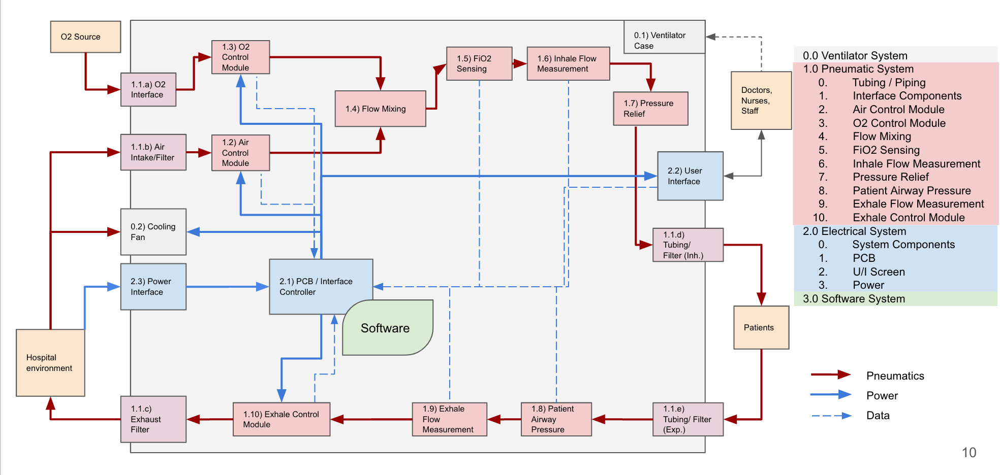

# RespiraWorks Ventilator Concept of Operations (conop)

## Purpose

- Build a common understanding of ventilator internal operation amongst different parts of the team.

- Caution: this document has not been formally reviewed and is a work in progress. Be responsible to understand the provenance of documentation.

## Document Content

- Summary of key constraints
- Understanding of current intra-breath cycle control for the development (“Pizza”) board.
- Preliminary description of system operation for next iteration of system with O2 mixing
- Envisioned Inter and Intra-breath cycle control states
- Open questions / points to resolve.

## Functional Diagram

## “Pizza Build” Intra-breath Cycle Control

The Alpha system flow path is:
- Fan
- Air Valve (not on current pizza build)
- Tee <-> Test Lung
- Exhale valve
- Exhaust

The Alpha build (first iteration) did closed loop control on the blower speed and setpoint control on the exhale valve state to achieve the desired target pressure. However, this left significant shortfalls in both pressure rise and pressure reduction times.

The intra-breath control cycle for the Alpha build is:
- **Inhale:**
Increase pressure set point for closed loop control to PIP pressure
Exhale moves to exhale position (fully closed)
Controller adjusts blower speed based on PID control closed around the measured patient pressure
PIP pressure target is maintained for a specified amount of time - then step transition to exhale
- **Exhale:**
Exhale valve moves to exhale position (fully open)
Controlled adjusts pressure set point for closed loop control to PEEP pressure - controller adjusts blower speed to meet PEEP.
PEEP pressure target is maintained for a specified amount of time - then transition back to inhale

Alpha build has no inter-breath or “adaptive” control on top of this.
