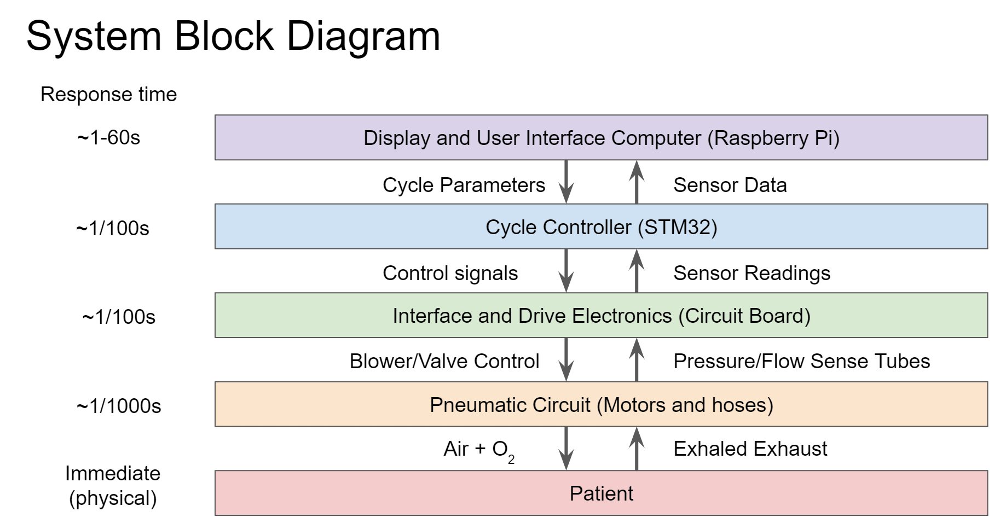
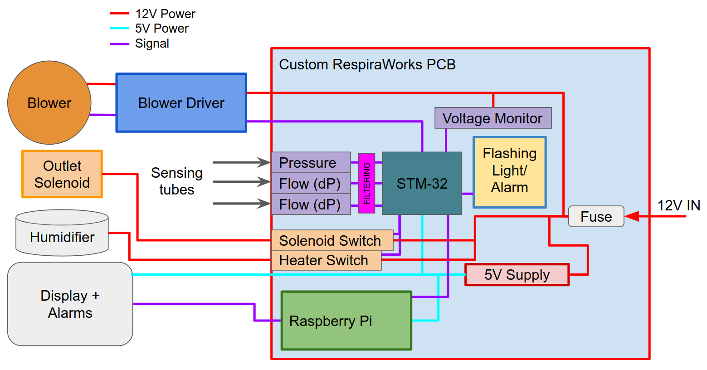

# Electrical Design

**TODO:** update electrical circuit diagram to reflect current design

The electronics system provides power to the ventilator, real-time
control of its sensors and actuators, safety protections and alarms, and
a user interface for delivering information and controlling the
parameters of its operation.

As with the pneumatics system, the electrical system is designed to be
amenable to global supply chains, be low cost, and yet be robust and
reliable.

## Computing Architecture

A dual-computer architecture was selected.  There is a Cycle Controller
based on STM32 that handles the real-time control of the ventilator’s
sensors and actuators.  Connected to this is a UI Computer based on a
Touchscreen, Raspberry Pi 4, and Linux to provide the user interface.
 This design allows us to delegate the most critical functions to a
simple design that can be reasonably reviewed and tested in its
entirety, while also allowing enough complexity in the UI Computer to
provide a comprehensive user interface.

The division of responsibility between the two computing elements is
divided roughly by the immediacy of a potential failure.  For the class
of operations in which a potential failure could result in a hazard too
quickly for reasonable human intervention, the Cycle Controller is used.
 For the class of operations in which a potential failure can reasonably
be addressed by human interaction in a reasonable amount of time given a
timely alarm, the UI Computer is used.  This design also allows for
self-checking between the two computing elements to mitigate
single-point failures.

The STM32 microcontroller was selected because it is more powerful than
Arduinos or similar popular microcontrollers, but it is still cheap,
widely available, well-documented, and has extensive debugging tools.
The STM32 is proven to be a reliable medical electrical component and
has a diverse I/O set for pneumatic and mechanical control.  The
operation of the Cycle Controller is kept as simple as possible to
facilitate comprehensive review, test, and verification of its function.

The Raspberry Pi was selected as the UI controller for its wide
compatibility with existing human-machine interfaces and robustness to
supply chain shock. The Raspberry Pi also enables rapid software and UI
development by supporting a Linux-based operating system and the common
HDMI interface. It supports remote monitoring, as well as automated
testing, through its wired and wireless network interfaces.  While
powerful and flexible, the complexity of its operating system means that
real-time control cannot be sufficiently guaranteed or verified.  Hence
all time-critical operations, such as ventilator pneumatic control, are
handled by the STM32.

A serial communication link using checksums to ensure data integrity
provides reliable communication of settings and data between the two
computing elements.

Each computing element has its own alarm system as well as a watchdog
timer.  If either computing element becomes non-responsive, the
watchdogs will put it into a safe state and restart it.  The UI Computer
monitors the Cycle Controller and vice versa, and will issue an alarm if
the other stops responding.  Each controller can trigger an audible
alarm system independently, and the UI controller can display alarms
visually as well.  The motherboard features bright LEDs in 3 colors to
provide visual alarms independently of the touchscreen interface.  The
Cycle Controller and UI Computer each have independent control of their
own set of bright red, yellow, and green LEDs.  Due to an error in the
motherboard design, the Cycle Controller only has command of the red LED
in its set.  This will be fixed in a future revision.

A custom motherboard has been designed to host both the UI Computer and
Cycle Controller, as well as all the required communication, filtering,
safety protections, sensors, motor drivers, and power supplies.  This
improves both the manufacturing assembly and the electromagnetic
immunity of the electronics.

All mainboard design files are maintained in this repository
in the [../../pcb](../../pcb) directory.

Wiring materials and assembly guide on [this page](../../manufacturing/wiring).

## Closed-Loop Pneumatic Control

All key elements of the pneumatic system are controlled by electronics.
The WS7040 blower features its own driver, which is powered by 12VDC
controlled by the motherboard with a PWM signal. The
RespiraWorks-designed proportional pinch valves are driven by stepper
motors, which are controlled by powerSTEP01 stepper driver ICs. The
powerSTEP01 is available in a daughterboard compatible with the STM32
developer module - this synergy enables rapid hardware and software
development around controlling airflow, and provides a proven electronic
design for integration into the next motherboard revision.

The differential pressure (dP) sensors that monitor inhale/exhale flow
rates are board mounted as well. These are automotive differential
pressure sensors which are cheap and widely available in large
quantities worldwide.  They monitor the pressure difference across the
two venturi-based flow sensors as well as the delivered patient
pressure.  They output an analog electrical signal which is filtered and
conditioned on the motherboard and delivered to the STM32 Cycle
Controller.  They are pneumatically connected to the venturis by 2.5mm
flex tubing.  In the case of the single-ended pressure measurements only
one of the two pressure ports is connected by 2.5mm tubing, and the
second port is referenced to atmospheric pressure.

The oxygen supply is controlled by a proportional solenoid.  The
motherboard features two high-current MOSFET switches fused with
resettable thermal fuses and protected by flyback diodes for operating
inductive loads.  These switches are capable of fixed on/off control or
proportional PWM control of a 12V load.  One of these switch channels is
used for the proportional solenoid.  The other channel is uncommitted
and can be used for a future feature, such as humidifier heating
control.

For future expansion of features, the motherboard also provides 4
powered I2C ports that can be configured for 3.3V or 5V operation.
 These can be used to command actuators, read sensors, or interface with
other supporting devices such as an external humidifier or
uninterruptible power supply (UPS).

## Power Supply Design

An early decision during the electronics design was to standardize the
input voltage to 12 VDC. This enabled rapid prototyping around the
WS7040 blower and driver. Using 12VDC enables the use of
widely-available sealed lead-acid security system batteries or
automotive batteries as a backup or primary power source in field
hospitals. 12VDC is also a common battery standard and there exist
60601-1 compatible wall adapters for operation in a more conventional
medical facility.

The custom motherboard features DC/DC converters to supply and regulate
the logic voltages for the on-board electronics.  In the next iteration
of the motherboard, backup batteries shall be present for supplying
emergency shutdown alarms (when both mains and backup battery are absent
or depleted) as well as providing real-time clock support for
monitoring, diagnostics and logs.

## Human-machine Interface

A 7-inch capacitive touchscreen is selected as the primary user
interface. This is a color display capable of receiving user input and
refreshing data with 50 ms latency.  Both the display and the integrated
speakers are operated through the HDMI interface of the UI controller.

The cycle controller has access to its own dedicated audio system. This
is a simpler piezo buzzer, driven by a square wave signal and capable of
the required output volume. The buzzer and LEDs provide a secondary
emergency interface in the event of a touchscreen failure.
