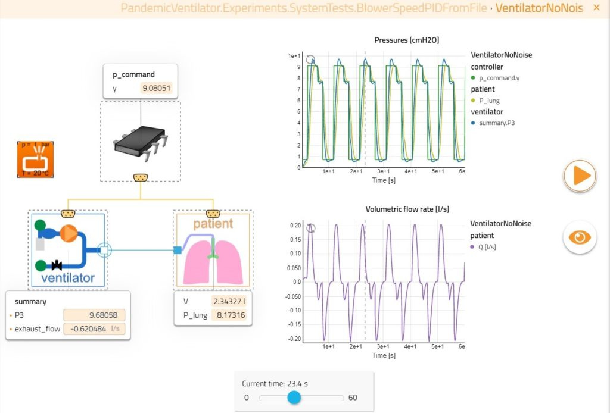
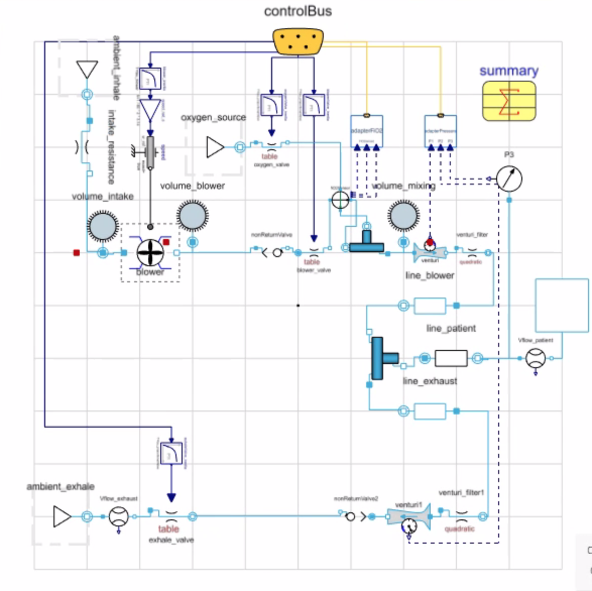
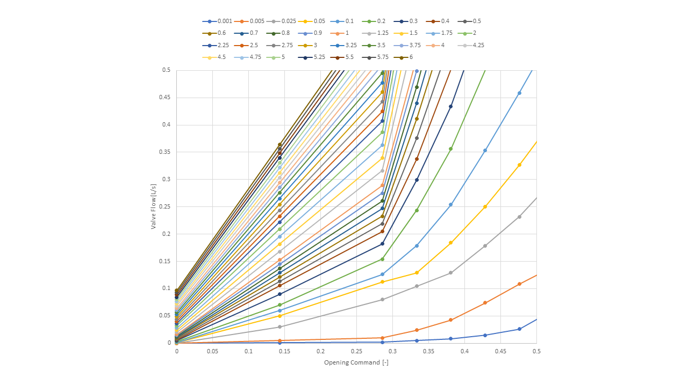

# Modelica Simulation Model

## Modelica Overview

Modelica [www.modelica.org](http://www.modelica.org)
is a non-proprietary, object-oriented, equation-based language used to model complex multi-domain physical systems.
Developed by the non-profit Modelica Association, the Modelica language is widely used in industry for modeling physical
systems with mechanical, electrical, pneumatic, hydraulic, thermal, control, electric power, and process-oriented
components.  With Modelica, models can be built from the open source Modelica Standard Library (the largest free library
for multi-domain models), other open source libraries, commercial libraries, and custom in-house libraries to leverage
existing modeling technology while providing the openness and flexibility to incorporate custom modeling IP.

Modelica is used for modeling the dynamic behavior of technical systems.  Models are described by differential,
algebraic, and discrete equations.  Modelica physical models are acausal and allow the creation of reusable primitive
components, subsystems, and complete systems.  To illustrate a simple Modelica model, the figure below shows the
graphical representation and Modelica code for the 1D rotational inertia from the Modelica Standard Library.  Modelica
models are written as equations, typically in standard text book form, that express relationships between variables.
Since Modelica models are descriptive but not necessarily programmatic, a Modelica tool is needed to generate executable
code.  The entire process starting from Modelica code to a simulation result is shown in the figure below. A Modelica
compiler assembles the Modelica code, performs symbolic manipulation on the equations, generates C code, and compiles
the C code into a simulation object that is linked with a numerical solver that executes to generate the simulation
result.  Both open source and commercial compilers are available for Modelica.  With the powerful symbolic processing
from a Modelica compiler, modelers are free to focus on developing high quality models for systems engineering rather
than numerics and equation solving.

## Model Overview

For the ventilator work, we partnered with Modelon, who provided licenses for a beta version of their commercial
Modelica tool Modelon Impact [https://www.modelon.com/modelon-impact/](https://www.modelon.com/modelon-impact/).
Modelon Impact is a fully featured Modelica development and simulation environment integrated into a web browser.
Modelon Impact is designed to enable system simulation beyond just CAE experts and facilitate collaboration and
model-based engineering.

Modelon helped us to develop a package of models to support the ventilator physical system and controls development.
These models are based on Modelon's Pneumatics Library, a commercial library for modeling pneumatic systems.  Modelon
continues to develop the ventilator modeling package in partnership with RespiraWorks.

As shown in the figure below, there are three main parts of the model: the controller, the ventilator, and the patient.
The beauty of modelon impact is that it lets you easily swap in different instances of each of the components and see
how that affects your results. Below we'll walk through how each of these were created.

Screenshot of Modelon Impact Showing The Model GUI

### Patient

There are currently three main different patient models. The first is a basic model that allows the user to specify a
resistance and compliance and then calculates the internal volume and pressure based on pressure and flow rate from the
ventilator. The second is a breathing model that allows a respiratory rate, IE ratio, and a musculatory pressure to be
specified, controlling both how quickly and how forcefully the simulated patient breathes. There is also a more advanced
lung model that incorporates more parameters to enable more complex simulations, though we have not used this model
extensively yet.

### Ventilator

 Current Ventilator Model in Modelica

As the ventilator design has changed, there have been many iterations of the ventilator model in modelica. The most
recent one is shown in the figure below, where you can see the oxygen leg with oxygen source and ox valve, the air
inhale branch with blower and pinch valve, the patient circuit with venturis before and after, and the exhale leg with
the exhale pinch valve. The control signals from the controller enter through the control bus at the top and are then
routed to the actuators (blower and 3x valves), and the pressure measurements are passed back to the controller through
the same control interface.

Each component is built up using the modelica language. The components in this ventilator model are a combination of
default modelica components and components created specifically for our ventilator. The blower component, the
proportional pinch valve components, and the oxygen valve components are based on test data and data sheets for the
actual hardware we are using. An example of the flow curves inside the modelica model for the custom proportional pinch
valves are shown below. Similar curves were created for the blower and the oxygen valve.

Flow Curves for Custom Proportional Pinch Valves Used Inside Modelica, Based on Flow Testing. Valve flow vs opening
command with different curves for DP across the valve.

### Controller

We explored two different ways of implementing a controller in Modelica. The first was to build the controller in
modelica, using components based in the modelica language. The second is to write a controller outside of modelica
(e.g. in C++) and to then link it through the modelica interface. The first approach allows rapid interaction for those
who are less familiar with how to implement controllers in software; this allowed us to prototype different controller
configurations before we actually had the hardware set up to test them with the real system. The second approach could
be useful for testing the controller software without being constrained by hardware, something that is discussed in the
next section.

### Executing The Model

When the model is run, the various components begin in their initial state. The tool then steps forward in time,
calculating both the commands from the controller and the corresponding response of the system at each time step,
solving the various underlying equations to calculate pressures, flow rates, etc. The results can then be visualized to
see how the system performed over time.

## Comparing Model to Hardware

Currently, we are working to verify that the model matches what we see with hardware. This has been challenging for a
few key reasons:

*   Rapidly changing controller code that hasn't been integrated into the modelica model. This makes it difficult to
    tell if differences between results from the model and the hardware are because of issues in how the hardware is
    modeled, or differences in the commands coming from the controller, which affects the system response.
    Unfortunately, the structure of the controller code has also been changing, which means that this isn't completely
    solved by using the external controller.
*   Rapidly changing hardware that has not been completely characterized. As we iterate on the hardware design, we have
    been changing components faster than we've been able to collect characterization data with which to anchor our
    modelica models.

Moving forward, we are evaluating ways to anchor the modelica model to give us more confidence in its predictive
capabilities.
