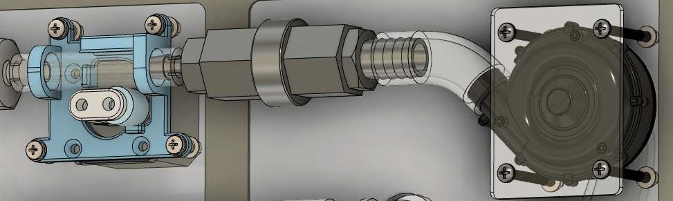
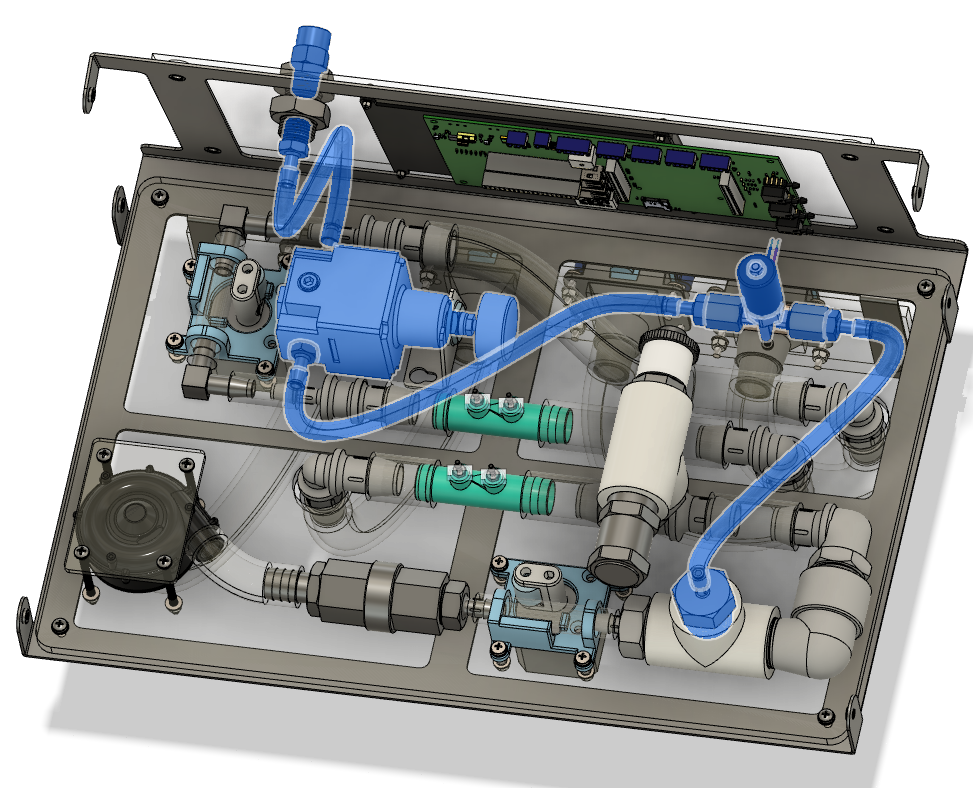
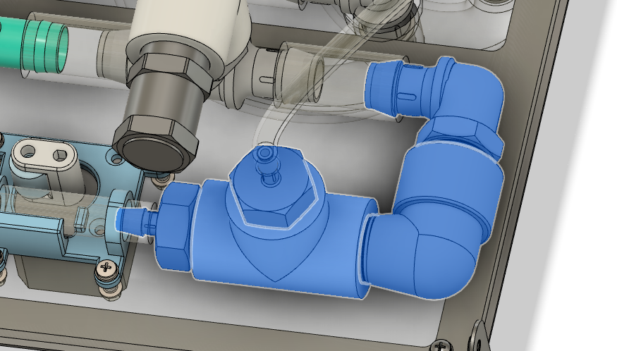
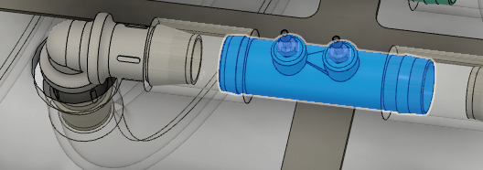
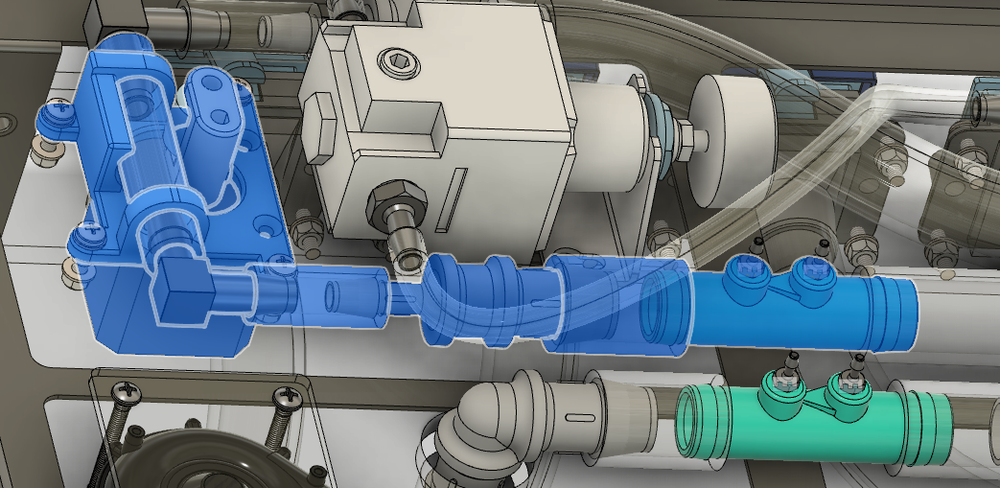

# Pneumatic Design

**TODO:** Move stuff into subdirectories

**TODO:** Cross-link to manufacturing and other docs

## Physical Block Diagram

The figure below displays the physical pneumatic layout of the system.

## Control Block Diagram

### Rev 0.3 (Current)
- The current pneumatic control system (Ventilator Rev 0.3) is based on a single closed-loop pressure control around the patient pressure sensor, commanded by a state machine, with blower pinch valve, exhale pinch valve, and oxygen PSOL as actuators.
- Overall structure is OxygenLoop(PressureLoop(Actuator)).
- A flow sensor observes the combined air and oxygen flow to the patient and provides an estimation of the tidal volume.
- A slow outer loop controls the oxygen mix based on the O2 sensor.

### Rev 0.4 (Proposed)
- The proposed control starting with Ventilator Rev 0.4 adds a separate flow sensor for air and oxygen input.  Overall structure is Pressure Loop -> Flow Command -> Actuator. Flow becomes controlled instead of merely observed.
- Overall structure is OxygenLoop(PressureLoop(FlowLoop(Actuator))).
- Air and oxygen limbs will each have their own closed-loop flow controller, with the blower pinch valve and oxygen PSOL as actuators.
- The flow commands to these inner loops, as well as to the exhale pinch valve, come from an outer loop pressure controller which is closed around the patient pressure sensor.
- The pressure command to this outer loop comes from the state machine.
- FiO2 is controlled by a slow, outer-most control loop that changes the ratio of mixing between air and oxygen flow commands, and is closed around the oxygen sensor.

## Overview

Oxygen is supplied from an external pressurized source to the oxygen
port. Air is drawn in by the blower from the ambient room air.  The
device can also operate without an external supply of pressurized oxygen
in the event of supply shortages, (delivering only 21% FiO2).

### Air Path

Air is drawn in by the blower through a replaceable HEPA filter and
pressurized for use within the system. The blower maintains a relatively
constant speed and is open-loop controlled. The capability to  control
the fan speed to conserve power and increase response time has not been
incorporated in the current release. After leaving the fan, the
pressurized (5 kPa) air passes through a check valve included to prevent
oxygen backflow into the blower, as the blower is not rated for oxygen
duty and could present a fire risk. Following the check valve, a
proportional pinch valve regulates the downstream airflow. It does this by
adjusting the cross sectional area of the flow path in the tubing
built-in to the pinch-valve.

### Oxygen Path

The oxygen circuit is fed from an external oxygen source, with a
built-in regulator to step the pressure down to a pressure low enough to
allow it to be controlled by a 12V proportional solenoid (PSOL). The
design oxygen pressures at the inlet are 440 kPa - 120 kPa. The highest
pressure connection that is allowable is set by the capability of the
regulator, which cannot be used at a pressure higher than its rated
pressure. The minimum pressure is set by the orifice size in the PSOL.
With a supply pressure below the PSOL minimum, it cannot generate
sufficient flow to the patient.

A check valve prevents contamination of the hospital oxygen system.
Oxygen flow to the patient is controlled by the PSOL, whose orifice size
is controlled by a variable pulse-width signal. Currently, the PSOL is a
small automotive solenoid, which is not qualified for oxygen
duty, though it is functionally suitable
for development. Identifying a more reliable oxygen injection method is
a high priority for improving the design. It is the understanding of
RespiraWorks that the current PSOL is capable of being oxygen cleaned,
and it enables fine control and rapid development (assuming) they can be
sourced. As such, it has been included in the design.

### Oxygen and Air Mixing

The oxygen and air streams are mixed in the patient tubing without a
dedicated oxygen blender; instead, the oxygen blending function is
provided by proportional control of the two input streams. A galvanic
cell oxygen sensor is used to measure the oxygen content as the gasses
mix and provide feedback to the controller to calculate, display, and
enable closed-loop control of FiO2.

### In-flow Measurement

After mixing, the combined gasses pass through a venturi
differential-pressure flow sensor, where the flow rate of gas delivered
to the patient is measured. This gas passes a medical-grade anti-viral
filter upon exit from the machine for protection against viruses,
bacteria, or other foreign material. If these filters are not available,
the device also includes the capability to add an inline HEPA filter in
the panel mount for the tubing. This feature was included due to the
difficulty sourcing medical viral filters and the desire to support
additional options.

The patient circuit utilized by the ventilator is an ISO 5356-1 standard
22mm female dual limb circuit which interfaces to male ports on the
ventilator. If a humidifier, HME, or other device is used, these are
connected to the patient inhale or exhale circuit, as appropriate.

### Expiratory Limb

On the expiratory path, the exhaled gas returns to the ventilator via a
medical-grade anti-viral filter. This filter captures
droplets exhaled by the patient. This reduces the possibility of machine
contamination and dispersal of aerosolized virus from escaping into the
local environment. The expiratory flow rate is measured by a flow meter
similar to the one used on the supply side.

### PEEP Control

Following exhale flow measurement, another proportional pinch-valve is
used to set PEEP.

Air exiting the machine is processed through a final HEPA filter to
provide an additional safety factor for staff protection.

## Fan Selection

A key decision was made early on to use a blower (rather than a
pressurized oxygen source and control valve), to deliver patient air.

WS7040 fan with air intake assembly

The rationale for use of a blower in general, and this blower in
particular, had a few bases. First, using a blower (rather than
compressed air) allows the device to provide emergency ventilation with
only a relatively small power supply (around 50W continuous). This
allows the device to be portable and makes the device amenable to use in
field hospitals or mass casualty incidents where providing compressed
air or compressors can be challenging at scale. The blower selected is
also a common CPAP blower rather than a high performance ventilator
unit.

This allows the use of an easily achieved blower performance
specification, reduced cost and increased supply chain resilience.

However, selection of a CPAP blower does come with drawbacks—the blower
is not rated for oxygen duty and the pressure response of the blower is
slow, with a time constant some 1500 ms longer than comparable blowers
in ventilators. This led to the development of a high-flow, long-life
proportional valve, discussed in a subsequent section.

By placing oxygen mixing after the blower and using a check valve to
prevent backflow, the design ensures that the blower will never see high
oxygen concentrations.

Additionally, based on medical feedback, the delivered patient pressure
is no more than 60 cm H20. It is common for ventilators to specify
higher in order to ensure adequate ventilation for highly resistive
airways . Adopting this lower pressure spec allows the ventilator to
provide a pressure range that is most often needed, while avoiding
significant cost. It is compliant with 80601-2-12 and all specifications
reviewed for Covid-19 ventilators.

## Dual Limb Patient Circuit

The ventilator uses a dual limb patient connector (i.e., flow is sent to
the patient in one tube, and returns in a second). The flow is always
one way, starting from the device going to the patient, and returning in
a second limb. The other option is a single limb design, with an exhale
valve at the patient side.

A dual limb design was selected to allow for mechanical PEEP control, as
discussed in the next section.

Note as well that there is no check valve between the mixing volume and
the patient. Backflow is prevented through two means. First, there are
two check valves upstream of the tee, and no exhaust ports between the
tee and the patient, so gas can only flow back into the ventilator as
much as compressibility allows, which is not significant.
Second, even when fully closed, the
inhale proportional valve allows a small leakage (bias) flow through the
device, ensuring that, as long as the device is on, flow should never
enter the ventilator through the inhale port.

In a survey of suppliers, very low-cracking check valves (i.e. duckbill
valves) that were available in an inline configuration were not common.
The one that was tested had significant flow resonances at low
velocities which interfered with volume sensing. The present approach
uses no medical check valves. Normal (i.e., high-cracking) check valves
can be used on the air and oxygen lines.

## PEEP control

One of the differentiating features of the RespiraWorks pneumatic
circuit is the use of a controlled mechanical valve to maintain PEEP,
rather than a traditional passive PEEP valve. This decision was made
early on for several reasons. First and foremost, early in the pandemic,
PEEP valves were essentially unavailable and so they were not available
for prototyping, but also implied they might not be available for some
time. PEEP valves are effective, and so the option to design a new PEEP
valve, or base a valve on other open source designs was explored.
However, calibrating the spring constants proved to be a challenging
manufacturing process. Generally these types of passive PEEP valves are
considered disposable and so don’t experience long term use. This led to
concerns about long-term use of these PEEP valves as the spring
constants change with time/wear, motivating our incorporation of the
controlled solution.

Incorporating a controlled mechanical valve also provides the ability to
fully close the airway during inhale, thus preserving oxygen and
improving the response time of the inhale circuit.

Finally, the use of a controlled valve allows the device to adjust
settings based on user input, rather than requiring staff to
mechanically adjust the ventilator.

A fail-open valve also
prevents the need to include a separate valve for anti-asphyxia
protection, though this is still being evaluated with respect to the
hazard assessment..

The separate question has been raised of why not to use a pilot actuated
valve, either using patient pressure or a small proportional solenoid.
This was avoided entirely for sourcing considerations and was decided
early in the pandemic; this could be re-evaluated for future iterations.
In general, the pilot operated valves, such as those from Philips and
Galemed, were deemed a risk for countries without existing supply chains
to those manufacturers. The device seemed difficult to safely
re-engineer.

## Custom Proportional Pinch Valves

The design process for the entire ventilator started with a desire to
avoid custom components at all costs. However, after an exhaustive
search of valves, control methods, fans, and spare ventilator parts, it
was decided that a custom valve was the only option that would allow the
design to achieve targets on cost, supply chain, and features for
expiratory flow control. This decision was undertaken considering the
significant quality and qualification burden required for custom parts.

A rapid pressure swing on the inhale is required to provide ventilation
to low compliance lungs at a high respiratory rate, which was to that
point impossible using closed-loop control of the fan
alone.

The design originated by trying to tackle the PEEP problem as discussed
above. A design was specified in order to maintain a variety of
different PEEP levels and to avoid significant wasted flow during
inhale. In the process of development, it was realized that the same
design could also be used to provide a rapid pressure swing on the
inhale flow, in addition to exhale.

One of two pinch valves in each ventilator (early model)

The general operating principle of the pinch valve is to use a
high-torque stepper motor to rotate a cam/rotor onto peristaltic pump
tubing. The cam pinches the tubing against a platform affixed to the
base. Other than the interior tubing, the valve assembly never comes
into contact with the gas stream. The highest wear portion of the design
is the tubing itself, which can be replaced for less than 1 USD when it
must be replaced.

One option explored, not currently implemented, is to
provision the device and arrange the components with an extra length of
tubing (not shown above) such that it can be fed through the valve over
time; pushing the extra from upstream to downstream of the valve and
changing the wear point. This maintenance operation will extend valve
lifetime significantly and should be able to be performed by hospital
staff in addition to maintenance technicians.

Life-leader testing is currently underway to demonstrate the ultimate lifetime of
the valve; though it will take time to accumulate. As of submission of
this proposal, the valve has been running at a 200% duty cycle for 21
days continuously. Further information on life leader testing can be
found in the 01-02 Progress Status Update.

An additional advantageous feature is that the valve is closed through a
stepper motor which does not maintain its state when power is lost. The
elastic modulus of the tubing, coupled with the fact that the rotor can
not reach a "locked" position is sufficient to force the valve open if
the power fails—the
valve is normally open, and allows the exhale valve to also function as
an anti-asphyxia pathway.

The pinch valve itself is built from relatively simple components,
discussed in more detail in 05-01 05-01 Production Methods for Custom
Components.

## Proportional Solenoid

Proportional solenoids (PSOLs) are used in many applications (including
other ventilators) for precise, rapid control of high pressure gases.
The major factor arguing against the use of a PSOL in the RespiraWorks
ventilator is that PSOLs with applicable characteristics are, almost by
definition, produced for ventilator use, with an associated limitation
on cost and availability. While some are available outside this market,
those are typically not designed for use with high-pressure oxygen. High
pressure oxygen requires real safety considerations, as the opportunity
for fires can occur from improper lubricants, components, or errant
sparks.

All that said, from the options considered and reviewed, a properly
designed and sourced proportional solenoid is the cheapest, most
reliable method for controlling high pressure gas flows, provided the
flow rates and pressures are modest. There is still interest in
improving the oxygen circuit to use a high-pressure rated pinch valve,
perhaps in combination with a 2-way (rather than proportional) solenoid
as part of a future cost optimization.

In the near term, a proportional solenoid was selected in order to
facilitate development rather than tackle the high-pressure pinch valve
design.

A secondary but important consideration is that in order to protect the
patient from barotrauma, it is important for the oxygen valve to fail
closed when power is lost, which is a feature of the selected
proportional solenoid but not of the pinch valve.

## Venturi-Based Flow Sensing

One of the guiding principles of our design was to avoid using
proprietary equipment and avoid disposables associated with each
patient. This philosophy led us to develop a custom venturi-based flow
sensor. It lacks some low-order accuracy, leading to reduced tidal
volume accuracy, though still within spec. In return, by producing an
easy-to-sterilize sensor the device can avoid proprietary and costly
proximal flow sensors.

A venturi flow sensor with a differential pressure sensor used to
calculate flow

Venturi flow meters are commonly used to measure the flow of gasses by
measuring the change in pressure of the gas as the area is constrained.
Relative to other sensor types, a venturi is the cheapest method for
measuring flow rate, as it produces the largest signal to pressure drop
ratio of any flow measurement solution.

RespiraWorks initially pursued numerous different flow measurement
methods, including pneumatic methods such as pitot, pneumotachograph, or
orificing flow sensors, which all require far more sensitive (and
expensive) pressure sensors than a venturi. RespiraWorks also reviewed
existing thermal mass flow sensors, which were not available during
initial development. While they are costly, thermal mass sensors provide
better low-noise signals at low flow rates and may in the long run prove
to be a more reliable and robust solution. The issues with the sensor
led to significant effort on software algorithms to improve the
response. The effort that went into robust volume and flow integration
will make it relatively easy to change to a different (better) sensor,
but testing has shown the accuracy sufficient to control flow rate and
estimate tidal volume within required accuracy.

For our ventilator, we designed venturis that can measure the high flow
required, but that can also be made through widespread, low cost
manufacturing processes (e.g. injection molding).

The venturi design was based around a garden fertilizer injector.
 Though all initial prototypes have been 3D printed, the required
geometry is almost identical to a ½" garden venturi, which can be
purchased at quantity for 2-4 USD / pc.

Venturis produce a large signal ratio.  In ours, a maximum pressure drop
of 5cm at 100 slpm produces a measured signal of 4 kPa, which can be
measured with cheap, widely-available automotive differential pressure
(dP) transducers.

In contrast, similar flow orifice and pneumotachograph style sensors
require expensive amplified pressure sensors to measure signals in the
range of just 100 Pa.

These dP measurements can then be converted into flow rate estimates
based on the physics of the venturi. By placing one venturi on the
inhale limb and one on the exhale limb, the flow rate going to the
patient is estimated by subtracting the two flow measurements.

## Oxygen Sensing

Based on conversations with doctors, there were two driving constraints
for our oxygen sensing needs. First, the ventilator needed to be able to
provide fine FiO2 control, not just a few set-points. Second, the
ventilator needed to work with oxygen tanks and concentrators that were
not actually 100% oxygen (e.g., improperly charged hospital oxygen
tanks), since reliably pure O2 can be unavailable in many developing
markets.

Based on both of these constraints, we needed an oxygen sensor to
measure the actual oxygen content of the flow. We chose a galvanic
oxygen sensor because they are widely available.

A downside of galvanic O2 sensors is their finite lifetimes. Therefore,
we will likely add an ability to also measure oxygen flow rate, so the
system is more robust to a failure of the oxygen sensor (and can sound
an alarm that maintenance is required). We’re exploring whether a sensor
that uses fluorescence quenching can provide the requisite sensitivity
and responsiveness, as this would last for the lifetime of the device.

## Filtration Approach

Filtration is critical to both keeping the ventilator from being
contaminated by the patient or the environment, and keeping the patient
protected if the ventilator does become contaminated.

In our system this is accomplished by dual filtering on both the inlet
and exhale paths, such that for each path, there is a filter between
both the ventilator and the patient and the ventilator and the
environment.

HEPA filters were chosen because they are widely available and designed
to filter both large and small particles. The HEPA filters are held in a
custom enclosure that is designed to be injection molded.  It’s easy to
disassemble, clean, and reassemble, making it easy to change filters
over time.

## Overpressure Protection

To date, RespiraWorks has not been able to identify a robust, reliable
method for overpressure relief. Numerous options have been tested. All
of these present failure modes, or had leakage issues which were likely
more significant than their pressure protection function. One valve was
identified which worked well, but the price was over \$100 per valve.
The current design does not possess a dedicated overpressure protection
relief valve. The fan specification is such that it likely cannot result
in a pressure greater than 55 cm H2O. However, the PSOL can easily
generate pressures in excess of 60 cm H2O. There is some leakage at high
pressure through the pinch valve, which is pressure dependent but this
is likely not sufficient for patient protection. Additionally, most
failure modes identified for the ventilator result in the PSOL failing
closed; However, this is not sufficient from a risk consequence
perspective, and this is an area requiring further address.

## Anti-Asphyxia Protection

The device currently does not have a dedicated anti-asphyxia protection
valve. Requirements on flow and flow resistance for anti-asphyxia have
been included in 01-3 System Requirements. The current anti-asphyxia
strategy in the event of ventilator failure is to actuate alarms (see
Software) section and to fail-open the exhale control valve, which
should provide an inhalation and exhalation pathway. It has not been
evaluated if this pathway meets the flow resistance requirements
identified, nor if this failure mode is appropriately addressed from a
hazards perspective.

## Planned Mechanical Upgrades

The RespiraWorks ventilator has developed organically over time. As the
design matures, a number of upgrades are under consideration beyond the
current design.

These include:

-   Adding a pressure transducer prior to the patient inspiratory limb
    (either in addition to the one on the exhale venturi or replacing
    it). The benefit of placing the pressure transducer here is that if
    something happens to the line between the patient and the exhale
    portion of the ventilator (e.g. it is stepped on), the ventilator
    can detect such an obstruction and maintain basic safety.
-   As mentioned above, adding flow sensing on the oxygen inlet circuit,
    to aid in FiO2 control and make the system more robust to failure of
    the oxygen sensor.
-   Adding redundant pressure differential sensors to make it easier to
    detect a sensor failure.
