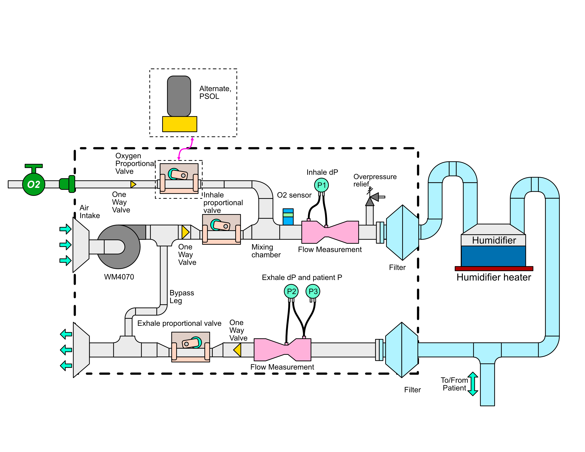

# Pneumatic Design

-------------

## Overview

**TODO:** Say stuff here and provide context for diagram below.

**Source files:**

* [EPS](assets/pneumatic-diagram.eps)
* [afdesign](assets/pneumatic-diagram.afdesign)

## Components

- [Fan](../../manufacturing/blower)
- [Proportional pinch valve](../../manufacturing/pinch_valve)
- [Venturi flow sensor](../../manufacturing/venturi)
- Oxygen control valve
- Exhaust closure valve
- Inhale and Exhale Nozzle + Filter
- Exhaust / Intake Filter
