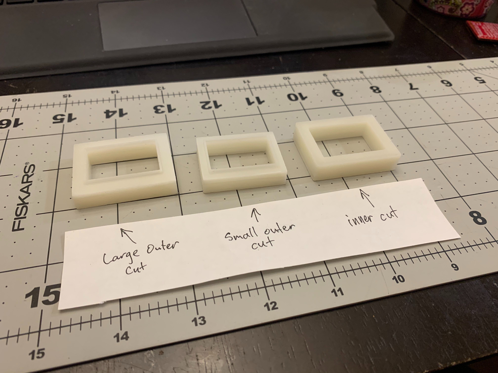
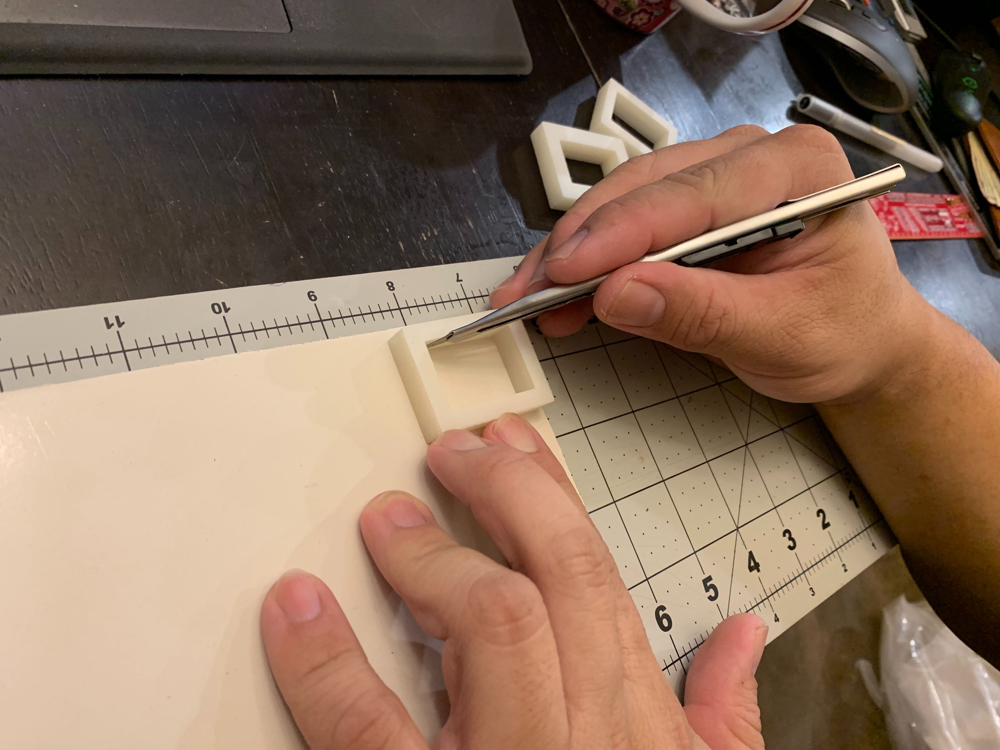
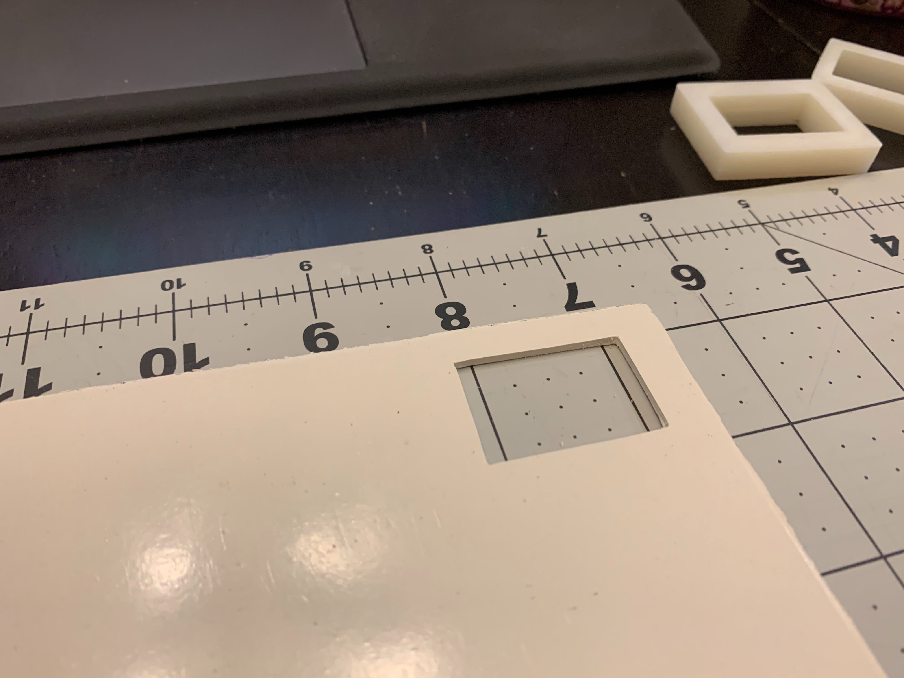
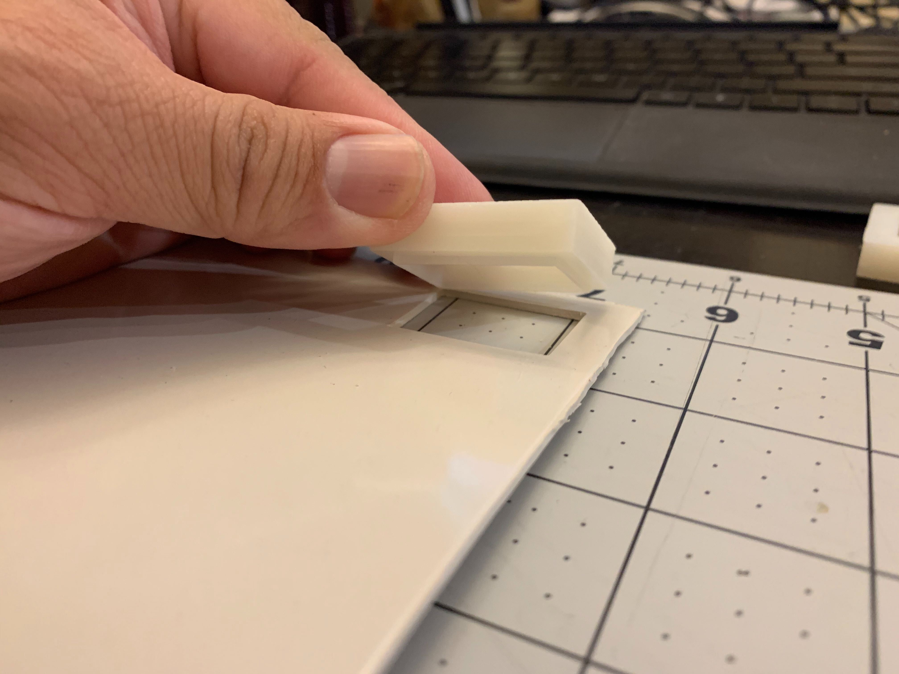
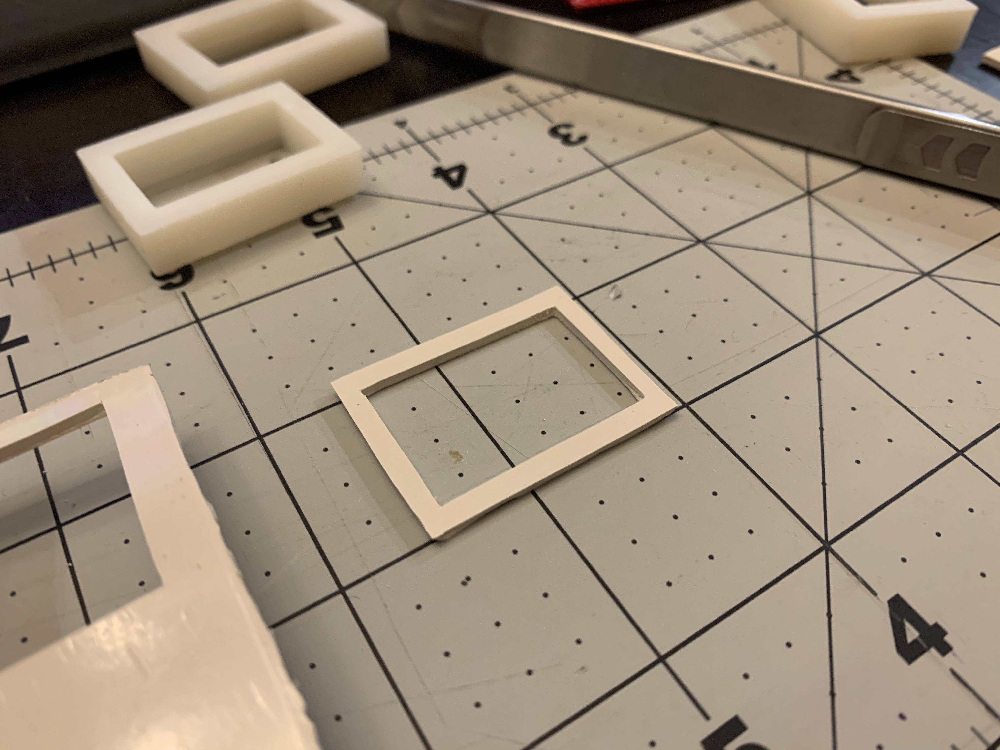
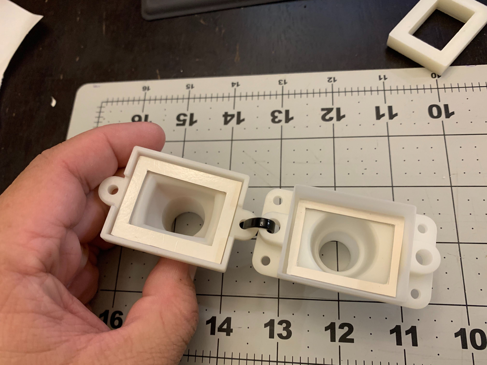
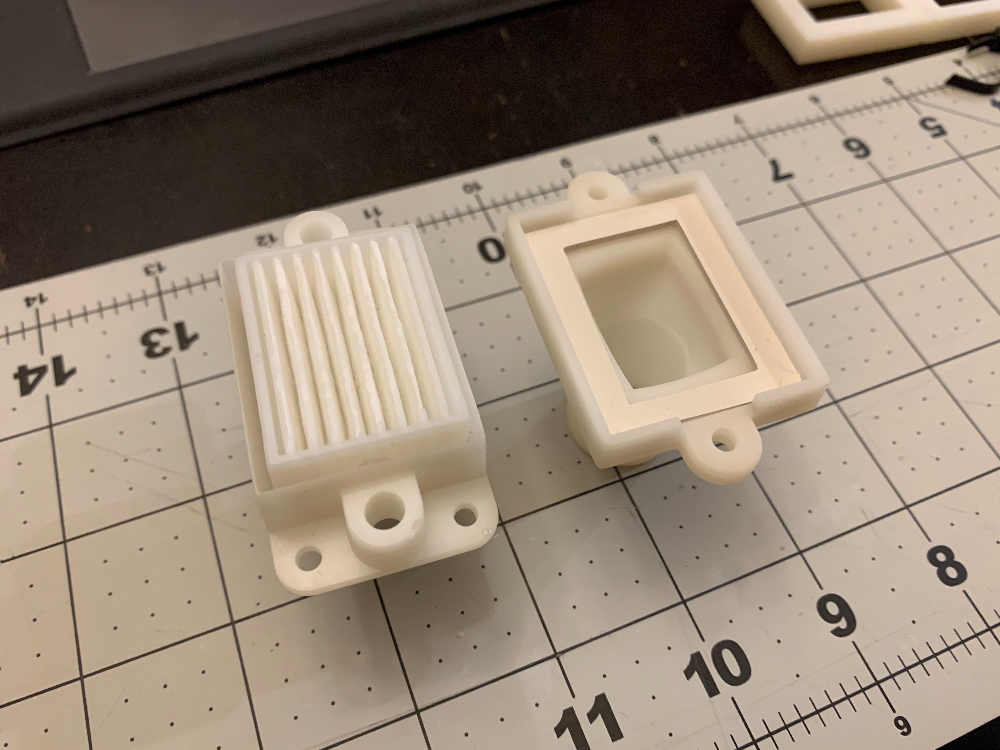

# Air filter assembly

- This is a panel mount filter housing, which allows the use of inexpensive vacuum HEPA filters in line between the
machine and the patient tubing.
- The filters we're using are from the Roomba 700 series. These are widely available and cost around $0.50/unit. To use
them, we're removing the actual filter from the yellow plastic housing. We expect we'll be able to order the filters
themselves this way in bulk in the future.
- These will require two custom gaskets, made of either 3 mm EPDM foam or 1.5 mm <60 durometer rubber,
- The panel mount mounts with 4x m3x10 screws.
- The top and bottom connect by 2x m3x20 thumb screws, which go into threaded inserts. Right now we're using standard
McMaster heat-set inserts; for production we'll consult with the manufacturer. We might upgrade from m3 to m4.

## Parts List (BOM)

**Note: If you are a member of the RespiraWorks team, review [part purchasing guidelines](../../README.md) BEFORE
purchasing any parts.**

### Purchasing Source Key

* **A** = Ali Express
* **C** = McMaster-Carr
* **W** = Wonsmart
* **K** = Digikey
* **B** = Built by RespiraWorks
* **Z** = Amazon
* **R** = RS computing

### Parts

**NOTE:** Before you buy anything on this list, check with Edwin, Martin or Ethan. Blower takes a while to deliver.
We may have parts to send you from our inventory.

| Item | Quantity | Manufacturer  | Part #               | Price (USD)      |Sources     | Notes |
| ---- |---------:| ------------- | -------------------- | ----------------:|:-----------|:------|
| 1    |        1 | RespiraWorks  | Filter Outer Housing | $1 (material)    | [B][1rw]   | 3D printed from data in link |
| 2    |        1 | RespiraWorks  | Filter Inner Housing | $1 (material)    | [B][2rw]   | 3D printed from data in link |
| 3    |        1 | Roomba        | Filter               | $8/6pk           | [Z][3amzn] | removed from filter unit as delivered |
| 4    |        1 | RespiraWorks  | Filter Inner Gasket  | $0.10 (material) | B          | make using item 6 below |
| 5    |        1 | RespiraWorks  | Filter Outer Gasket  | $0.10 (material) | B          | make using item 6 below |
| 6    | ~4 sq in | Amazon        | Gasket Material      | $0.10 (material) | [Z][6amzn] | cut with jigs to make items 4 and 5 |
| 7    |        2 | McMaster-Carr | 96016A556            | $5.50/10pk       | [C][7mcmc] | thumbscrews |
| 8    |        2 | McMaster-Carr | 94180A333            | $16.69/100pk     | [C][8mcmc] | thumbscrews |

[1rw]: assets/SmallFilterHousing.stl
[2rw]: assets/SmallFilterPatientConnector.stl
[3amzn]: https://www.amazon.com/gp/product/B01KNZCW8E
[6amzn]: https://www.amazon.com/gp/product/B07BKP6KFX
[7mcmc]: https://www.mcmaster.com/96016A556-96016A831/
[8mcmc]: https://www.mcmaster.com/94180A333/

**Note: items 4 and 5 are made in this procedure from the material in item 6

## Tools

| Item | Quantity | Manufacturer  | Part #                         | Price (USD)   | Sources   | Notes |
| ---- |---------:| ------------- | ------------------------------ | -------------:|:----------|:------|
| a1   |        1 | RespiraWorks  | Filter Inside Cut Jig          | $1 (material) | [B][a1rw] | 3D printed from data in link |
| a2   |        1 | RespiraWorks  | Inner Housing Outside Cut Jig  | $1 (material) | [B][a2rw] | 3D printed from data in link |
| a3   |        1 | RespiraWorks  | Outer Housing Outside Cut Jig  | $1 (material) | [B][a3rw] | 3D printed from data in link |

[a1rw]: assets/filter-gasket-jig-inside.stl
[a2rw]: assets/filter-gasket-jig-outsideSmall.stl
[a3rw]: assets/filter-gasket-jig-outsideLarge.stl

## Assembly Instructions

- Step 1: 3D print the parts and tools called out in the BOM.

- Step 2: Identify the gasket jigs

- Step 3: Cut the inner edge of the gasket in the gasket material.

|                            |                             |
|:--------------------------:|:---------------------------:|
| |  |

- Step 4: Place the Small Outer Cut jig into the hole you just made.

- Step 5: Cut the outer edge of the gasket.  This forms the Inner Housing Gasket.

|                            |                             |
|:--------------------------:|:---------------------------:|
| |  |

- Step 6: Repeat steps 1-5 with the Large Outer Cut jig.  This forms the Outer Housing Gasket

- Step 7: Place the gaskets as shown.

- Step 8: Place the filter into the housing as shown.

- Step 9: Assembly filter housing (TBD)
