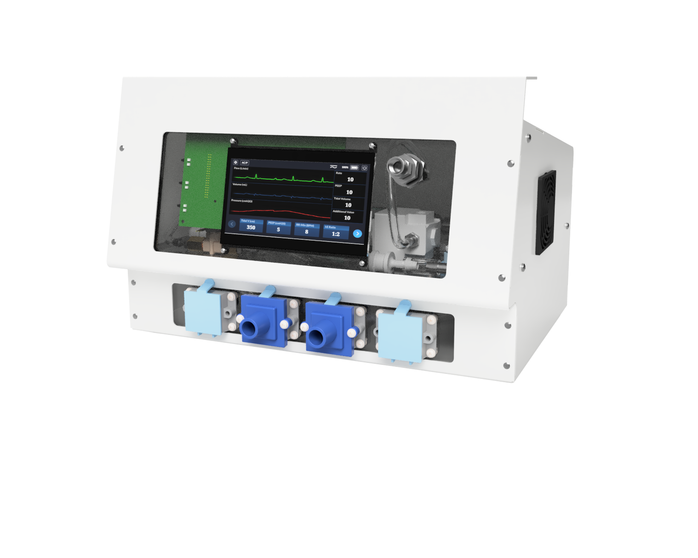
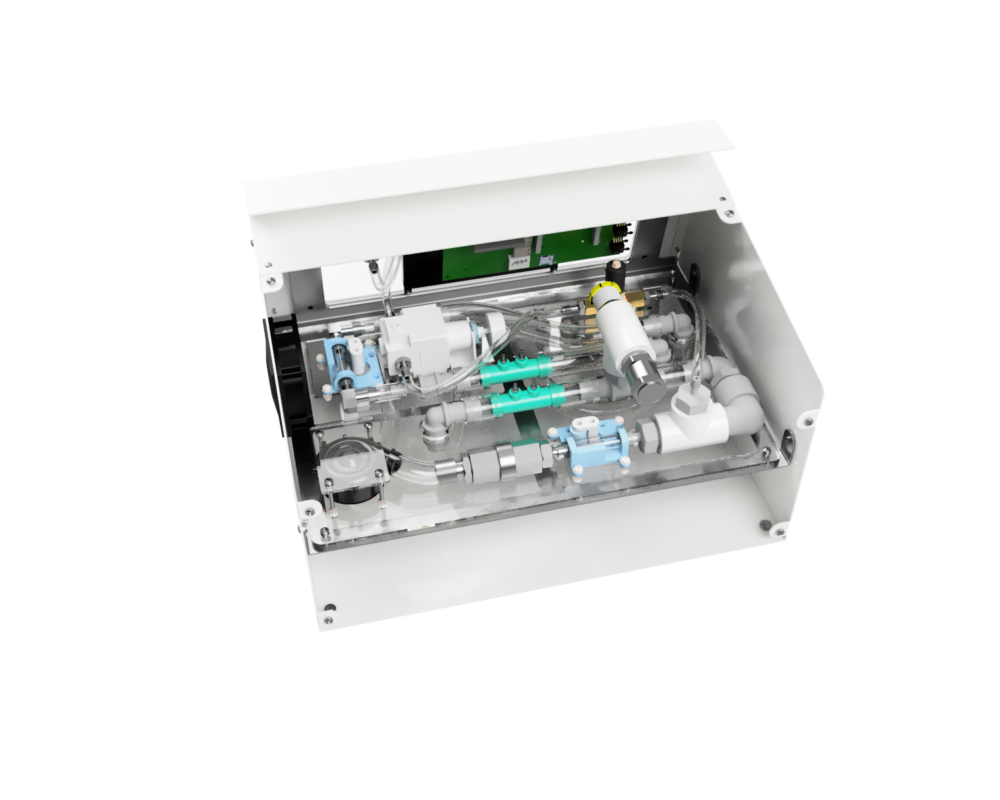
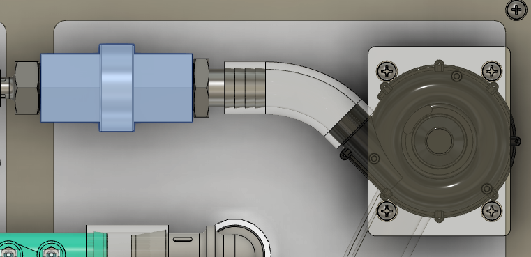

# Enclosed build

## DISCLAIMER

**This is an incomplete, as yet untested design that is not yet intended to be used on patients.**

This page contains a running list of notes and planned updates that will be organized and added to as we get further into beta design and build.

## Concept

These components are intended to be assembled into a rugged sheet metal enclosure for the final mechanical design. The
compact version of the ventilator assembly and packaging strategy has already gone through several iterations,
including an Alpha Build device which proved out the use of a detachable internal structure for ease of assembly.

The next iteration of this build will demonstrate the packaging in the production housing, which has been designed but
not yet constructed. Based on lessons learned from the Alpha Build prototyping process, the ventilator will use a
detachable internal assembly, to which all pneumatic components can be mounted and connected. This allows for 360
degree accessibility to components during initial assembly. When complete, this internal assembly is bolted into the
enclosure, and the enclosure is screwed shut. The top-rear positioning of the removable enclosure lid provides
access to components that will need routine maintenance.

| production ventilator assembly    |  back panel removed   |
|:---:|:---:|
|  |   |

Further aspects of the production packaged design are detailed in the first section of the\
[Assembly Video](https://youtu.be/2hdV5CWcLb4).

## India build

Preliminary enclosed build was produced by our partners, Foundry-M in Visakhapatnam, India.

|     |     |
|:---:|:---:|
| |   |

## Beta Build Plan

Here is the CAD model for viewing: [autodesk360 link](https://a360.co/2PTyRzh)

Here is a page on the [metal enclosure assembly](enclosure).

### Blower

Note that the check valve should be included with any build where oxygen is used. The check valve is visible in blue in the image below.

The purpose of the Beta Build is to build the complete ventilator in an enclosure.

The Components/Sub assemblies of the Beta Build is as follows:

Top Assy - This acts as the highest assembly, it includes all of the parts and sub assemblies to complete the beta build. (includes image of assy, link to CAD, links to stp files, etc) #TODO

Blower Sub Assembly

Brain Sub Assembly

Venturi Sub Assembly

Pinch Valve Sub Assembly

Int & Pneumatic Sub Assembly

Filter Sub Assembly

For Testing purposes, the Testing Lung Assembly can be used to support testing and QA.

In addition to reviewing the enclosure design, the below are some design features included within the Beta Build.

## Venturi Updates

We're planning to use 3/4"ID tubing throughout. The venturi will most likely be redesigned to have barbs that fit 3/4" ID tubing directly.

### Nucleo Module Updates

We're planning to move the STM32 onto the PCB, so there won't be a need to buy nucleo module.

### STM32 Updates

We're planning to add some kind of Flash memory to support non-volatile storage of configuration parameters. Part selection is still TBD; we'll either be moving to dual flash bank STM32 or add an i2c EEPROM (already planned for PCB Rev A).

### Stepper Drivers Updates

We're planning to move the steppers driver onto the PCB. Because of this, there will be no need to buy stepper drivers.

### RTC Battery

We're planning to add an RTC battery, which will allow controller to keep track of time while off - Pizza build no change, this feature not available for now

## Beta Build Assembly Instructions
To be completed when enclosure build is completed. #TODO
