# Enclosure

|             |     |
:------------------:|:-----------------:|
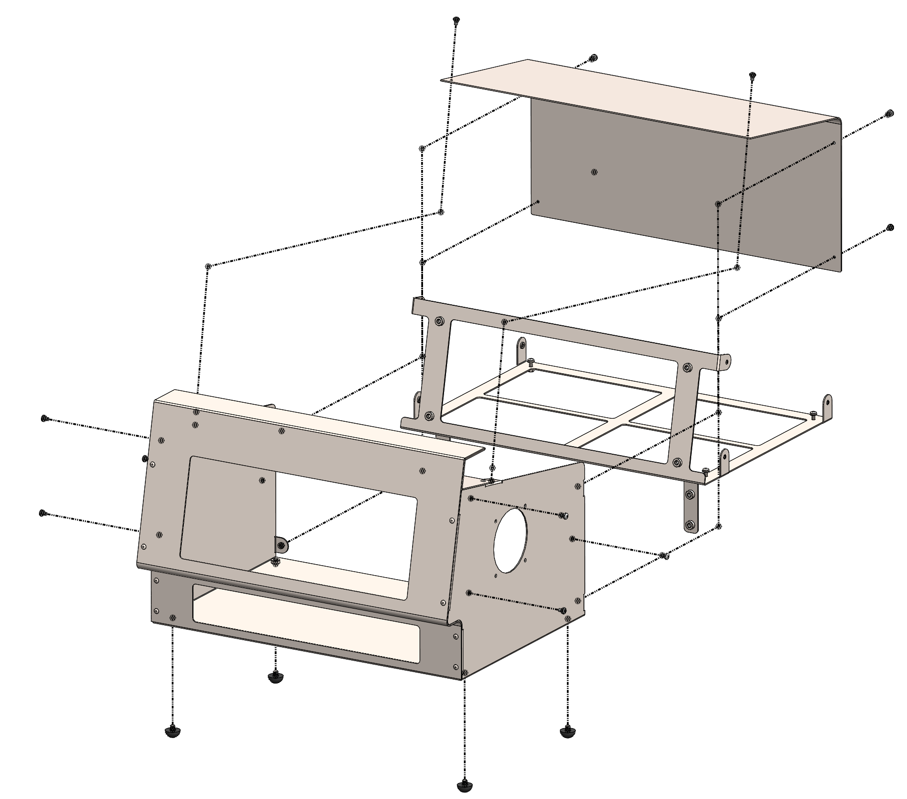  |  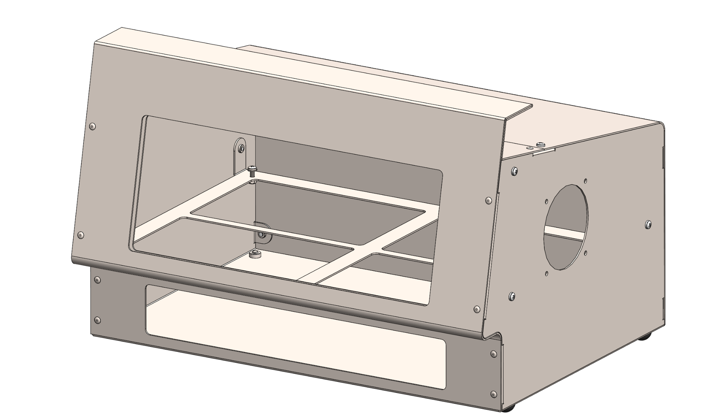  |

The ventilator enclosure is made up of three folded, 1.52mm thick, stainless steel sheets; the main enclosure, the rear
closure panel and the internal equipment bracket.

The main enclosure is folded from a single sheet and fastened together using 1/8" diameter, stainless steel blind rivets
(McMaster 97525A420). There are rubber bumper feet (McMaster 9541K82) on the bottom of the enclosure that are threaded
into M6 PEM nuts (Bisco CLS-M6-1). The rubber bumpers can be removed to allow the enclosure to be mounted to a medical
cart. M4 PEM nuts are installed, on tabs, on the main enclosure to allow the rear closure panel to be fastened to the
main enclosure. 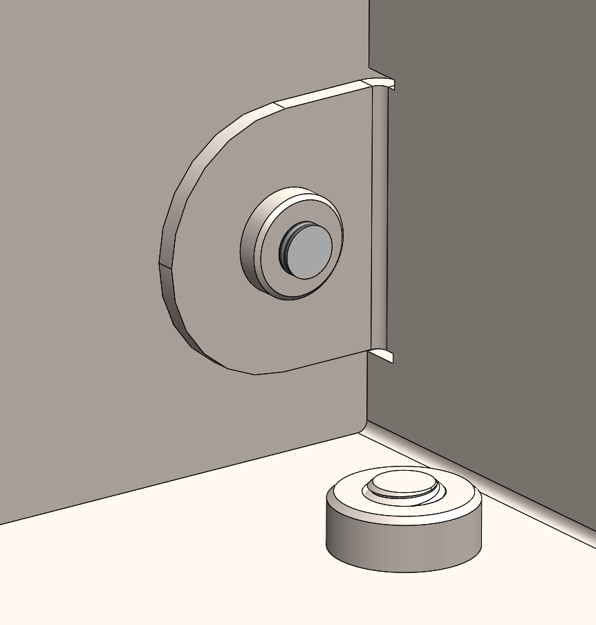

The rear closure panel is folded from a single sheet. The rear closure panel is fastened to the main enclosure using
(6) M4 x 0.7 x 6mm long, phillips, pan head, 18-8 stainless steel screws.

The internal equipment bracket is folded from a single sheet. The bracket is designed to be simple and lightweight.
Acrylic sheets are either fastened to or hung from the bracket to allow for design adjustments while utilizing the same
bracket. The internal equipment bracket is attached to the main enclosure using (6) M4 x 0.7 x 6mm long, phillips, pan
head, 18-8 stainless steel screws.

## Fabrication Drawings

Enclosure fabrication drawings.

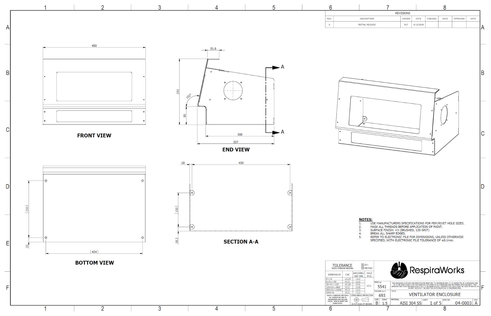

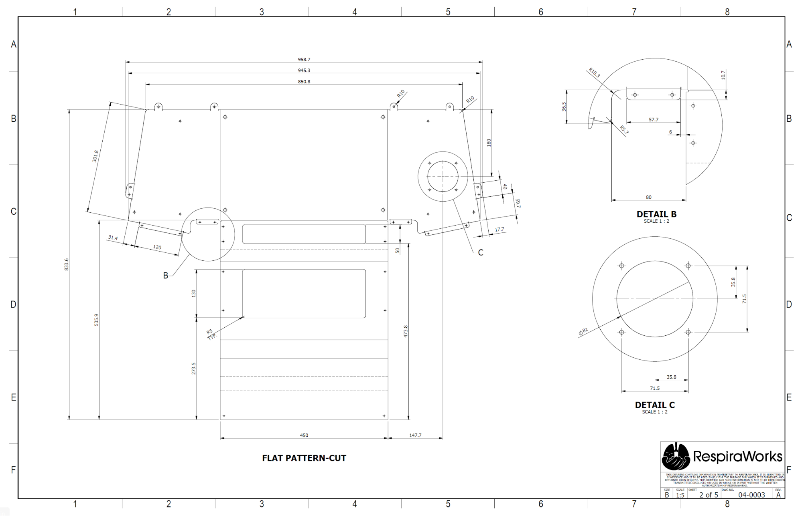

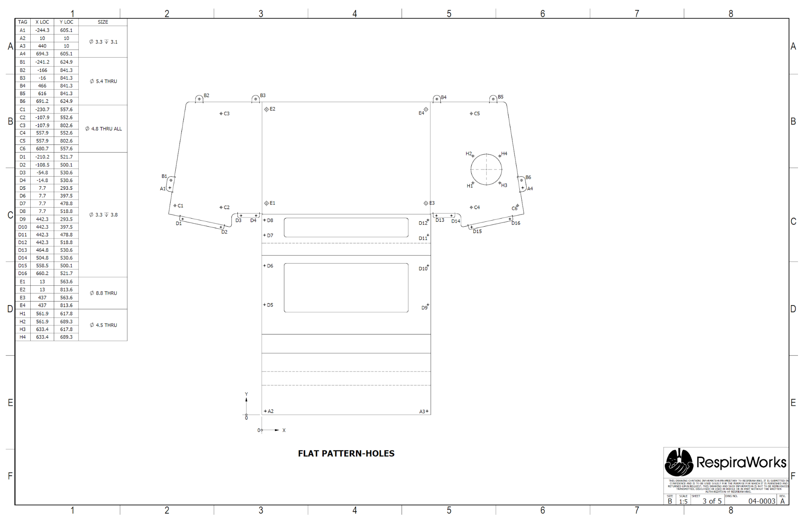

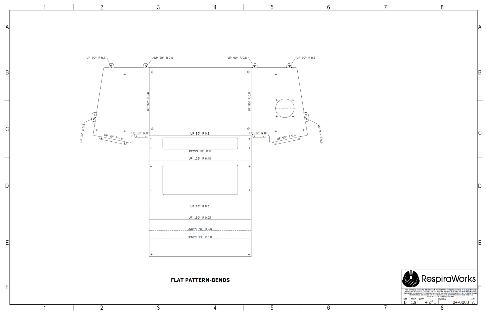

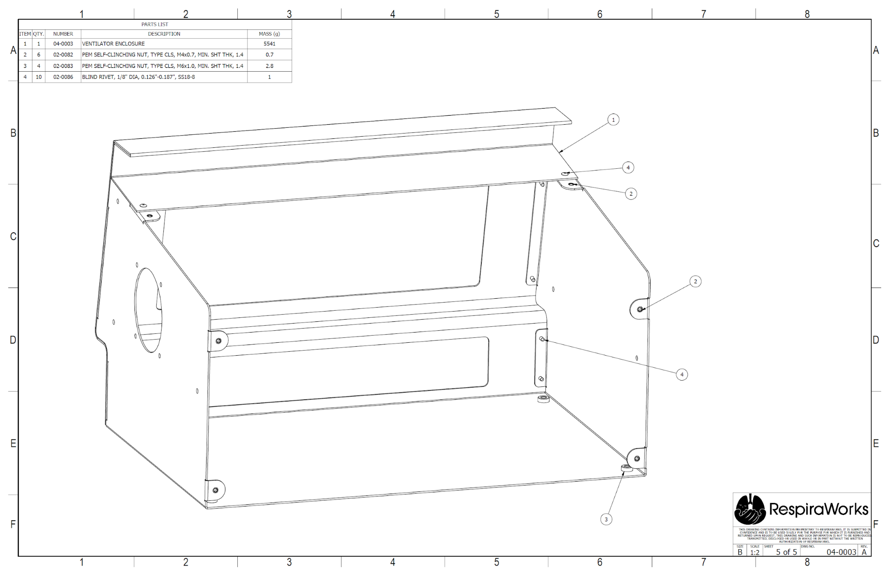

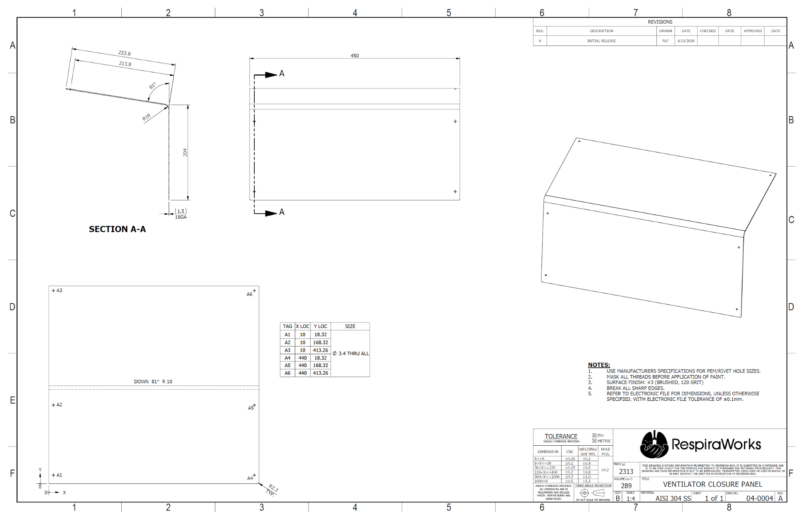

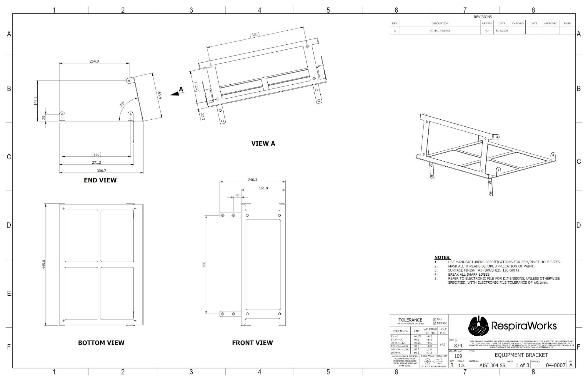

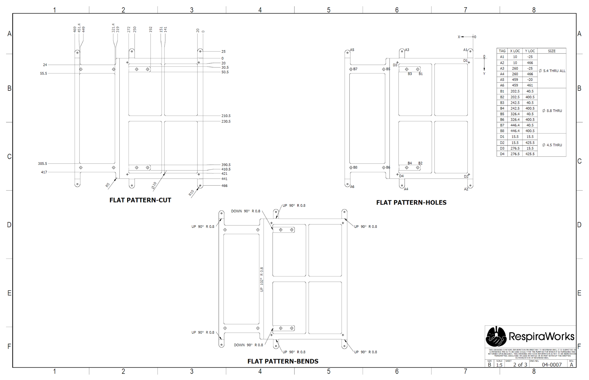

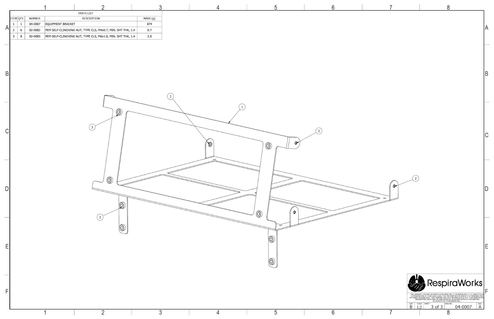
