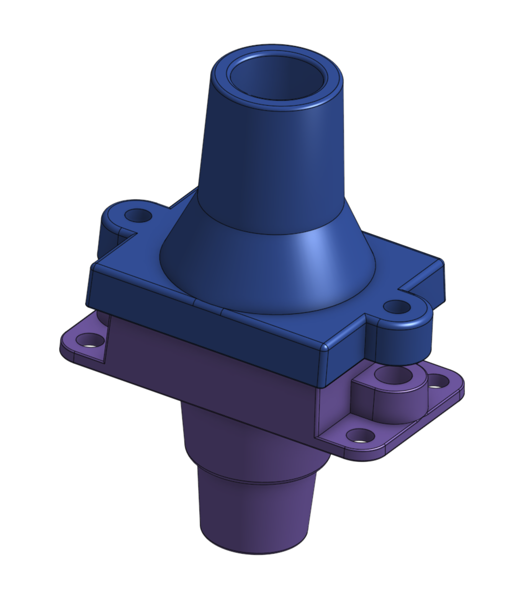
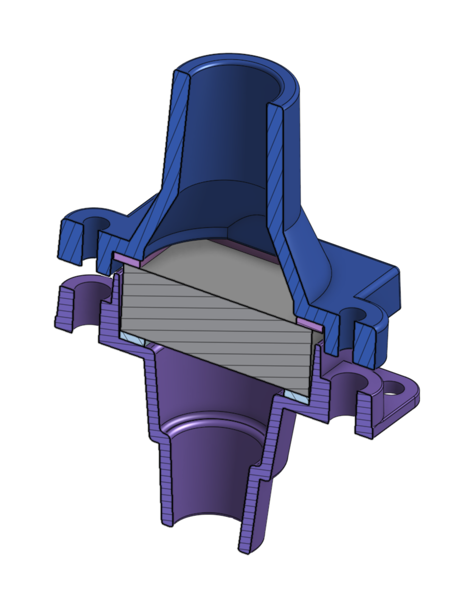

# Air filter assembly

## Design basis

The ventilator uses four mass-manufactured replaceable HEPA filter cartridges to isolate the patient from the device,
and to isolate the device gas path from the environment. These filters were selected based on research described in the
design overview document. Currently this form factor HEPA filter is available in quantities exceeding 10,000. A set of
custom panel-mount components houses this filter cartridge and serves as the connector for the inspiratory and
expiratory ends of the patient breathing circuit. A modified version of these connectors, utilizing the same filter,
is used as an additional barrier on the inspiratory and expiratory pathway to the device.

While the prototype components are 3D printed using SLA resin, these parts are designed to be injection molded in ABS,
and have undergone several iterations of feedback from a fabrication partner that specializes in injection molding. As
such, they have a draft angle of 2 degrees and uniform wall thickness to simplify mold-making.

These parts are modular in design: the fixed component of the filter housing can accommodate several sizes of flexible
tubing connections on the back side (options for 3/4 in / 19mm ID, and 1 in / 25 mm ID). This allows the same part to be
used for all four filter housings, decreasing part cost by economies of scale and simplifying the assembly procedure.
The fixed panel-mount component includes two M4 press-in or heat-set threaded metal inserts to be used as a mounting
point for the filter cartridge hold-down parts.

The replaceable filter cartridges are held in place by one of two component options - for the device inlet and outlet,
a simple screw-down tab holds the filter in place; for the patient breathing circuit connectors, a 22mm cone (male) port
is provided to interface with standard 22mm socket (female) breathing circuits. The patient breathing circuit connector
cone is dimensioned according to [ISO 5356-1](https://www.iso.org/obp/ui#iso:std:iso:5356:-1:ed-4:v1:en).

# Implementation

- This is a panel mount filter housing, which allows the use of inexpensive vacuum HEPA filters in line between the
machine and the patient tubing.
- The filters we're using are from the Roomba 700 series. These are widely available and cost around $0.50/unit. To use
them, we're removing the actual filter from the yellow plastic housing. We expect we'll be able to order the filters
themselves this way in bulk in the future.
- These will require two custom gaskets, made of either 3 mm EPDM foam or 1.5 mm <60 durometer rubber,
- The panel mount mounts with 4x m3x10 screws.
- The top and bottom connect by 2x m3x20 thumb screws, which go into threaded inserts. Right now we're using standard
McMaster heat-set inserts; for production we'll consult with the manufacturer. We might upgrade from m3 to m4.

## Custom parts CAD
There are two types of filter assemblies to be used in our ventilator.

|   [Patient Connectors][PC]       |  [Non Patient connectors][NPC]  |
|:--------------------------------:|:-------------------------------:|
||   |
| |    |

[PC]: https://cad.onshape.com/documents/3fe0c1f79c482144c267173d/w/2ad1c08071a25185f9c78c68/e/3f7805d0bb1b53e700b6c7eb
[NPC]: https://cad.onshape.com/documents/3fe0c1f79c482144c267173d/w/2ad1c08071a25185f9c78c68/e/11907480755add4f9ca862c4

## Parts List (BOM)

**Note: If you are a member of the RespiraWorks team, review the
[part purchasing guidelines](../../manufacturing/README.md#part-purchasing-guidelines)
BEFORE purchasing any parts.**

### Purchasing Source Key

* **C** = McMaster-Carr
* **B** = Built by RespiraWorks
* **Z** = Amazon

### Parts

**NOTE:** The below quantities are for building 4 complete sets which are needed for one Ventilator.

| Item | Quantity | Manufacturer  | Part #               | Price (USD)      |Sources     | Notes |
| ---- |---------:| ------------- | -------------------- | ----------------:|:-----------|:------|
| 1    |        4 | RespiraWorks  | Filter Inner Housing | $1 (material)    | [B][1rw]   | 3D printed from data in link |
| 2    |        2 | RespiraWorks  | Outer housing with patient tubing interface  | $1 (material)    | [B][2rw]   | 3D printed from data in link |
| 3    |        2 | RespiraWorks  | outer housing without tubing interface | $1 (material)    | [B][3rw]   | 3D printed from data in link |
| 4    |        1 | Roomba        | Filter               | $8/6pk           | [Z][4amzn] | removed from filter unit as delivered |
| 5    |        4 | RespiraWorks  | Filter Inner Gasket  | $0.10 (material) | B          | make using item 6 below |
| 6    |        4 | RespiraWorks  | Filter Outer Gasket  | $0.10 (material) | B          | make using item 6 below |
| 7    | ~4 sq in | McMaster-Carr | Gasket Material      | $22.22/ 12x12" sheet | [C][9mcmc] | cut with jigs to make items 4 and 5 |
| 8    |        8 | McMaster-Carr | 96016A556            | $5.50/10pk       | [C][7mcmc] | thumbscrews |
| 9    |        8 | McMaster-Carr | 94180A333            | $16.69/100pk     | [C][8mcmc] | inserts |

[1rw]: assets/SmallFilterHousing.stl
[2rw]: assets/SmallFilterPatientConnector.stl
[3rw]: assets/SmallFilterNonPatientConnector.stl
[4amzn]: https://www.amazon.com/gp/product/B01KNZCW8E
[9mcmc]: https://www.mcmaster.com/8785K82-8785K822/
[7mcmc]: https://www.mcmaster.com/96016A556-96016A831/
[8mcmc]: https://www.mcmaster.com/94180A333/

**Note:** items 5 and 6 are made in this procedure from the material in item 7

## Tools

| Item | Quantity | Manufacturer  | Part #                         | Price (USD)   | Sources   | Notes |
| ---- |---------:| ------------- | ------------------------------ | -------------:|:----------|:------|
| a1   |        1 | RespiraWorks  | Filter Inside Cut Jig          | $1 (material) | [B][a1rw] | 3D printed from data in link |
| a2   |        1 | RespiraWorks  | Inner Housing Outside Cut Jig  | $1 (material) | [B][a2rw] | 3D printed from data in link |
| a3   |        1 | RespiraWorks  | Outer Housing Outside Cut Jig  | $1 (material) | [B][a3rw] | 3D printed from data in link |

[a1rw]: assets/filter-gasket-jig-inside.stl
[a2rw]: assets/filter-gasket-jig-outsideSmall.stl
[a3rw]: assets/filter-gasket-jig-outsideLarge.stl

## Assembly Instructions

- Step 1: 3D print the parts and tools called out in the BOM.

- Step 2: Identify the gasket jigs

- Step 3: Cut the inner edge of the gasket in the gasket material.

|                            |                             |
|:--------------------------:|:---------------------------:|
| |  |

- Step 4: Place the Small Outer Cut jig into the hole you just made.

- Step 5: Cut the outer edge of the gasket.  This forms the Inner Housing Gasket.

|                            |                             |
|:--------------------------:|:---------------------------:|
| |  |

- Step 6: Repeat steps 1-5 with the Large Outer Cut jig.  This forms the Outer Housing Gasket

- Step 7: Place the gaskets as shown.

- Step 8: Place the filter into the housing as shown.

- Step 9: Assembly filter housing (TBD)
