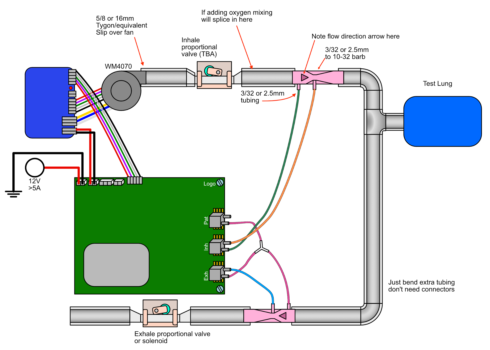

# Pizza Build

**WARNING: This is not intended to be used on patients and lacks a number of safety features.**

This is a ventilator prototype for testing and development.
The build consists of a functional ventilator pneumatic assembly with controller and user interface. This build is adequate for integration and systems testing.

It lacks heating, humidification and battery backup.

It is also not enclosed like the final product and is meant to be operated in an open layout on your table, like a pizza.

It can also come in various configurations, depending on your testing needs:

| Solenoid valve setup  |  Pinch valve setup   | Blower bypass setup     |
|:---------------------:|:--------------------:|:-----------------------:|
 |  |  |

**DISCLAIMER:** These are live documents.
There are duplicate and alternative items for undecided aspects of the physical design.

RespiraWorks may or may not compensate you for any of these parts if you choose to buy them. Please connect with Edwin, Martin or Ethan first.
If you decide to buy them, do so at your own risk... oh, and thank you ;).**

## Planning

Before you start, it would be wise to plan the configuration you will build and order adequate amounts of components.
Try to plan for what you'll need in a few weeks rather than what you need now.
Supply chains are quirky and shipping times can be long, so your surprise at having missed something will soon turn to frustration.
The goal of this documentation has been precisely to help you avoid unproductive waiting. **PLAN NOW!**

Read over as much of the following documentation as you can and then come back to this point.

Now, contact the team to see if we have components in stock that we can send you.
Once you know what you are getting from "headquarters", only then should you start filling up your baskets.
Also ask the team if anything should be ordered on the company account.

## Essentials

The first thing you will need is a [Brain build](../brain), which contains the computing components.

We are using 3/4" ID tube as the default standard (and adapters where needed, like to the blower and the pinch valves).
This easily can have 19mm ID tubing substituted in metric manufacturing settings (3/4" = 19.05mm).
All rigid plumbing fittings should be NPT/imperial standard (3/4 NPS preferable, to keep ID consistent throughout the flowpath).

## Parts List (BOM)

**Note: If you are a member of the RespiraWorks team, review the
[part purchasing guidelines](../../manufacturing/README.md#part-purchasing-guidelines)
BEFORE purchasing any parts.**

### Purchasing Source Key

* **Z** = Amazon
* **C** = McMaster-Carr

### 3/4" ID Tubing Components

| Item | Quantity | Manufacturer  | Part #              | Price (USD)     |  Sources       | Notes |
| ---- |---------:| ------------- | ------------------- | ------------:|----------------| ----- |
| a1   |      5ft |      OCSParts |            117062-5 | 22.99 / 5ft  | [Z][a1amzn]    | soft 3/4"ID 1"OD tubing |
| a2   |      5ft | McMaster-Carr | 5233K71             | 14.20 / 10ft | [C][a2mcmc]    | hard 3/4"ID 1"OD tubing, **alternative to a1**, not as fun to work with, not for medical use |
| a3   |        6 | McMaster-Carr | 9579K73             | 12.24 / 20   | [C][a3mcmc]    | Herbie clip K (22.2-24.9mm) for clamping 1"OD tubing, works better for soft tubing |
| a4   |        6 | McMaster-Carr | 9579K74             | 12.33 / 20   | [C][a4mcmc]    | Herbie clip L (24.5-27.6mm) for clamping 1"OD tubing, **alternate to a3** maybe works better for hard tubing? |
| a5   |        1 | McMaster-Carr | 5463K648            | 10.20 / 10   | [C][a5mcmc]    | 3/4"ID <-> 3/8"ID adapter, to interface with pinch valve tubing |

[a1amzn]: https://www.amazon.com/gp/product/B01LZ5ZK53
[a2mcmc]: https://www.mcmaster.com/5233K71
[a3mcmc]: https://www.mcmaster.com/9579K73
[a4mcmc]: https://www.mcmaster.com/9579K74
[a5mcmc]: https://www.mcmaster.com/5463K648

### Metric Version

**#TODO: document how to build with metric components**

### Tools

Assembling the pneumatic system will likely need the following tools.
T1 might be enough and T4 might be unnecessary.
Also, scissors or a sharp knife might be ok instead of T3.

| Item | Manufacturer  | Part number        | Price (USD) | Sources         | Notes |
| ---- |--------------:| ------------------ | -------- | ---------------:|------ |
| c1   |        TEKTON |              37122 |    13.00 | [Z][c1amzn]     | 8 inch slip-joint pliers, for clamping tubes onto fittings |
| c2   |   Duda Energy |     LPpvc075-005ft |    19.99 | [Z][c2amzn]     | Adjustable wrench, at least 1" wide opening, for screwing in NTP fittings |
| c3   |        DEWILL |          (unknown) |    15.88 | [Z][c3amzn]     | Pipe and PVC cutter, for cutting tubing |
| c4   |         IRWIN |            2078216 |     8.90 | [Z][c4amzn]     | Long nose pliers, for removing herbie clips |
| c5   |          PTFE | vanguardSealantsPTFE-01 |     6.49 | [Z][c5amzn]     | It's advisable to teflon tape all NTP threaded components. Not only will they be more airtight, but also they will be easier to tighten and release. |

[c1amzn]: https://www.amazon.com/TEKTON-2-Inch-Joint-Pliers-37122/dp/B00KLY1FAY
[c2amzn]: https://www.amazon.com/GETUPOWER-10-Inch-Adjustable-Opening-Vanadium/dp/B07RGV2VK1
[c3amzn]: https://www.amazon.com/gp/product/B07Y997XKC
[c4amzn]: https://www.amazon.com/Tools-VISE-GRIP-Pliers-6-Inch-2078216/dp/B000A0OW2M
[c5amzn]: https://www.amazon.com/gp/product/B01L2F428C

## Sub-assemblies

The following are essential sub-assemblies that you'll need no matter what additional/optional "toppings" you chose to have.

* 1x [Blower assembly](../blower) - the main driver of pressure in the pneumatic circuit
* 2-3x [Venturi flow sensors](../venturi) and corresponding tubing, to provide the controller feedback
* 2x [Pinch valves](../pinch_valve) - a proportional pinch valve to control the airflow constriction with precision
* optional [Air filter assemblies](../filter_holder) - for the safety of patient and health workers. Constricts air flow
  to some extent and thus will affect the ventilator performance

## Assembly Instructions

Use the following diagrams as well as the pictures of the most recent builds at the top of the page to help you assemble this lego set.
Note: mind which tubes go into the bottom and top ports of the sensors on the PCB.

Additionally, the following document was produced for the Covent19 challenge. It encompasses some aspects of both the
pizza and the enclosed build. **TODO:** Contents therein should at some point be migrated over into the repository as
plain text: [Covent19 assembly instructions](../assets/covent-june-2020-assembly-instructions.pdf)

| Pneumatics schematic  |  Shitty diagram     |
|:---------------------:|:--------------------:|
 |  |

[Pneumatics diagram source](graphics/pizza-pneumatics.eps)
