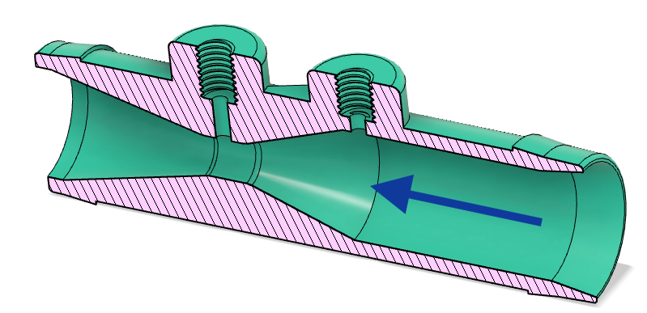
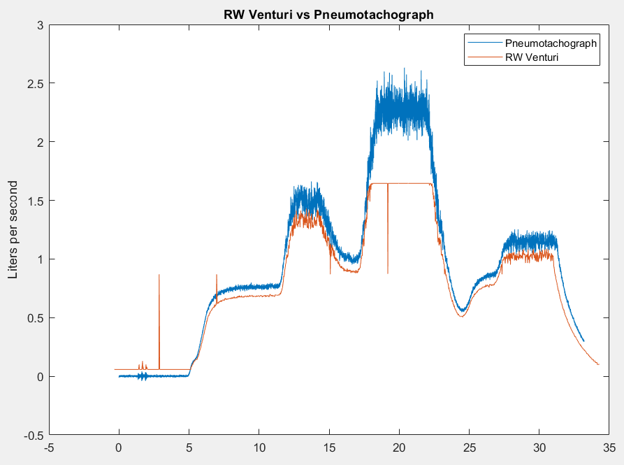

# Venturi Flow Sensor

|  Design           |  Implementation   |
:------------------:|:-----------------:|
  |    |

## Design basis

The venturi is used to measure flow by measuring a change in pressure as the flow accelerates through the throat.
Relative to other pressure sensor types, a venturi flow meter produces the largest signal pressure at the smallest
pressure loss. This allows significantly cheaper and more widely available pressure sensors to be used, because a
signal at peak flow can be 5 to 15 times larger than the flow resistance. For a resistance type flow sensor, the ratio
is 1:1. The change in pressure is measured between the two ports, and this is correlated to the flow rate through the
orifice. It is important to note that as the flow expands, almost all of this pressure is recovered to the original
flow; the pressure signal measured is not the same as the pressure resistance to flow.

### Mechanical Implementation

Currently the prototype parts are 3D printed using an SLA printer in ABS-like resin. Ultimately this design requires
some modification to make it amenable to injection molding, which is the intended method for at-scale production.
Venturis like these are commonly injection molded, so there is precedent for successful injection molding of parts with
the required internal profile. However, the team did not identify any off-the-shelf parts that met the orifice sizing
requirements dictated by the ventilatory flow rates required, leading to a custom design for this part. This part
incorporates molded-in hose barbs, which are compatible with either 3/4"ID or 19mm ID flexible tubing depending on
supply chain availability.

The venturi outer diameter is defined by the tubing standard. The current design is made for 3/4" ID tubing.

The pressure sensor we are using, the [MPXV5004DP](https://www.nxp.com/docs/en/data-sheet/MPXV5004G.pdf)
has 2.5 mm or 3/32" barbs. Note that this is not sufficiently close in size to use more common 3mm or 1/8" tubing.
This model has printed threads to accept an adapter from #10-32 pipe to 3/32" adapter. Other adapters could be
incorporated eventually by changing the interface design.

There is an arrow printed onto the body between the two ports to indicate the direction of flow. The venturi is
asymmetrical, with a tighter constriction on entrance than exit.

You can use a zip tie or hose clamp to improve the seal by tightening it behind the barb.

### Fabrication at Scale

The basis for the design came from previous experience using adapted fertilizer injection venturis as flow measurement
devices. The original part is shown below.

There is no fundamental reason why the exact same design cannot be used for this application, especially if these are
being produced at scale. However, the dimensions of this part are not quite right to optimize for the flow regime of
patient inspiration. The commonly available ½-NPT fertilizer venturi has an entrance diameter of 12.7mm and a throat
diameter of 4.1 mm. After experimentation with the prototype venturi, the final dimensions were selected as an entrance
diameter of 15.05 mm and a throat diameter of 5.5 mm. These are significantly different from a flow measurement
standpoint, but not particularly different from a manufacturing standpoint.

The fabrication for the above process is to produce two mirror half-molds with partial thread blanks for the three
threads and alignment pins in the molds. Glue is applied to the mold halves, with the pins used to precisely align the
components. After the glue sets, additional flashing and the alignment pins are machined off, and the threads are
cleaned up with a cutting die. By using common thread fittings (1/2 NPT on other end, and 1/4 NPT on the pressure tap)
readily available adapters can be attached. For the upstream pressure tap, a 1/2 NPT tee is used, with the flow entering
the tee from upstream, and a barb adapter used to connect to the 3/32 tubing. For the throat tap, a 1/4 NPT female to
3/32 barb adapter is required.

## 19mm or 3/4" Version (beta)

The beta build of the ventilator uses 3/4"ID or 19mm ID tubing throughout.

This version has received more updates as it is a later version. Relative to the 16mm sensor, it has a slightly larger orifice (design 5.50 mm) and a more aggressive chamfer at the inlet to improve the aerodynamic flow. It also obviously
has a slightly larger internal diameter compared to the 16mm sensor.

### Files

* [.stl format](assets/venturi-3-4.stl)
* [.iges format](assets/venturi-3-4.iges)
* [.f3d format](assets/venturi-3-4.f3d)

## Transfer Function

To go from voltage to flow rate, you must correlate the flow rate to a change in pressure, and the change in pressure to a voltage.

The fundamental equation for a ventiru flow meter is:

However, this assumes perfect aerodynamics. A calibration factor is required to increase the accuracy of the signal.
Unfortunately this calibration factor is going to be dependant on the quality of your printer, or eventually, the
reproducibility of the manufacturing method. We are in the process of producing a calibration factor for the 19mm and
16mm sensors.

You then need to convert from dP to voltage, if using an analog sensor, or from dP to serial, if using an I2C sensor.

You can use
[this short spreadsheet](https://docs.google.com/spreadsheets/d/1G9Kb-ImlluK8MOx-ce2rlHUBnTOtAFQvKjjs1bEhlpM/edit#gid=963553579)
to return the transfer function.

**#TODO:** make spreadsheet contents visible here

## Pressure Sensor

This venturi is designed to be paired with this sensor and a 14-bit ADC. A 12-bit ADC would work, but accuracy at the
low end is improved.

[Data Sheet MPXV5004DP](https://www.nxp.com/docs/en/data-sheet/MPXV5004G.pdf)

Adjust values in the spreadsheet above accordingly to see how it will perform in your setup.

## 3D Printing

### Guidelines

These should not be printed with FDM. Instead, a leaktight method like SLA or MJF should be used. Also, this model
contains printed threads and is designed to interface with the referenced mcmaster barbed fitting (item 2 below).

Note that the flow measurement is very sensitive to the exact geometry, particularly the thread geometry. 3D printing
can have variable shrinkage that results in uncertainty in the throat size, and thus the flow rates. Check the diameter
of the printed venturi; a good way to do this is to put a drill into the venturi that just barely fits, and then measure
the diameter of that drill bit. (Any round thing will work.)

## Parts List (BOM)

**Note: If you are a member of the RespiraWorks team, review the
[part purchasing guidelines](../../manufacturing/README.md#part-purchasing-guidelines)
BEFORE purchasing any parts.**

### Purchasing Source Key

* **C** = McMaster-Carr
* **Z** = Amazon
* **3D** = 3D printed

### Parts

| Item | Quantity | Manufacturer  | Part #         | Price (USD)     | Action | Sources    | Notes |
| ---- |---------:| ------------- | ------------------- | ------------:| ------- |-------------| ----- |
| 1    |        1 | RespiraWorks  |                     |              | **ask** | **3D**      | 3D-printed venturi |
| 2    |        2 | McMaster-Carr | 5463K33             | 3.93 / 10    | buy     | [C][2mcmc]  | Barbed fitting 3/32" AKA nipple |
| 3    |        1 | McMaster-Carr | 5463K44             | 7.39 / 10    | buy     | [C][3mcmc]  | sensing tube 3/23" t-junction |
| 4    |        - | uxcell        | a16031400ux0163     | 6.49 / 16ft  | buy     | [Z][4amzn]  | 2.5 mm tubing for connecting to sensors |
| 5    |        - | McMaster-Carr | 50315K68            | 5.75 / 25ft  | buy     | [C][5mcmc]  | 2.5 mm tubing, alternative to *3* |

[2mcmc]:   https://www.mcmaster.com/5463K33
[3mcmc]:    https://www.mcmaster.com/5463K44
[4amzn]:   https://www.amazon.com/gp/product/B01F4BJ7PI
[5mcmc]:   https://www.mcmaster.com/50315K68

### Tools

We try to make few assumptions about what tools you have. Here are recommended tools you might need. You might already
have some of these.

| Item | Quantity | Manufacturer  | Part #         | Price (USD) | Sources         | Notes |
| ------ |---------:| ------------- | ------------------- | --------:|-----------------| ----- |
| a1     |        1 | McMaster-Carr | 2636A251            |     6.76 | [C][a1mcmc]     | Tap for 10-32 threading nipple ports. |
| a2     |        1 | Kaufhof       | KF-ATW-0053         |    14.11 | [Z][a2amzn]     | Hand-operated tap wrenches, for use with a1 above |

[a1mcmc]:https://www.mcmaster.com/2636A251
[a2amzn]:https://www.amazon.com/gp/product/B003GKJYKI

## Assembly

**TODO:** pictures of assembly process

**TODO:** reaming might be required

Screw the nipples into the 3d-printed venturi.
There are threads in the print but they don’t always come out right if resin gets trapped in the grooves while it prints.
In such a case you might need a tap (listed in tooling BOM above) to clean the threads. You do not need a bottoming tap,
since there is enough depth in the holes and the threads are short.

In the latest tested version, no hand-tapping was required to insert nipples. With good enough 3d printing, this step
should not be necessary.

**TODO:** instructions on connecting tubes to sensors

## Verification

Check for leaks by plugging the holes and pulling some vacuum.

* Plug one large end, plug both nipples, suck on the remaining end.  If you have a vacuum pump handy do a regular vacuum hold leak test.
* Or, blow into each port with your fingers over the other three.

# Performance Data

## Pressure Loss curve

**TODO:** add flow loss curve

## Flow Rate

Without calibration, using the NXP sensor above, the 16mm sensor was compared to a Fleisch Pneumotachograph.
The response curve is shown below over a varying flow signal. Note there is no calibration factor applied, so there is some offset.

**TODO:** add flow accuracy curve and get improved correlation.

## Characterization tests

Characterization tests are included [here](characterization-tests).
