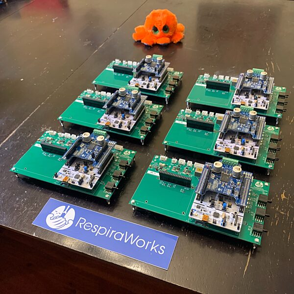

# Ventilator Mainboard 

This directory contains files for the Ventilator mainboard design.

Due to the coupled nature of the controls, electrical, and mechanical components and their design the RespiraWorks
ventilator contains a custom fabricated printed circuit board (PCB) to connect the microcontroller, interface processor,
and sensor interfaces. The use of a custom PCB greatly reduces the chance for electrical assembly and fabrication errors
and is far more amenable to a quality fabrication process than hand-soldered components. We do not intend for this
component to be hand-assembled, and engineering turnkey fabrication instructions have been generated as part of the
submission; no assembly instructions are provided here.

The RespiraWorks Ventilator Mainboard PCB is a custom component that integrates the Cycle Controller, UI Computer,
sensors, actuator drives, power supplies, filtering, and protection components.

Note the the information below currently pertains to the Rev 1 PCB, done in Alitum.  For the next rev, Rev A, the project is currently moving to KiCad for better accessibility.  This Readme will transition over to supporting the new KiCad-based design as it develops.

The exported complete Rev 1 files for manufacture can be found in the folder [rev1_export](rev1_export).

The old Altium-based design files, including a snapshot of this readme, can be found in the folder [archived-Altium-Version-RevA-work-in-progress](archived-Altium-Version-RevA-work-in-progress)

## Contents

The following are Altium files for various aspects of the circuit design.

* PrjPcb - the top level project
* SchDoc - schematic pages
* PcbDoc - PCB physical design
* OutJob - automated job for creating manufacturing package
* Net - netlist, logical electrical connections

**TODO:** identify each file individually.

## Rev 1.0

Exported files for the most recent release of the board and set-up instructions are provided [here](rev1_export).

Instructions for adding stepper motor support to Rev 1.0 board are [here](rev1_export/stepper_driver_setup.md).

## Current issues

Issues for PCB work are tracked by tickets with the [PCB label](https://github.com/RespiraWorks/Ventilator/labels/pcb).

Somewhat related are the [Electrical design](https://github.com/RespiraWorks/Ventilator/labels/Electrical) issues.

### Important Rev 1.0 PCB Errata

Here are problems discovered with the latest release of the PCB that need solving for the next iteration.

* [#739](https://github.com/RespiraWorks/Ventilator/issues/739): DNP resistors populated on board, typing 3.3V to the 5V
  rail (bad) - if you have SN 01, 02, 03, or 05 - don't continue using the board without executing the fix in this issue
  ticket.  See ticket for rework instructions and photos.  All other serial number boards are shipping with this issue
  fixed.
* [#738](https://github.com/RespiraWorks/Ventilator/issues/738): Yellow and Green alarm LEDs don't work due to a pin use
  conflict on the nucleo
* [#745](https://github.com/RespiraWorks/Ventilator/issues/745): Blower command is 5V but nucleo outputs 3.3V.  All
  boards are currently shipping with a level translator fitted which addresses this problem, however the blower will
  turn on full blast briefly at reset ([#740](https://github.com/RespiraWorks/Ventilator/issues/740) - to be fixed in
  next rev)
* [#736](https://github.com/RespiraWorks/Ventilator/issues/736) I2C sensor connectors labeled A, C, B, D. Should be A,
  B, C, D :facepalm:  To be clear, what this means is, the I2C multiplexer assignments, as labeled on the board in Rev
  1.0 are: MUX0: SENSOR A; MUX1: SENSOR C; MUX2: SENSOR B, MUX3: SENSOR D
* [#846](https://github.com/RespiraWorks/Ventilator/issues/846): anti-miller caps C33 and C34 filter out PWM signal and
  prevent proper operation.  The Miller effect is only present at startup and doesn't cause a problem with permanently
  connected loads like the PSOL.  Remove C33 and C34.
  
## Requesting hardware for development

If you are a RespiraWorks contributor, request dev hardware by making an entry
[here](https://docs.google.com/spreadsheets/d/1rf-cOTlQL_LnzrZq-64n7_R_pFyFMdCAxsPC65YqKUg/edit?usp=sharing)
