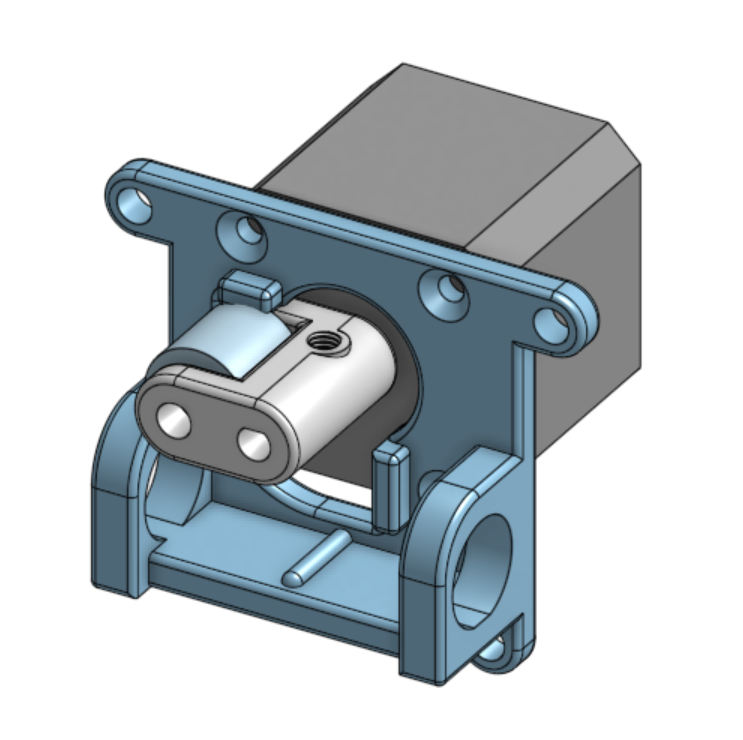

#Stepper proportional pinch valve

## CAD files

**TODO:** explain this better

[Exported step file](exhaust%20pinch%20valve%201.5.step) of version 1.5 is available here for download.

### Changes since last version
The stop is moved down by 3 mm, which should buy us a lot more leverage.
The stop is now flat. We might need to tweak exact dimensions further to get a perfect close, but this should be better.
Watching the video I'm pretty concerned watching that stop flex. I made it run the full width, I made it thicker, and I also bulked out the tube holders.
Bearings are now better aligned with the tube.

Latest progress on 3d-printed part design is found in
[OnShape](https://cad.onshape.com/documents/3fe0c1f79c482144c267173d/w/2ad1c08071a25185f9c78c68/e/fed9023927bfd7d2374ff967).

## BOM

**TODO:** list parts that need purchasing here

## Assembly

**TODO:** add or link to instructions here
