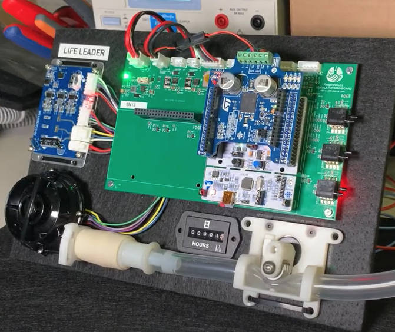

# Testing

This section contains testing information, including testing plans, and resulting data.

## Test equipment

The following custom in-house developed test equipment is used.

[Simple test lung](simple_test_lung)

[Test lung with adjustable compliance](compliance_test_lung)

## Testing data

Some testing data is [here](testing-data)

## Durability and Life-Leader Testing

To validate that the ventilator components are suitable for extended periods of operation, we are setting up automated
durability and life-leader tests. These tests will cycle both individual components and assembled ventilators over time,
measuring any change in performance. The goal is that these test units will have more cycles on them than any
operational ventilators, giving us confidence that the design can withstand continued operation.

Our initial life-leader testing has focused on the custom proportional pinch valve design. As discussed in more detail
elsewhere, the pinch valve design results in cyclical stress both on the valve and on the tubing - a key question is how
well the design will hold up over time. We have had one pinch valve running continuously for a few weeks and are doing
performance testing to see how it compares to fresh valves.

To date (2020.09.01), 1080 hours and 3.9 million cycles, or 12 weeks of continuous ventilator operation at 30 bpm,
equivalent to 2160 hours of continuous use. Testing continues 24/7.

**TODO:** link to life-leader tests

## Status of SiL (Software-in-the-Loop) Testing

Software-in-the-loop testing is a way of testing the controller software with the modelica model such that software
development is not held up by access to hardware (testing on actual hardware would be HIL (hardware-in-the-loop)). For a
distributed team that may not have access to hardware, this can be a key way to allow the team to move quickly.
Additionally, modelica models of new components can be developed based on their data sheets before they are acquired,
allowing us to explore designs both cheaper (can evaluate components without buying them) and faster (can start updating
the software before the new hardware arrives).

We have built out the infrastructure for interfacing our controller code with modelica and tested early prototypes. We
are currently evaluating how best to integrate our existing controller code. Unfortunately, modelica relies on an
earlier version of Visual Studio to compile the external controller for it to interact with, which means it does not
support all of the C++ features that we are using. How best to work around this limitation without adding so much
overhead that SIL testing becomes more work than it is worth is still to be determined.

[More on modelica simulations](../../design/modelica.md)

## Status of Continuous Integration

We have the following automatic or automated testing and continuous integration infrastructure currently set up:

*   Cycle Controller and (New in v0.2) UI Controller unit tests being run on each commit. Only commits that pass tests
    can be merged. We use [CircleCI](https://circleci.com/), a popular continuous integration service.
*   (New in v0.2) Hardware-in-the-loop unit tests that developers can trigger manually using a shared server connected
to a development build of the device or can run against their personal device.
*   (New in v0.2) The Cycle Controller debugger tool allows automating hardware-in-the-loop tests and was used to
collect data for CoVent testing scenarios presented in 02-1 Performance Evaluation Report.
*   (New in v0.2) Continuous building of UI Controller Docker images, which also uses CircleCI.

Our near term plans also include the following:

*   Reporting of code coverage of unit tests
*   Optimizing GUI deployment with a loose coupling strategy to minimize update and development overhead:
*   Switching to Debian package management system
*   Unit tests for communications between the GUI and controller
*   Automate data analysis from unit tests to provide insight from test data

### Hardware-in-the-loop testing

The goal of these tests is to test some subsets of our system with hardware on a regular basis and in a systematic way,
to increase the likelihood of catching at least some problems early.  These tests consider some cross-section of the
hardware-software stack. To avoid the "fox watching the hen-house" situation, we have aimed at using an alternative
hardware-software stack to confirm the performance of our system.

We are in the process of procuring all necessary components for this testing infrastructure, as well as building the
automation software, however some of it is already available for developers.

In particular:

*   We have set up a server connected to a build of the ventilator, which developers can access over ssh
*   We have written several tests that can be run against the device to confirm the functionality of the hardware
    abstraction layer of our software.
*   Multiple independent sensors have been procured to help confirm our code for pressure and flow sensing.
*   Modified pinch valves have been designed with additional sensors to confirm proper calibration and homing routines.
*   A Labjack data acquisition system has been obtained that will allow us to acquire validation data in an automated
    fashion.
*   The test units are powered via USB-controlled relays, allowing developers to remotely power cycle the test units.
*   A Jenkins CI server has been set up that will allow us to run all of these tests on a regular basis, same as
    software unit tests done in CircleCI.

This testing lab will remain functional for the duration of further ventilator design through final product deployment
and beyond, while any software development is taking place.

Some of the developed test infrastructure will likely inform the development of validation and testing suites for the
manufacturers of the final product.

More information about this infrastructure is available under
[software/controller/integration_tests](../../software/controller/integration_tests).

### System tests using the scriptable debug interface

Additionally, we have built a debug interface into the device, and a Python-based command-line tool that can communicate
with the device over that interface. The tool can be attached to the device even when the GUI is running.

Normally the debug tool is used simply for debugging (e.g. retrieving or overwriting values of certain system state
variables or parameters, or collecting data traces), however it is scriptable and is also used for automating testing
scenarios. As of writing, we have used the tool for automating the collection of test data for CoVent testing scenarios.
We plan to expand its use to more automated tests and apply it as part of the shared hardware-in-the-loop testing
infrastructure described above.

More information about the debug interface is available [here](../../software/utils/controller_debug.md).
