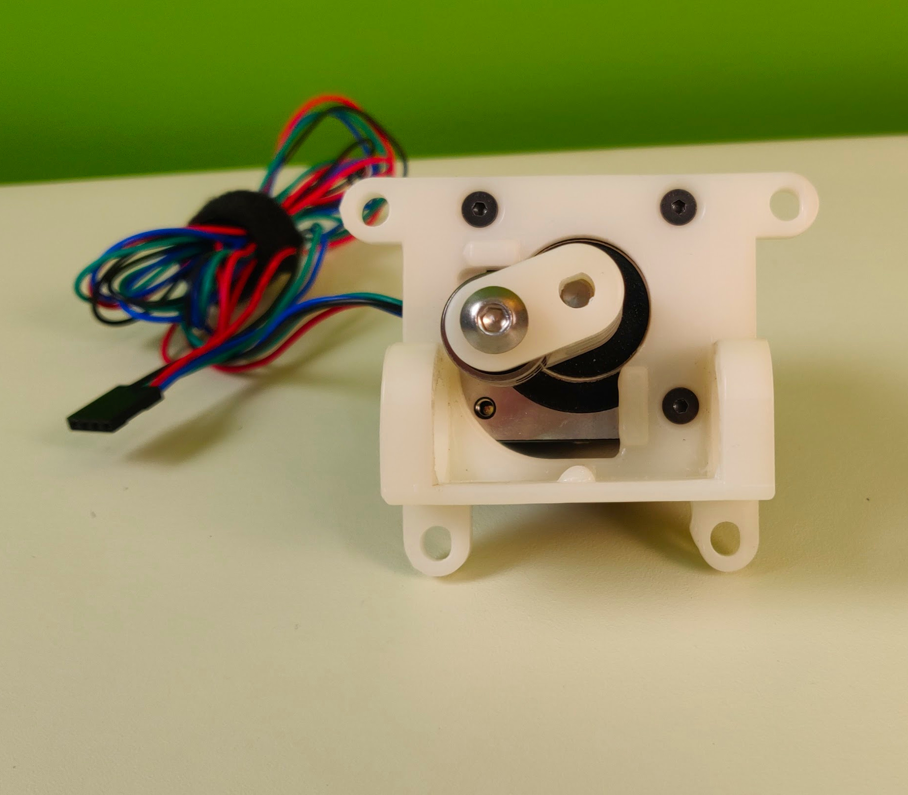
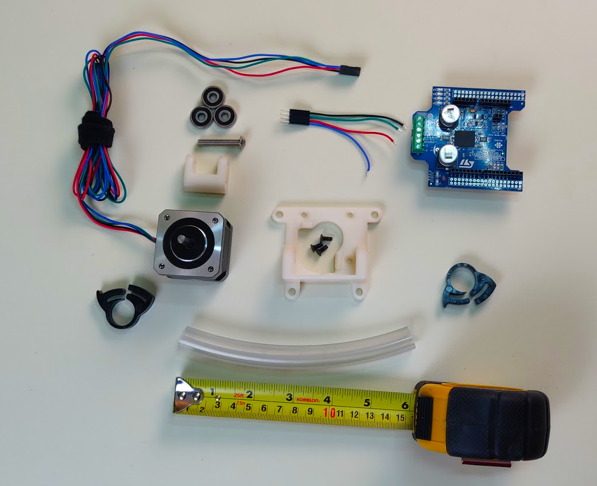
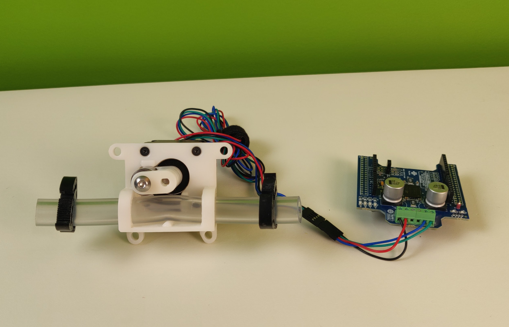

# Stepper Proportional Pinch Valve

  CAD File         |  Assembled         | In action          
:------------------:|:-----------------:|:-------------------------:
  |    |  

## Overview

This contains details, BOM, & instructions for one pinch valve assembly for the pneumatic circuit. 

The module is something that can be "spliced" into any location in the pneumatic circuit.
This makes it interchangeable with solenoid or whatever other valve implementation we might consider/test.

For a full prototype build you will need 2 pinch valves, in which case it makes sense to purchase a 2-axis stepper driver,
though you can work with two single-stepper drivers if that's what you already have. 

### Change history

The stop is moved down by 3 mm, which should buy us a lot more leverage.
The stop is now flat. We might need to tweak exact dimensions further to get a perfect close, but this should be better.
Watching the video I'm pretty concerned watching that stop flex. I made it run the full width, I made it thicker, and I also bulked out the tube holders.
Bearings are now better aligned with the tube.

v1.6: Broader shelf, slightly larger bump.

v1.7: set screw removed, 3/8"OD version added for potential use as oxygen supply valve.

## 3D Printing

### Guidelines

These files should not be printed with FDM. Instead, a leak-tight method like SLA or MJF should be used.

### Files 

- [Base - .step format](assets/exhaust-pinch-valve-1.6-base.step)
- [Rotor - .step format](assets/exhaust-pinch-valve-1.6-rotor.step)

Original designs found
[here](https://cad.onshape.com/documents/3fe0c1f79c482144c267173d/w/2ad1c08071a25185f9c78c68/e/03a49465e4e026f9f102d0af).

You may also find other variations of the design meant for special testing/calibration units.

## Parts List (BOM)

**Note: If you are a member of the RespiraWorks team, review [part purchasing guidelines](../../ventilator-build/README.md) BEFORE purchasing any parts.**

### Purchasing Source Key

* **C**  = McMaster-Carr
* **Z**  = Amazon
* **F**  = Fast Eddy Bearings
* **K**  = Digikey
* **M**  = Mouser
* **3D** = 3D printed (RespiraWorks)
* **S**  = ST
* **R** = RS computing
(**note**: links provided are for worldwide customers; there are local RS retail sites for most countries that use the same product reference (RS Stock No.) and will probably ship faster if you order from your country's site)
* **T**  = Stepperonline.com

### Parts 

| Item   | Quantity | Manufacturer    | Part #              | Price (USD)  | Sources              | Notes |
| ------ |---------:| --------------- | ------------------- | ------------:| ---------------------| ----- |
| 1      |        1 | STEPPERONLINE   | 17HS19-2004S2       |11.59 / each  | [T][1step] [Z][1amzn]| Stepper motor. Make sure to get one with the full-cut D-shaft. |
| 2      |        1 | McMaster-Carr   | 92095A218           |   7.64 / 25  | [C][2mcmc]           | M5x30mm button head. Axle for bearing. |
| 3      |        3 | McMaster-Carr   | 91294A128           |  4.82 / 100  | [C][3mcmc]           | M3x8mm flat head. Attaches frame to stepper body |
| 4      |        3 | FastEddy        | TFE4262             |  12.50 / 10  | [F][4fast]           | 5x16x5 Metal shielded bearings |
| 5      | 6in/15cm | McMaster-Carr   | 5894K38             |  12.30 / 2 ft| [C][5mcmc]           | Continuous-Flex Soft Tygon PVC Tubing, 3/8" ID, 5/8" OD |
| 6      |        2 | McMaster-Carr   | 9579K67             |  12.63 / 20  | [C][6mcmc]           | Herbie clip E, 12-13.8mm, to clamp tubing to fittings |
| 7      |        1 | Digikey         | X-NUCLEO-IHM03A1    | 10.64 / each | [K][7key] [M][7mr]   | Stepper driver dev board |
| 8      |        1 | ST              | X-NUCLEO-IHM02A1    | 15.00 / each | [S][8st] [R][8rs]    | **ALT for item 10:** Two-axis stepper driver dev board |
| 9      |        1 | RespiraWorks    | N/A                 |       N/A    | [3D][9print]         | BASE - 3D printed |
| 10     |        1 | RespiraWorks    | N/A                 |       N/A    | [3D][10print]        | ROTOR - 3D printed |

[1step]:   https://www.omc-stepperonline.com/nema-17-stepper-motor/nema-17-bipolar-59ncm-84oz-in-2a-42x48mm-4-wires-w-1m-cable-and-connector-full-d-cut-shaft.html
[1amzn]:   https://www.amazon.com/dp/B07Z1J8JWH
[2mcmc]:   https://www.mcmaster.com/92095A218
[3mcmc]:   https://www.mcmaster.com/91294A128
[4fast]:   https://www.fasteddybearings.com/5x16x5-metal-shielded-bearing-625-zz-10-units/
[5mcmc]:   https://www.mcmaster.com/5894K38
[6mcmc]:   https://www.mcmaster.com/9579K67
[7key]:    https://www.digikey.com/short/z442qt
[7mr]:     https://www.mouser.com/ProductDetail/511-X-NUCLEO-IHM03A1
[8st]:     https://www.st.com/en/ecosystems/x-nucleo-ihm02a1.html#sample-and-buy
[8rs]:     https://export.rsdelivers.com/product/stmicroelectronics/x-nucleo-ihm02a1/stmicroelectronics-x-nucleo-ihm02a1-two-axis/1646982
[9print]:  #files
[10print]: #files

### Tools

| Item | Quantity | Manufacturer  | Part #      | Price (USD) | Sources         | Notes |
| ---- |---------:| ------------- | ----------- | ----------:|-----------------| ----- |
| a1   |        1 | TEKTON        | 37122       |       9.99 | [Z][a1amzn]      | Some sort of wrench/pliers, to clamp the herbie clips around the tubing+fitting. |
| a2   |        1 | Wiha          | 71397       |       6.76 | [Z][a2amzn]      | 2, 3mm hex drivers required for assembly.  |
| a3   |        1 | McMaster-Carr | 26475A38    |       9.55 | [Z][a3mcmc]      | M5x0.8mm taper chamfer tap, for bearing axle.  |

[a1amzn]:  https://www.amazon.com/TEKTON-2-Inch-Joint-Pliers-37122/dp/B00KLY1FAY
[a2amzn]:  https://www.amazon.com/Wiha-71397-Metric-Insert-6-Piece/dp/B0084B7S70/ref=sr_1_4?dchild=1&keywords=3mm+hex&qid=1590347774&sr=8-4
[a3mcmc]:  https://www.mcmaster.com/26475A38

## Assembly Instructions

You’ll need a vice to press on the rotors to the stepper motor shafts.  You may also need a tap ([Item a3](#tools)) to
chase the threads in the rotor ([Item 10](#parts)) for the bolt ([Item 2](#parts)) holding the bearings. On some
machines they way print too tight and you may crack the rotor trying to just muscle in the bolt without chasing the
threads first.  Prop tip: only chase a portion of the threads for the bolt that holds on the bearings, leaving a bit
to act as a lock nut.

Rotor Assembly                     |  Base Assembly           |   
:---------------------------------:|:-------------------------: 
|    
3mm hex and 2.5mm hex driver are required for assembling rotor.|  2mm hex driver is required for attaching base.

Assembled it should look something like this, ready to be integrated:

[Instructions on wiring the pinch valve to the PCB can be found here](https://github.com/RespiraWorks/pcbreathe).
