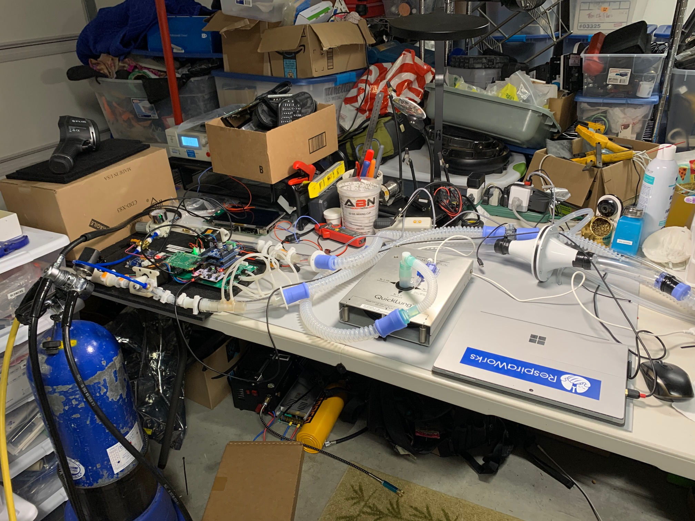

# 2020-06-20 Oxy PSOL Control Tuning

- Test Hardware: Pizza board SN 01 (Edwin)
- PID Gains: kp = 0.05 ki = 20.0
- Exhale Valve Settings: exhale = 1.0f - 0.6f * psol_valve - 0.4f
- Pinch Valve Linearization: unchanged
- Test #8 calls for R10 but this is not a QuickLung setting, so R20 was used.
- Notes: This dataset includes CoVent AD Instruments data, setup photos

Initial tuning of the Oxygen PSOL.  Some undershoot effets in test 3 and 8, but otherwise clean responses.

Setup Photo:

