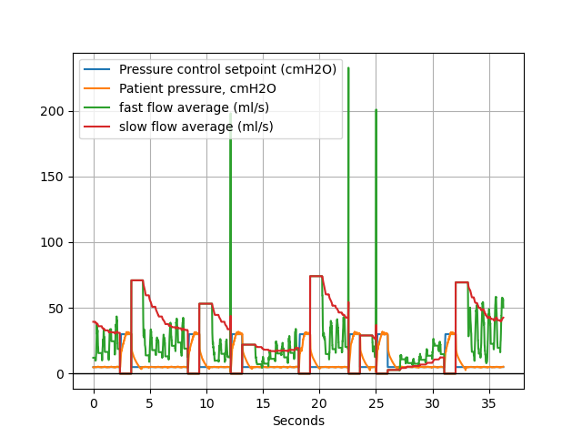
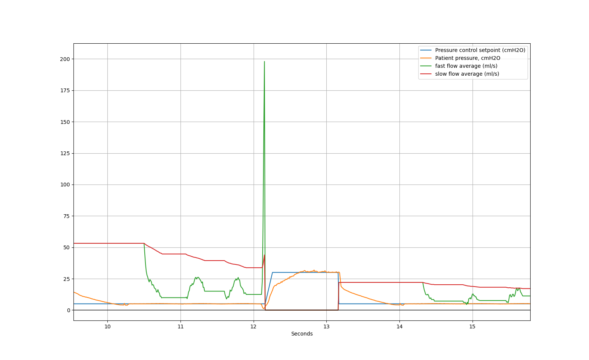
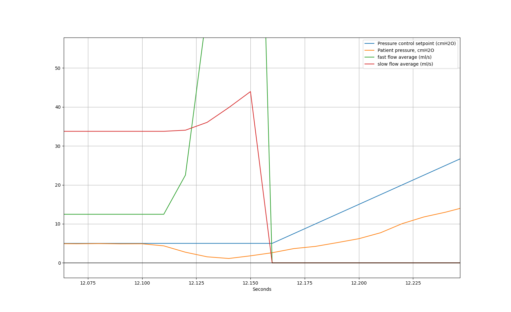

# 2020-06-21 Breath Detection Walkthrough

- Test Hardware: Pizza board SN 01 (Edwin)
- This data and video walkthrough demonstrates the breath detection algorithm of our Pressure Assist ventilator mode.
- We show the ventilator detecting and responding to patient breathing effort via a QuickLung and QuickTrigger setup.
- We then look at data from the ventilator to show how the detection is performed.
- This dataset includes data and images and a link to the video.

[Link to Video](https://youtu.be/6vUZYqXCQ2s)

