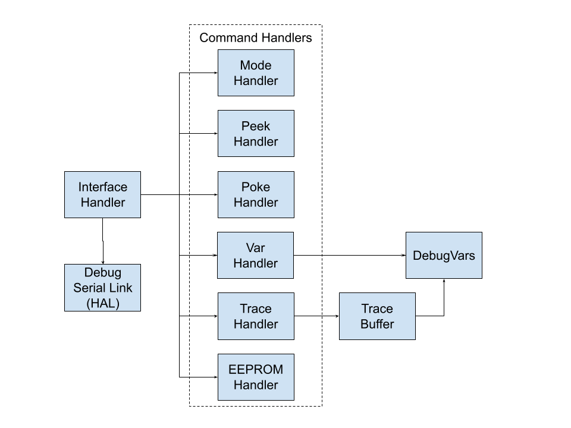

# Debug serial interface

This library adds a simple serial interface primarily intended to be used
for system debugging.  This entire library can be compiled out of the
production system. **#TODO** How?

The Python CLI interface can be accessed via the common controller utilities script at
[software/controller/controller.sh](../../controller.sh)

There is also a [brief tutorial](../../../utils/debug) on how to use it.

## Controller side architecture

On the controller side, the debug library consists of:
- a collection of `DebugVar` instances, defined throughout the controller code and accessible from the debug interface
- a `Trace` buffer that records the evolution of a set of (up to 4) `DebugVar` instances in time.
- a collection of `CommandHandler` derived classes and corresponding instances, used for the following commands:
    - `mode`: provision for when we will need a bootloader
    - `peek`: command that allows reading contents of a specific address on the STM32
    - `poke`: command that allows writing to a specific address on the STM32
    - `var`: set of commands (`get_var_info`, `get`, `set`) that allows manipulating the `DebugVar` instances
    - `trace`: set of commands (`flush`, `read`) that allows manipulating the `Trace` buffer
    - `eeprom`: set of commands (`read`, `write`) that allows read/write access to the I2C EEPROM
- an `interface` handler that:
    - parses data that arrives from the debugger (through the debug serial port)
    - once a full command has been received, checks its integrity (16 bits CRC) and feeds it to the proper `CommandHandler`
    - once the command has been processed, sends its result to the debugger (on the debug serial port)
