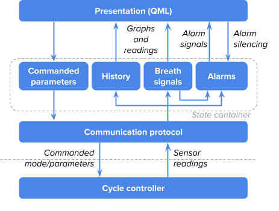

## User Interface (UI) Controller

The UI controller runs on a Raspberry Pi with a touchscreen and is
written in C++17 using QT as the user interface framework. The reasoning
behind this technology choice is described above, in the "Software
Design" section. Below we discuss the GUI features and architecture in
more detail.

There is a page on [User interface requirements](UI_requirements.md).

### Features

The most important features of the UI are displaying data and adjusting
ventilation parameters.

-   Data Display: The UI controller presents the user with the data
    coming from the ventilator, including both the actual sensor data
    and values that are derived from it (e.g. tidal volume and PIP/PEEP
    of the most recent breath). The data presented includes the standard
    respiratory cycle plot that most doctors and technicians would
    expect.
-   User Mode / Parameter Setting and Adjustment: The UI controller
    allows the user to set the desired ventilator mode and the desired
    control settings for that mode. The two modes currently supported
    are Pressure Control and Pressure Assist, as they are the modes
    supported by the Cycle Controller. The settings and ventilation mode
    can be changed at any time during operation, and adjusting a setting
    requires confirmation.
-   System state display: The UI controller displays a power source /
    battery status indicator and current time. Currently the battery
    status indicator uses a hard-coded value because the physical design
    lacks sensors to provide that data.

The UI implements an alarm subsystem based on ISO-60601-1-8.

-   Alarm State Detection: The UI controller is responsible for alarming
    when off-nominal events occur that require a clinician’s attention.
    The currently implemented alarms include over/under pressure (PIP is
    overshot or undershot by a certain amount compared to the commanded
    value) and disconnection of the patient circuit. The alarm
    architecture is robust and extensible, allowing us to easily add
    other alarms in the future.
-   Alarm Alerting and Information Display: The UI controller alerts the
    user to alarms through visual and audio cues:

-   Whenever an alarm condition is active, relevant sections in the UI
    are highlighted with color corresponding to the alarm priority. For
    example, over/under pressure alarms highlight the pressure graph.
-   If an alarm condition has been triggered, the UI emits an audio
    signal compliant with ISO 60601-1-8 according to the alarm priority
    until the alarm is acknowledged. If there are multiple
    unacknowledged alarms, the audio is based on the highest-priority
    one.
-   In ISO terminology, the audio signal is "latching": it persists even
    if the alarm condition is no longer active, so that the operator is
    made aware of a prior hazardous condition even if the condition
    activates sporadically and disappears before the operator walks up
    to the device upon hearing the audio signal.

-   Alarm Lifecycle: Whenever there are any unacknowledged alarms, the
    UI displays a banner showing the highest-priority currently
    unacknowledged alarm and offering to pause this alarm’s audio signal
    for 2 minutes.
-   Silenced alarms: The UI has a widget displaying the number of
    currently active but silenced (acknowledged) alarms, the highest
    priority of the alarms, and a countdown until the highest-priority
    alarm is unpaused.

### Software architecture

The GUI follows a standard layered Model-View Architecture depicted in
the following diagram.

Architecture of the RespiraWorks GUI

The GUI talks to the Cycle Controller over the serial bus, sending
commanded values of ventilation mode and ventilation parameters, and
receiving current sensor readings as well as a "breath id" value that is
used to establish breath boundaries for computing per-breath signals.

The state of the GUI is encapsulated in a State Container object, which
contains current parameter values to be commanded, recent history of
sensor readings for displaying time series graphs, as well as objects
that manage calculation of per-breath signals, detection of alarm
conditions and management of alarm lifecycle.

The presentation layer is written in QML (the markup language used by
the QT framework), where properties of various visual and audio elements
are wired together with aspects of the State Container, including
bidirectional updates.

Breath signals and the alarm subsystem deserve further discussion.

#### Breath signals

As noted above, each set of sensor readings obtained from the Cycle
Controller includes a "breath id" value, which changes on breath
boundaries. Breath boundaries are mandated or detected by the Cycle
Controller. This value can be used to partition the stream of sensor
readings into intervals corresponding to a single breath, letting us
compute per-breath signals.

We currently compute the following per-breath signals:

-   Measured PIP and PEEP are respectively the maximum and minimum
    patient pressure observed during the most recent breath.
-   Measured RR (in modes where RR is not mandated, i.e. in Pressure
    Assist mode) is the inverse average time-per-breath over the several
    most recent breaths.

These signals are naturally updated once per breath and are used both
for displaying respective readings in the Presentation layer and for
alarms.

#### Alarm subsystem

There is also a proposed architecture for the [GUI alarm subsystem](GUI_alarm_subsystem.md).

The UI controller is responsible for calculating and signaling all
alarms, with the exception of a planned "UI controller not responding"
alarm. The decision to place alarms into the UI controller, as opposed
to the Cycle controller, was intended to minimize the amount of code in
the cycle controller, the more safety-critical component of the system.

The alarm subsystem is based on ISO-60601-1-8 "General requirements,
tests and guidance for alarm systems in medical electrical equipment and
medical electrical systems". The key concepts are alarm conditions --
potentially hazardous conditions requiring operator awareness or action
-- which can have different priority, and audio and visual alarm
signals.

The subsystem consists of several independent alarms (one alarm for each
condition) and an alarm manager that aggregates their signals, for
example determining which audio signal should sound when several alarms
are active.

Each alarm is notified on each new sensor reading (together with updated
per-breath signals) in order to update the state of its condition. Each
alarm can be queried by the Presentation layer for the current state of
its visual and audio signals.

The visual signal is non-latching and is active whenever the alarm
condition is currently active. It is wired up at the Presentation layer
to the related visual elements, e.g., the over/under pressure alarms
affect the color of the pressure graph.

The audio signal is latching and remains active when the alarm condition
was active in the past but was not yet acknowledged. Audio signals of
active alarms are aggregated by the Alarm manager in order to emit only
the highest-priority one.

The presentation layer provides a control to acknowledge the current
highest-priority active alarm, which silences the alarm’s audio signal
for up to 2 minutes or until its condition becomes inactive. It also
provides a control notifying the user of the existence of active alarms
that have been silenced, with a countdown until the end of silencing.

### User experience principles

The user experience and the design of the user interface follows
mandatory ISO norms for medical equipment, specifically lung
ventilators. These norms include, but are not limited to:

-   BS EN ISO 80601-2-12:2020 Medical electrical equipment
-   BS EN 62366-1:2015 Medical devices
-   BS ISO 19223:2019 Lung ventilators and related equipment -
    Vocabulary and semantics

The user interface was designed using these ISO norms as guidelines,
focusing on patient safety, with the following set of user experience
principles in mind:

#### Use safety

The GUI and user experience must be designed with error prevention front
and center, because every mistake made by an operator in a stressful and
life-threatening situation can have severe consequences for the patient.

Example: any parameter that can be changed by the operator and that has
direct impact on the ventilator performance must be confirmed before
being executed.

#### System usability

The GUI’s design must present an effective, efficient, and easy-to-use
solution that lets the operator complete their tasks in a successful,
confident and satisfying manner.

Example: the main screen serves as the hub of the application, from
which every functionality can be easily accessed and performed in a
linear fashion, ultimately leading back to the hub. This design prevents
the operator from getting lost within the application.

#### Workload

For every task available, the GUI must provide a solution that keeps the
operator’s mental demand, physical demand, temporal demand, effort and
frustration as low as possible.

Example: alarms can be silenced for a brief period of time to let the
operator better focus on the patient’s need.

#### Visibility

Critical information displayed in the user interface (i.e. values,
waveforms, alarm signals) must be perceivable at 4m distance and
perfectly legible at 1m.

Example: the high contrast of screen elements vs background color, the
font size and selected alarm colors support this requirement.

#### Touch Target Sizing

Interactive affordances such as buttons must meet the minimal
recommended touch target size of 1 x 1 cm to guarantee a large enough
surface for the operator to press. Touch target dimensions should also
be adapted to meet the needs of various situations.

Example: primary functions used in critical situations should have a
larger touch target than a secondary function.

#### Fitt’s law

The user experience must follow [Fitt’s law](https://www.interaction-design.org/literature/topics/fitts-law) in
determining the position and dimension of interactive elements on the UI, to ensure operators can perform primary tasks quickly.

Example:

#### Hick’s law

The user experience must follow
[Hick’s law](https://www.interaction-design.org/literature/article/hick-s-law-making-the-choice-easier-for-users) in
structuring content, information architecture, and user flows, to ensure operators always have a clear path forward when
performing a task.

Example: touch targets to change or set parameters should be larger than
the touch target for the menu in the top left corner, as accessing the
menu is a secondary operation compared to changing values to directly
support the patient.

#### Accessibility

The design must take into account accessibility guidelines that let
operators with disabilities use the system without constraints or risks
to the patient’s health.

Example: color values for alarm priorities were selected and tested to
accommodate the most common types of color blindness (deuteranopia,
protanopia, achromatopsia, etc.). Additionally,
different alarm priorities emit different sounds communicating their
degree of urgency per ISO-60601-1-8.
