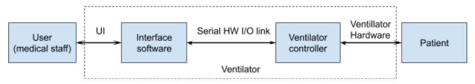

# Software design

## General considerations

For an overview of the software modules, see the Ventilator software architecture
[document](https://docs.google.com/document/d/1FPB31V72r_keu1_xjUfYCUXGLxBC5hoyCT1naPNNNTA).

**TODO:** Migrate contents of the above document to github.

There is a document defining the [ventilation modes](ventilation_modes.md) we intend to support.

## Controller

For more details on the inner workings of the controller, see
[Controller description](https://docs.google.com/document/d/1hztIBu9DR52r0LQuIpt6DZByBLfXfJy21BGqk2F34g8).

**TODO:** Migrate contents of the above document to github.

There is a
[Circuit board ICD](https://docs.google.com/spreadsheets/d/1JOSQKxkQxXJ6MCMDI9PwUQ6kiuGdujR4D6EJN9u2LWg/edit#gid=0)
which is a good reference on controller peripherals.

## User interface

There is a page on [User interface requirements](UI_requirements.md).

There is also a proposed architecture for the [GUI alarm subsystem](GUI_alarm_subsystem.md).

## Testing considerations

There is a strategy defined for [Embedded_software_testing](embedded_software_testing.md).

## Milestones

We have completed and successfully demonstrated the
[Alpha Milestone](milestone_alpha.md) and the [v0.2 milestone](milestone_v0.2.md).

## Design Reviews

[Details to-be-added - links to the design reviews]
