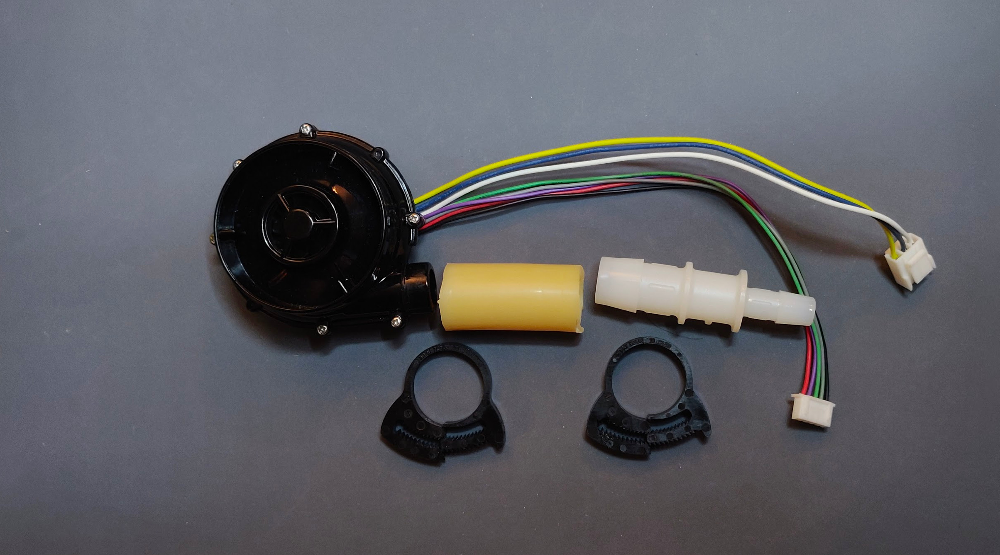
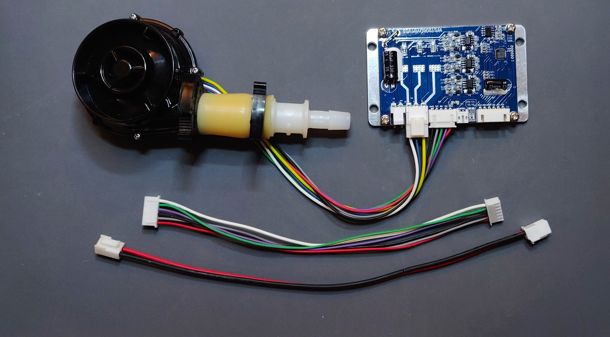

# Pizza Build: Blower Sub-assembly

The blower/fan is what provides air pressure to the ventilator's pneumatic circuit.

The pneumatic aspect of the blower assembly includes the blower and a short segment of tubing compatible with blower outlet diameter.

The electrical aspect of the blower assembly encompasses the driver board and wires of sufficient length to interface
with the [PCB](https://github.com/respiraworks/pcbreathe).

**#TODO:** unit price analysis

## Parts List (BOM)

**Note: If you are a member of the RespiraWorks team, review [part purchasing guidelines](../../README.md) BEFORE purchasing any parts.**

### Purchasing Source Key

* **A** = Ali Express
* **C** = McMaster-Carr
* **W** = Wonsmart
* **K** = Digikey
* **B** = Built by RespiraWorks
* **Z** = Amazon
* **R** = RS computing
(**note**: links provided are for worldwide customers; there are local RS retail sites for most countries that use the same product reference (RS Stock No.) and will probably ship faster if you order from your country's site)

### Parts

**NOTE:** Before you buy anything on this list, check with Edwin, Martin or Ethan. Blower takes a while to deliver.
We may have parts to send you from our inventory.

| Item | Quantity | Manufacturer  | Part #              | Price (USD)  |Sources                | Notes |
| ---- |---------:| ------------- | ------------------- | ------------:|:---------------------:|-------|
| 1    |        1 |               | WS7040-12-X200N     |        65.00 | [A][1ali]             | 12v blower and driver. Make sure to choose with driver when ordering. |
| 2    |        1 |               | WS1208              |        24.00 | [W][2won]             | blower driver, in case blower above did not come with driver. |
| 3    |   ~45 mm | McMaster-Carr | 5234K57             |  21.50 / 5ft | [C][3mcmc]            | Soft latex tubing, 5/8" ID, 7/8" OD |
| 4    |        2 | McMaster-Carr | 9579K72             |   12.21 / 20 | [C][4mcmc]            | Herbie clip J (20.3-23mm) for clamping 7/8"OD tubing |
| 5    |        1 | McMaster-Carr | 5463K644            |    7.80 / 10 | [C][5mcmc]            | 5/8"ID x 3/8"ID, for transition to pinch valve tubing |
| 6    |  6 or 12 | JST           | SXH-001T-P0.6       |         0.10 | [K][6digi] [R][6rs]   | XH crimps, for control connector |
| 7    |   1 or 2 | JST           | XHP-6               |         0.14 | [K][7digi] [R][7rs]   | XH 6-pin housing, for control connector |
| 8    |        - | CQRobot       | CQRJST254-BGB       |         9.99 | [Z][8amzn]            | XH connector kit for 6/7/8 pins, alternative for 1+6 above |
| 9    |   2 or 4 | JST           | SVH-21T-P1.1        |         0.11 | [K][9digi] [R][9rs]   | VH crimps, for power connector |
| 10   |   1 or 2 | TE            | 1-1123722-2         |         0.18 | [K][10digi] [R][10rs] | VH housing 2 pin, for power connector |
| 11   |        - | Remington     | 16UL1007STRKIT      |        29.70 | [K][11amzn]           | 16 AWG wire, for power cable, **optional** if not included or more length needed |
| 12   |        - | Remington     | 26UL1007STRKIT10COLOR |      31.60 | [K][12amzn]           | 26 AWG wire, for control cable, **optional** if not included or more length needed  |

[1ali]:   https://www.aliexpress.com/item/32698107687.html
[2won]:   https://wonsmart-motor.en.made-in-china.com/product/hsjxFewOppVg/China-Air-Pump12V-Brushless-Motor-12V-Blower-Fan-Driver.html
[3mcmc]:  https://www.mcmaster.com/5234K57
[4mcmc]:  https://www.mcmaster.com/9579K72
[5mcmc]:  https://www.mcmaster.com/5463K644
[6digi]:  https://www.digikey.com/short/z44f8d
[6rs]:    https://export.rsdelivers.com/product/jst/sxh-002t-p06/jst-xh-female-crimp-terminal-contact-26awg-sxh/1755645
[7digi]:  https://www.digikey.com/short/z44ff8
[7rs]:    https://export.rsdelivers.com/product/jst/xhp-6/jst-xhp-female-connector-housing-25mm-pitch-6-way/8201620
[8amzn]:  https://www.amazon.com/gp/product/B079MJ1RYN
[9digi]:  https://www.digikey.com/short/z44fjr
[9rs]:    https://export.rsdelivers.com/product/jst/svh-41t-p11/jst-nv-vh-female-crimp-terminal-contact-16awg-svh/7620692
[10digi]: https://www.digikey.com/short/z44fwj
[10rs]:   https://export.rsdelivers.com/product/jst/vhr-2n/jst-vhr-female-connector-housing-396mm-pitch-2/8201172
[11amzn]: https://www.amazon.com/gp/product/B00N51OJJ4
[12amzn]: https://www.amazon.com/gp/product/B011JC76OA

## Tools

| Item | Quantity | Manufacturer  | Part #              | Price (USD) | Sources         | Notes |
| ---- |---------:| ------------- | ------------------- | -----------:|-----------------| ----- |
| a1   |        1 | Preciva       | PR-3254 (PR102001)  |    39.99 | [Z][a1amzn]     | Crimping tool for HX and HV connectors |

[a1amzn]:https://www.amazon.com/gp/product/B07R1H3Z8X

**NOTE: Items 6-12 and a1 above are also duplicated in the [wiring BOM](../../../ventilator-design/electrical-system/wiring.md)**

## Assembly Instructions

Use short segment of tubing, clamp to blower and adapter.
Use Herbie clip to secure tubing to blower. Alternatively, you can use a zip-tie.

You will have to crimp connectors to the second end of the wiring that connects the driver board
to the [PCB](https://github.com/respiraworks/pcbreathe).
It depends on your build layout, but in the case that you need longer wires, you will have to crimp both ends.
In this case you will need the higher number of XH and VH connector components listed in the BOM above.
