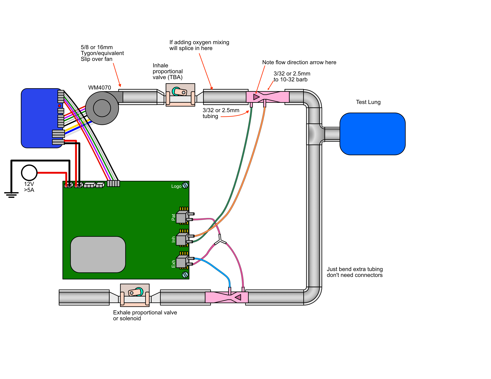

# Pizza Build

**WARNING: This is not intended to be used on patients and lacks a number of safety features.**

This is a ventilator prototype for testing and development.
The build consists of a functional ventilator pneumatic assembly with controller and user interface. This build is adequate for integration and systems testing.

It lacks heating, humidification, battery backup and air filtering.

It is also not enclosed like the final product and is meant to be operated in an open layout on your table, like a pizza.

It can also come in various configurations, depending on your testing needs:

| Solenoid valve setup  |  Pinch valve setup   | Blower bypass setup     |           
|:---------------------:|:--------------------:|:-----------------------:|
 |  |  |

**DISCLAIMER:** These are live documents.
There are duplicate and alternative items for undecided aspects of the physical design. 

RespiraWorks may or may not compensate you for any of these parts if you choose to buy them. Please connect with Edwin, Martin or Ethan first.
If you decide to buy them, do so at your own risk... oh, and thank you ;).**

## Planning

Before you start, it would be wise to plan the configuration you will build and order adequate amounts of components.
Try to plan for what you'll need in a few weeks rather than what you need now.
Supply chains are quirky and shipping times can be long, so your surprise at having missed something will soon turn to frustration.
The goal of this documentation has been precisely to help you avoid unproductive waiting. **PLAN NOW!**

Read over as much of the following documentation as you can and then come back to this point.

Now, contact the team to see if we have components in stock that we can send you.
Once you know what you are getting from "headquarters", only then should you start filling up your baskets.
Also ask the team if anything should be ordered on the company account.

## Essentials

The first thing you will need is a [Brain build](pizza-brain), which contains the computing components.

We are using 3/4" ID tube as the default standard (and adapters where needed, like to the blower and the pinch valves). This easily can have 19mm ID tubing substituted in metric manufacturing settings (3/4" = 19.05mm). All rigid plumbing fittings should be NPT/imperial standard (3/4 NPS preferable, to keep ID consistent throughout the flowpath). 

We are still providing 5/8" tubing as an option below, since some people may still have parts that support 5/8" tubing. 

## Parts List (BOM)

**Note: If you are a member of the RespiraWorks team, review [part purchasing guidelines](../README.md) BEFORE purchasing any parts.**

### Purchasing Source Key

* **Z** = Amazon
* **C** = McMaster-Carr

### 3/4" ID Tubing Components

| Item | Quantity | Manufacturer  | Part #              | Price (USD)     |  Sources       | Notes |
| ---- |---------:| ------------- | ------------------- | ------------:|----------------| ----- |
| b1   |      5ft |      OCSParts |            117062-5 | 22.99 / 5ft  | [Z][b1amzn]    | soft 3/4"ID 1"OD tubing |
| b2   |      5ft | McMaster-Carr | 5233K71             | 14.20 / 10ft | [C][b2mcmc]    | hard 3/4"ID 1"OD tubing, alternative to b1, not as fun to work with, not for medical use |
| b3   |       20 | McMaster-Carr | 9579K73             | 12.24 / 20   | [C][b3mcmc]    | Herbie clip K (22.2-24.9mm) for clamping 1"OD tubing, works better for soft tubing |
| b4   |       20 | McMaster-Carr | 9579K74             | 12.33 / 20   | [C][b4mcmc]    | Herbie clip L (24.5-27.6mm) for clamping 1"OD tubing, maybe works better for hard tubing? |
| b5   |        1 | McMaster-Carr | 5463K167            | 13.16 / 10   | [C][b5mcmc]    | 3/4"ID <-> 5/8"ID adapter single barb, to interface with blower sub-assembly |
| b6   |       ~6 | McMaster-Carr | 5463K651            | 10.20 / 10   | [C][b6mcmc]    | 3/4"ID <-> 1/2"ID adapter, to interface with pinch valve tubing, **read note below** |
| b7   |       ~6 | McMaster-Carr | 5463K648            | 10.20 / 10   | [C][b7mcmc]    | 3/4"ID <-> 3/8"ID adapter, to interface with alternative pinch valve tubing, **read note below** |
| b8   |       ~3 | McMaster-Carr | 4596K33             | 4.18         | [C][b8mcmc]    | 3/4 NTP female tee, if you plan to have bypass or oxygen limb |
| b9   |       ~5 | McMaster-Carr | 53415K217           | 12.89 / 10   | [C][b9mcmc]    | 3/4 NTP male <-> 3/4"ID single barb, for tee junctions, if you plan to have bypass or oxygen limb |
| b10  |        2 |      Antelco |           (unknown) | 13.45 / 2    | [Z][b10amzn]    | 2pac of ball valves 3/4"ID |

**NOTE:** You should select either **b6** or **b7** depending on what your pinch valve tubing diameter will be.**

[b1amzn]: https://www.amazon.com/gp/product/B01LZ5ZK53
[b2mcmc]: https://www.mcmaster.com/5233K71
[b3mcmc]: https://www.mcmaster.com/9579K73
[b4mcmc]: https://www.mcmaster.com/9579K74
[b5mcmc]: https://www.mcmaster.com/5463K167
[b6mcmc]: https://www.mcmaster.com/5463K651
[b7mcmc]: https://www.mcmaster.com/5463K648
[b8mcmc]: https://www.mcmaster.com/4596K33
[b9mcmc]: https://www.mcmaster.com/53415K217
[b10amzn]: https://www.amazon.com/gp/product/B07C5FVSQB

### 5/8"ID Tubing Components

Note: This is NOT the default tube size. If you are purchasing parts to assemble pizza build for the first time, use 3/4"ID tubing above.

| Item | Quantity | Manufacturer  | Part #              | Price (USD)     |  Sources        | Notes |
| ---- |---------:| ------------- | ------------------- | ------------:|-----------------| ----- |
| a1   |      5ft | McMaster-Carr | 5234K57             | 21.50 / 5ft  | [C][a1mcmc]     | Soft latex tubing, 5/8" ID, 7/8" OD |
| a2   |      5ft | Duda Energy   | LPpvc063-025ft      | 20.11 / 25ft | [Z][a2amzn]     | 5/8" tubing, alternative to *a1*, not as good, too hard |
| a3   |       20 | McMaster-Carr | 9579K72             | 12.21 / 20   | [C][a3mcmc]     | Herbie clip J (20.3-23mm) for clamping 7/8"OD tubing, you'll need plenty |
| a4   |       ~6 | McMaster-Carr | 5463K646            |  6.60 / 10   | [C][a4mcmc]     | 5/8"ID <-> 1/2"ID, adapter, to interface with pinch valve tubing, **read note below** |
| a5   |       ~6 | McMaster-Carr | 5463K646            |  6.60 / 10   | [C][a5mcmc]     | 5/8"ID <-> 3/8"ID, adapter, to interface with alternative pinch valve tubing, **read note below** |
| a6   |       ~3 | McMaster-Carr | 5372K128            | 2.82         | [C][a6mcmc]     | 1/2 NTP female tee, if you plan to have bypass or oxygen limb |
| a7   |       ~5 | McMaster-Carr | 5372K128            | 4.89 / 10    | [C][a7mcmc]     | 1/2 NTP male <-> 5/8"ID multibarbed, for tee junctions, if you plan to have bypass or oxygen limb |
| a8   |        2 |      Antelco |            (unknown) | 13.45 / 2    | [Z][a8amzn]     | 2pac of ball valves 5/8"ID |

**NOTE:** You should select either **a4** or **a5** depending on what your pinch valve tubing diameter will be.**

[a1mcmc]: https://www.mcmaster.com/5234K57
[a2amzn]: https://www.amazon.com/gp/product/B00LX6MFYE?th=1
[a3mcmc]: https://www.mcmaster.com/9579K72
[a4mcmc]: https://www.mcmaster.com/5463K646
[a5mcmc]: https://www.mcmaster.com/5463K644
[a6mcmc]: https://www.mcmaster.com/4880K154
[a7mcmc]: https://www.mcmaster.com/5372K128
[a8amzn]: https://www.amazon.com/gp/product/B07C5FVN9K

### Metric Version

**#TODO: document how to build with metric components**

### Tools

Assembling the pneumatic system will likely need the following tools.
T1 might be enough and T4 might be unnecessary.
Also, scissors or a sharp knife might be ok instead of T3.

| Item | Manufacturer  | Part number        | Price (USD) | Sources         | Notes |
| ---- |--------------:| ------------------ | -------- | ---------------:|------ |
| c1   |        TEKTON |              37122 |    13.00 | [Z][c1amzn]     | 8 inch slip-joint pliers, for clamping tubes onto fittings | 
| c2   |   Duda Energy |     LPpvc075-005ft |    19.99 | [Z][c2amzn]     | Adjustable wrench, at least 1" wide opening, for screwing in NTP fittings |
| c3   |        DEWILL |          (unknown) |    15.88 | [Z][c3amzn]     | Pipe and PVC cutter, for cutting tubing |
| c4   |         IRWIN |            2078216 |     8.90 | [Z][c4amzn]     | Long nose pliers, for removing herbie clips |
| c5   |          PTFE | vanguardSealantsPTFE-01 |     6.49 | [Z][c5amzn]     | It's advisable to teflon tape all NTP threaded components. Not only will they be more airtight, but also they will be easier to tighten and release. |

[c1amzn]: https://www.amazon.com/TEKTON-2-Inch-Joint-Pliers-37122/dp/B00KLY1FAY
[c2amzn]: https://www.amazon.com/GETUPOWER-10-Inch-Adjustable-Opening-Vanadium/dp/B07RGV2VK1
[c3amzn]: https://www.amazon.com/gp/product/B07Y997XKC
[c4amzn]: https://www.amazon.com/Tools-VISE-GRIP-Pliers-6-Inch-2078216/dp/B000A0OW2M
[c5amzn]: https://www.amazon.com/gp/product/B01L2F428C

## Sub-assemblies

The following are essential sub-assemblies that you'll need no matter what additional/optional "toppings" you chose to have. 

* [Blower assembly](pizza-blower) - the main driver of pressure in the pneumatic circuit
* [Basic test lung](pizza-test-lung) - something to simulate a lung
* 2x [Venturi flow sensors](../../research-development/project-venturi) and corresponding tubing, to provide the controller feedback
* Some sort of valve or valves, which leads us to...

## Optional Components

**Optional additions (toppings) for your pizza build:**
These can be added or customized based on what functions you will be developing or testing.

* **Binary solenoid:** One option for inhale or exhale valve is a binary solenoid, which either opens or closes.
The sub-assembly for this component is documented [here](pizza-binary-solenoid). The PCB can only power/control one such
solenoid, so for more advanced designs you will want to (also) start using other valves.
* **Proportional pinch valve:** A proportional pinch valve can control the airflow constriction with much better precision.
Multiple such pinch valves can be used in our prototype, the part is buildable from 3d-printed plastic components and
easily obtainable generic parts. Instructions are [here](../../research-development/project-pinch-valve).
You may need anywhere between 1 and 3 such pinch valves, depending on the complexity of your system.
* **Reduced compliance test lung:** To test basic function a ventilator check lung or a breathing bag is sufficient,
but can really only work up to 10cmH2O. To be able to test higher PIP values, you need to reduce the compliance of the
lung so you don’t just inflate it like a balloon (or pop it). View more details on reduced compliance test lung [here](pizza-compliance-test-lung).
* **#TODO: check valve**
* **#TODO: oxygen supply limb** 

## Assembly Instructions

Use the following diagrams as well as the pictures of the most recent builds at the top of the page to help you assemble this lego set.

[Pneumatics diagram source](assets/pizza-pneumatics.eps)

Note: mind which tubes go into the bottom and top ports of the sensors on the PCB.

