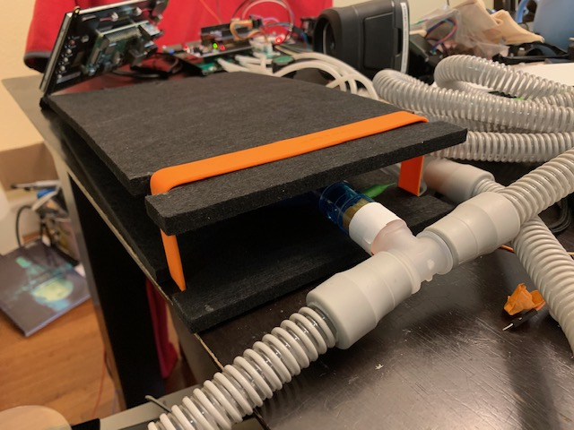

# Pizza Build: Reduced Compliance Test Lung Add-on

This is an optional add-on (topping!) to the [pizza build](../pizza-build.md).

To test basic function a ventilator check lung or a breathing bag is sufficient, but can really only work up to 10cmH2O.

To be able to test higher PIP values, you need to reduce the conpliance of the lung so you don't just inflate it like a balloon (or pop it).  These are partial instructions, and there is currently a shortage of test lungs, so what model you get can vary, so expect to do some tinkering to these instrutions if you are going to build you own.

This is completely uncalibrated, so it is not intended for instrumentation, just for functional observation.

**NOTE: As a prerequisite for this reduced-compliance test lung, please first follow instructions and buy parts as needed for the [simple test lung](../pizza-test-lung). See additional notes on part redundancies in the Part List section below.**

## Part List (BOM)

**Note: If you are a member of the RespiraWorks team, review [part purchasing guidelines](../../README.md) BEFORE purchasing any parts.**

**Add-on part redundancies: You'll first need to secure parts for the [simple test lung](../pizza-test-lung).**

### Purchasing Source Key

* **Z** = Amazon
* **C** = McMaster-Carr

### Parts

| Item | Quantity | Manufacturer    | Part #         | Price (USD) | Sources         | Notes |
| ---- |---------:| --------------- | ------------------- | --------:|-----------------| ----- |
| 1  |        1 | BXI or whatever | CA-BX-AP-PF |    24.95 | [Z][1amzn]     | Just some sturdy material.  Aluminum, wood, whatevery you have around. 1x 16x12 sheet needed, or 2x 8x12 sheets |
| 2  |        1 | Grifiti         | 41010   |     10.98| [Z][2amzn]     | just a big rubber band.  several jumbo rubber bands or resistance tubing from an exercise device will work. |
| 3 |        1 | Alliance Rubber | 08997  |     6.48| [Z][3aamzn]     | just some more big rubber bands. good for tuning the response. |
| 4  |        1 | NewMainOne         | 4336300183   |     13.98 / multi-pack| [Z][4amzn]     | hopefully you have some zip ties at home already but if not, here's a link |
| 5   |        1 |           GRIFITI |            41192 | 17.98         | [Z][5amzn]     | more rubber bands, optional or alternative to 3 and 3a |

[1amzn]:  https://www.amazon.com/gp/product/B077Q2HYMW
[2amzn]:  https://www.amazon.com/Wrapping-Exercise-Chemical-Resistant-Silicone/dp/B0070EEGTK
[3aamzn]:  https://www.amazon.com/gp/product/B0017D16PW
[4amzn]: https://www.amazon.com/gp/product/B0777LWBD9
[5amzn]:  https://www.amazon.com/gp/product/B018WPZCSO

## Assembly Instructions

* Cut a 16x12 panel of sturdy material into two 8x12 panels. (the sound absorber panels above work fine, or any wood or aluminum you have around.  Cardboard is probably not sturdy enough.)

* Drill 2 holes at one end of each panel to form a zip tie hinge.  Drill two additional holes in one of the panels as a securing point for the test lung.  Measure with the rubber band and cut 2 notches at the opposite end of both panels to accomodate the rubber band.  
* If your lung does not have an attachment loop, make a fold of duct tape attached to the end of the lung and poke a hole in it for the zip tie to secure.  Secure the lung to the panel.
* Put the zip ties into the end of the panel for the hinge. Make sure the ties are loose enough to allow the panels to fold over completely.

* Put the rubber band around the notches.

* Mate the tee-junction to the port on the lung to allow attachment of your hoses.

